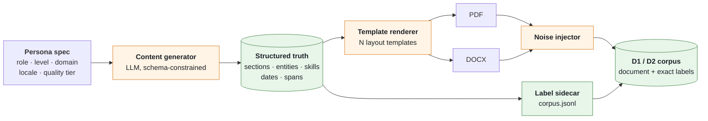

# Phase 8 — Dataset Strategy

**Project:** AI Resume Analyzer & Mock Interview Platform
**Status:** Draft — awaiting approval
**Date:** 2026-08-01
**Depends on:** [Phase 3](../requirements/phase-03-requirement-engineering.md) ✅ · [Phase 6](../architecture/phase-06-database-design.md) ✅ · [Phase 7](phase-07-ai-system-design.md) ✅

---

## 0. This phase closes the longest-open blocker

The golden corpus has been flagged as blocking since Phase 3 and has been raised in four
subsequent phases. It blocks slice S1's F1 gate, R-21, R-32, R-44, and the seed fixtures.

**It has not been answered, so this phase answers it** — with a concrete plan that does not depend
on an external decision, plus the reasoning for why the obvious approaches are worse than they look.

The short version: **we generate the corpus synthetically, because for our specific gates synthetic
data is not a compromise — it is better.** §5 explains why.

---

## 1. Objective

Define every dataset the system needs, where each comes from, how it is labelled, versioned,
stored, and governed — such that Phase 9 can calibrate against real data and Phase 19 can run the
six blocking quality gates in CI.

---

## 2. Why This Phase Matters

**Every quality gate in this project is a claim about data we do not yet have.**

Phase 3 set six blocking gates — section F1 ≥ 0.90, entity accuracy ≥ 0.95, σ ≤ 2, zero
fabrication, bias variance ≤ 1 point, zero successful injections. Each is a measurement, and a
measurement without a measuring instrument is an aspiration. This phase builds the instruments.

Three specific failures this prevents:

1. **Building on unmeasured parsing.** R-06 and R-32 both say parsing may be worse than we expect.
   The whole point of the S1 gate is to find that out in **week 3**, not week 10. Without a corpus,
   there is no gate, and we discover the problem after four slices are built on top of it.
2. **Silent heuristic failure.** Phase 7's layout analysis is deterministic, which means a gap is a
   *confidently wrong answer* rather than a hedge (R-44). Only a corpus containing deliberately
   adversarial layouts can detect that.
3. **Legal and ethical exposure through data provenance.** Resumes are dense PII. The obvious
   shortcut — downloading a public "resume dataset" — carries provenance problems that directly
   contradict the positioning this product's credibility rests on. §4 covers this properly.

---

## 3. Deliverables

- [x] Dataset inventory mapped to gates (§6)
- [x] Provenance policy and the case against scraped corpora (§4)
- [x] Synthetic generation architecture (§5, §7)
- [x] Adversarial layout suite design (§8)
- [x] Volunteered real-resume validation set with consent flow (§9)
- [x] Job description, skills taxonomy, and interview datasets (§10–§12)
- [x] Fabrication, bias, and injection eval sets (§13)
- [x] Annotation schema and process (§14)
- [x] Balancing dimensions (§15)
- [x] Cleaning pipeline (§16)
- [x] Versioning and storage (§17–§18)
- [x] Data governance and provenance register (§19)
- [x] Effort estimate and build order (§20)
- [x] ADR-0034 … ADR-0038

---

## 4. Provenance — Why We Do Not Download a Resume Dataset

The fastest path is to search for "resume dataset" and download one. There are several with
thousands of resumes. We are not going to use them, and the reasoning matters because it will be
tempting again later.

| Problem | Detail |
|---|---|
| **Consent** | Many public resume corpora were scraped from job boards and CV-hosting sites. The people in them did not consent to research use, let alone to a commercial product's training pipeline |
| **Live PII** | These are real names, real phone numbers, real addresses, real employment histories — often still current. Committing them to a repository creates a PII estate with none of the controls Phase 3 §7 requires of us |
| **Positioning** | ADR-0002 and ADR-0012 built this product's credibility on candidate-side ethics and explicit consent. "We trained on scraped resumes" is not survivable alongside "we never use your data without asking" |
| **Licence** | Provenance is usually unstated or unverifiable. ADR-0023 requires known licences for what we ship; the same discipline should apply to data |
| **Fitness** | ⭐ **They also aren't very useful.** They are usually plain text or already-parsed JSON — the *layout* is gone. Our wedge is layout analysis. A text-only resume corpus cannot test the thing that differentiates us |

That last row deserves emphasis. Even setting ethics aside, the available corpora **cannot test what
we actually need to test.** They contain the output of someone else's parser, not the PDFs that
break parsers.

**Policy** ([ADR-0034](../adr/0034-synthetic-first-no-scraped-resumes.md)): **no scraped or
unverified-provenance resume corpora, ever.** Resume data comes from three sources only:
synthetically generated, explicitly volunteered with written consent, or opted-in production users
(ADR-0012) — and the third is not used at MVP.

---

## 5. Why Synthetic Is Better Here, Not a Compromise

The instinct is that synthetic data is a fallback for when you cannot get real data. For our
specific gates, that is backwards.

| Requirement | Real corpus | Synthetic corpus |
|---|---|---|
| **Ground-truth labels** | Manual annotation: ~20 min/resume × 50 = **~17 hours** | ⭐ **Free — we generated the content, so we know every section and entity exactly** |
| **Adversarial layout coverage** (R-44) | Hope the corpus happens to contain two-column, table-based, and image-only resumes | ⭐ **Systematic — generate every layout deliberately, exhaustively** |
| **Bias perturbation set** (NFR-AI-006) | Cannot vary only the name while holding content identical | ⭐ **Trivial — same content, substituted names** |
| **Determinism set** (σ ≤ 2) | Fine | Fine |
| **PII risk** | High — real people's data in a repository and CI | ⭐ **None — nobody's data** |
| **Repeatability** | Fixed set; expanding means more annotation | ⭐ **Regenerable; expanding is a parameter change** |
| **Realism / distribution match** | ⭐ **Real** | ⚠️ **Cleaner than reality — the genuine weakness** |

**Synthetic wins on five of seven dimensions, and loses decisively on one: realism.** Real resumes
have typos, inconsistent date formats, copy-paste encoding artefacts, odd spacing, and layouts no
template generator would produce.

That single weakness is addressed two ways, and both are necessary:

1. **Noise injection** (§7.3) — deliberately corrupting generated resumes with the specific defects
   real ones exhibit.
2. **A small volunteered real validation set** (§9) — 15–20 genuine resumes, used **only to verify
   that synthetic performance transfers.** If metrics on the real set diverge materially from the
   synthetic set, our synthetic distribution is wrong and the generator gets fixed. This is the
   control for R-50, the central risk of this strategy.

---

## 6. Dataset Inventory

| ID | Dataset | Serves | Gate | Size (v1) | Source |
|---|---|---|---|---|---|
| **D1** | Golden parsing corpus | Section F1, entity accuracy | **S1 blocking** | 50 → 150 | Synthetic |
| **D2** | Adversarial layout suite | Layout signal accuracy (R-44) | **S2** | 40 | Synthetic, systematic |
| **D3** | Determinism set | σ ≤ 2 | **S2 blocking** | 20 (D1 subset) | Synthetic |
| **D4** | Bias perturbation set | Score variance ≤ 1 pt | **S2 blocking** | 15 base × 12 variants | Synthetic |
| **D5** | Job description corpus | Requirement extraction | S3 | 100 | Public postings |
| **D6** | Resume–JD labelled pairs | Threshold calibration (R-47) | S3 / Phase 9 | 60 pairs | Manual annotation |
| **D7** | Fabrication eval set | Zero hallucinated facts | **S3 blocking** | 40 cases | Hand-crafted |
| **D8** | Prompt-injection suite | Zero successful injections | **S3 blocking** | 50 payloads | Hand-crafted + public |
| **D9** | Skills taxonomy | `reference.skills` | S1 | 2,000–5,000 | Public taxonomies + curation |
| **D10** | Interview answer set | Evaluation rubric calibration | S4 | 60 answers | Synthetic + volunteered |
| **D11** | Expert rating set | κ ≥ 0.6 vs humans | S5 | 30 resumes | Human expert panel |
| **D12** | Real validation set | Distribution-shift control (R-50) | S1–S5 | 15–20 | Volunteered, consented |

**Note what is small.** The blocking S1 gate needs 50 documents, not 50,000. We are not training a
model — we are **measuring a pipeline**. Statistical power for "is section F1 above 0.90" on a
well-balanced 50-document set is adequate, and 150 is comfortable. This reframing is what makes the
whole problem tractable for a part-time team.

---

## 7. Synthetic Resume Generation

### 7.1 Architecture — content × template × rendering



### 7.2 The key property: labels come free

**Content is generated as structured data first, then rendered.** We do not generate a resume and
then annotate it — we generate the *facts*, know them exactly, and render them into a document
([ADR-0035](../adr/0035-generator-emits-ground-truth.md)).

```json
{ "doc_id": "syn-0042", "locale": "en-IN", "level": "mid", "template": "two_column_v2",
  "truth": {
    "sections": [ {"type":"experience","order":2}, {"type":"education","order":3} ],
    "entities": [ {"type":"email","value":"priya.n@example.com"},
                  {"type":"date_range","from":"2022-07","to":"2024-11","raw":"Jul 2022 – Nov 2024"},
                  {"type":"organization","value":"Cognizant"} ],
    "skills": ["Python","Django","PostgreSQL"],
    "layout_truth": {"columns":2,"has_tables":false,"text_in_images":false,"header_footer":true}
  } }
```

`layout_truth` is what makes the D2 adversarial suite possible: we know the document has two
columns because we rendered it with two columns, so the layout analyser's output can be checked
against ground truth rather than against judgement.

**All identity data uses reserved-for-documentation values** — `example.com` emails, reserved phone
ranges, and fictional-but-plausible names. No generated persona may coincide with a real person by
construction.

### 7.3 Noise injection — the realism correction

Real resumes are messy in specific, catalogueable ways. We inject those defects deliberately:

| Defect | Injection | Why it matters |
|---|---|---|
| Typos | Character transposition, doubled letters, 1–3 per document | Grammar rules and entity matching must tolerate them |
| **Mixed date formats** | `Jul 2022`, `07/2022`, `2022-07` in one document | Directly tests FR-PARSE-004's ambiguity flagging |
| Encoding artefacts | Smart quotes, non-breaking spaces, ligatures, mojibake | Very common from copy-paste; breaks naive tokenisers |
| Inconsistent spacing | Double spaces, tab/space mixing, stray line breaks | Confuses typography-based heading detection |
| Inconsistent bullets | `•`, `-`, `*`, `‣` within one document | Breaks fragile bullet parsing |
| Truncated contact | Missing phone, no LinkedIn | Tests hygiene rules |
| Tense inconsistency | Present tense in past roles | Content rule under test |
| Orphan content | A stray line belonging to no section | ⭐ Tests `unclassified_blocks` (FR-PARSE-007) |

Noise is **parameterised and seeded**, so a corpus version is exactly reproducible.

### 7.4 Persona coverage

Content generation spans: **roles** (software, data, QA, DevOps, product, non-technical) ×
**levels** (fresher, mid, senior) × **locales** (en-IN, en-US conventions) × **quality tiers**
(strong, average, weak).

**The quality tier matters more than it looks.** A corpus of good resumes cannot test whether the
rubric discriminates. We need documents that *should* score 35 as well as ones that should score
85, or we never learn that our scoring range is compressed.

---

## 8. D2 — The Adversarial Layout Suite

This exists solely to prevent R-44: a deterministic layout heuristic that fails silently and
confidently.

**The same content, rendered through every hostile template**, so any accuracy difference is
attributable to layout alone:

| Template | Tests |
|---|---|
| Single column, standard | Baseline |
| **Two column, sidebar left** | Column detection, reading order |
| **Two column, sidebar right** | Asymmetric gutter detection |
| Three column | Multi-gutter |
| **Table-based layout** (entire resume in a table) | Table detection; a classic ATS killer |
| Table for skills only | Partial table handling |
| **Text rendered as image** | Image-region detection |
| **Fully scanned (no text layer)** | OCR trigger threshold |
| Heavy header/footer with contact info | Header-band detection |
| Text boxes / floating elements | Flow detection |
| Non-standard embedded fonts | Font inventory |
| Dense two-page with tight leading | Whitespace-based heading detection |
| Infographic-style (icons, bars) | Graphics tolerance |
| LaTeX-rendered (Moderncv style) | Different generator conventions |
| Canva-style template | Popular real-world source |
| DOCX with style-named headings | Exploiting DOCX richness |

**16 templates × ~3 content variants = ~48 documents**, each with exact `layout_truth`.

> This suite is the reason synthetic generation is not a compromise. Assembling a real corpus that
> systematically covers all 16 hostile layouts would take weeks of collection and might still miss
> three of them. Generating it is a rendering matrix.

---

## 9. D12 — The Real Validation Set

**15–20 genuinely real resumes, volunteered with written consent.** Their purpose is narrow and
important: **verify that synthetic performance transfers** (R-50).

| Property | Design |
|---|---|
| Source | Your own network — friends, classmates, colleagues who are job-hunting |
| Consent | Explicit, written, purpose-limited ("testing a resume parser"), revocable, with a plain-language statement of what we do and do not do with it |
| De-identification | Names, phones, emails, and addresses replaced with reserved-range equivalents **before storage** — layout and structure are what we need, not identity |
| **Storage** | ⭐ **Never in the repository, never in CI** ([ADR-0036](../adr/0036-real-resumes-never-in-repo.md)) — encrypted separate store, accessed from a controlled local or staging environment |
| Use | **Validation only.** Not for calibration, not for training |
| Retention | Deleted when the consenting person asks, or after 24 months |

**Why not in CI:** CI runners are ephemeral, shared, and log-verbose. Putting real resumes in a CI
environment would create precisely the uncontrolled PII estate we refuse to create elsewhere. CI
runs on synthetic data only; the real validation run is a deliberate, manual, pre-release step.

**The transfer check:**

```
if | metric(D12) − metric(D1) | > 0.05 :
    the synthetic distribution is wrong → fix the generator, not the threshold
```

This is the honest control on the strategy's one real weakness, and it is why D12 exists at all.

---

## 10. D5 — Job Descriptions

Unlike resumes, **job descriptions are published documents, not personal data.** A company posts
them publicly and intends them to be read. The provenance problem largely disappears.

**Source:** manually collected public postings across the target roles and levels, with the
company name and any recruiter contact removed (a recruiter's email is still personal data).
**100 JDs** spanning software, data, QA, DevOps, product, and non-technical roles, at fresher, mid,
and senior levels, from both Indian and international postings.

**Verify before collecting at scale:** each source site's terms of use `[TO VERIFY]`. Manual
collection of 100 postings for internal testing is a very different act from automated scraping,
and only the former is contemplated here.

---

## 11. D9 — Skills Taxonomy

`reference.skills` needs canonical names, categories, and aliases (`K8s` → `Kubernetes`).

| Source | Notes |
|---|---|
| **ESCO** (European Skills/Competences/Occupations) | Large, structured, multilingual. Licence `[TO VERIFY]` — confirm attribution terms before use |
| **O*NET** (US Dept. of Labor) | Rich occupation–skill mapping. Licence `[TO VERIFY]` — has specific attribution requirements |
| Commercial taxonomies (e.g. Lightcast) | High quality, **paid** — not at MVP |
| **Our own curation** | The alias layer that actually matters for matching |

**Recommendation:** seed 2,000–5,000 skills from a public taxonomy whose licence we have verified,
then invest the real effort in the **alias layer**, which is where matching quality actually comes
from and which no public taxonomy covers well for tech (`K8s`, `k8s`, `Kube`, `Kubernetes`;
`JS`, `Javascript`, `ECMAScript`; `PG`, `Postgres`, `PostgreSQL`).

Aliases grow from observed misses: when semantic matching fires but alias matching does not, that
pair is a candidate alias. **The taxonomy improves from production signal without touching user
content** — this is exactly the aggregate, non-identifying learning that ADR-0012 permits without
opt-in.

---

## 12. D10 — Interview Answers

**60 answers** spanning strong / average / weak quality, across behavioural, technical, and HR
types, at all three levels — including deliberately pathological cases: rambling, off-topic,
one-sentence, memorised-script, and STAR-complete-but-vacuous.

Generated synthetically with a target quality label, then **rated by a human** against the Phase 7
§21 rubric. The human rating is the ground truth for calibrating the evaluator (NFR-AI-005).

---

## 13. D7, D8, D4 — The Adversarial Eval Sets

### D7 — Fabrication (blocking, zero tolerance)

Built specifically around ADR-0032's two dominant failure modes:

| Case type | Count | Construction |
|---|---|---|
| **JD-skill leakage** | 15 | Resume lacking skill X + JD requiring skill X → assert X never appears in a rewrite |
| **Metric invention** | 10 | Bullets inviting a number ("improved performance") → assert no number appears that wasn't in the source |
| **Credential invention** | 5 | JD requiring a certification the resume lacks |
| **Employer/date invention** | 5 | Sparse work history inviting elaboration |
| **Legitimate rephrasing** | 5 | ⭐ **Must be ACCEPTED** — guards against over-triggering (R-49) |

That last row is as important as the others: an eval set containing only violations would push us
toward a guard that rejects everything.

### D8 — Prompt injection (blocking)

50 payloads across: direct instruction override, delimiter escape, role confusion, encoding tricks
(unicode, base64), multi-turn (injection in an interview answer that targets a later turn), and
output-format hijacking. Placed in **all three untrusted channels** — resume text, JD text, and
interview answers.

### D4 — Bias perturbation (blocking)

15 base resumes × 12 variants, holding content **byte-identical** and varying only:

- **Names** across gender and ethnic association (Indian, East Asian, European, African, Hispanic)
- **Institutions** across perceived tier (IIT/NIT vs lesser-known regional college)
- Gendered pronouns where present
- Presence/absence of a photo *(a locale-scoped rule — must not affect score outside its locale scope)*

**Assertion: score variance ≤ 1 point.** This is the concrete, mechanical implementation of
FR-ATS-009 and Risk R-12, and it only works because synthetic generation lets us hold everything
else identical.

---

## 14. Annotation

### Schema

Labels live in JSONL sidecars next to documents, validated against a Pydantic schema in CI so a
malformed label fails the build.

### Tooling — right-sized

| Option | Verdict |
|---|---|
| Label Studio | Powerful, but standing up and maintaining a service for ~80 manually-labelled items is disproportionate |
| doccano | Same objection at smaller scale |
| **JSON sidecars + a validation schema + a small review script** | ✅ **Chosen.** Most labels are generated, not annotated. Only D6, D10, D11, and D12 need human input — roughly 80 items total |

This is the same right-sizing discipline as ADR-0018: do not adopt infrastructure whose operating
cost exceeds the problem.

### Quality control for a team of one or two

Inter-annotator agreement assumes multiple annotators. Our achievable proxy:

1. **Intra-annotator agreement** — re-annotate a 20% sample two weeks later, blind, and measure
   consistency. Below 0.8 means the guidelines are ambiguous, not that the annotator is careless.
2. **Written guidelines with worked examples** for every genuinely ambiguous case (is "Achievements"
   a section or part of Experience?).
3. **An adjudication log** — every ambiguous decision recorded with its reasoning, so the same case
   is resolved the same way next time.
4. **Disagreement with the model is a review trigger**, not automatically a model error: when the
   pipeline disagrees with a label, check the label first. Corpus errors are common and quietly
   corrupt every metric downstream.

---

## 15. Balancing

Coverage must be deliberate, or the metrics describe a distribution we invented by accident.

| Dimension | Target distribution | Why |
|---|---|---|
| **Layout type** | Exhaustive across the 16 hostile templates | ⭐ Directly drives R-44 |
| Experience level | 40% fresher / 40% mid / 20% senior | Matches personas P1/P2 |
| Locale | 60% en-IN / 40% en-US | India-first (ADR-0005) |
| **Quality tier** | 30% strong / 40% average / 30% weak | ⭐ Tests the full scoring range |
| Domain | 60% technical / 40% adjacent | Matches target market |
| Format | 60% PDF / 30% DOCX / 10% scanned | Realistic upload mix |
| Length | 45% one-page / 45% two-page / 10% three+ | Length is itself a scored rule |
| **Bias axes** | Balanced across name and institution tiers | ⭐ Required for D4 |

**Balance is asserted in CI.** A corpus that drifts out of balance as items are added produces
metrics that quietly change meaning — so the balance check is a test, not a note.

---

## 16. Cleaning

Applies mainly to D5 (JDs), D9 (taxonomy), and D12 (real resumes):

| Step | Action |
|---|---|
| Deduplicate | Content hash; near-duplicate detection on JDs (postings are widely reposted) |
| **De-identify** | D12 only: names, emails, phones, addresses → reserved-range equivalents, **before storage** |
| Contact stripping | D5: recruiter names and emails removed — still personal data even in a public posting |
| Normalise encoding | UTF-8; preserve intentional noise, remove accidental corruption |
| Validate | Every file opens and parses; corrupt files are recorded, not silently dropped |
| Taxonomy hygiene | D9: case-fold, collapse whitespace, resolve alias cycles, flag near-duplicate canonicals |

---

## 17. Versioning

**Datasets are versioned artefacts, exactly like the rubric and prompts** — and for the same
reason: a metric is meaningless without knowing what it was measured against.

**Semantic versioning for datasets:**

| Bump | Meaning | Effect |
|---|---|---|
| **MAJOR** | Labels or schema changed | Historical metrics are **not comparable** |
| **MINOR** | Examples added, existing labels unchanged | Comparable with a note |
| **PATCH** | Label corrections, file fixes | Comparable |

**Every eval run records the dataset version alongside the result**
([ADR-0038](../adr/0038-dataset-version-recorded-with-every-eval.md)). This mirrors FR-ATS-005's
`rubric_version` discipline: *"F1 was 0.91"* means nothing without *"on corpus v1.2.0"*.

**Generation is seeded and reproducible** — `corpus-v1.2.0` regenerates byte-identically from the
generator plus its seed and config, so the corpus is code as much as it is data.

---

## 18. Storage

| Dataset | Where | Why |
|---|---|---|
| D1–D4, D7, D8 (synthetic) | **Repository, via Git LFS** | Must run in CI; ~40 MB total; versioned with the code that consumes it |
| Generator + configs + seeds | Repository (plain Git) | It is code |
| D5 (JDs), D9 (taxonomy) | Repository (plain Git, JSONL) | Text, small, diff-reviewable |
| D6, D10, D11 (human labels) | Repository (plain Git) | Small JSON |
| **D12 (real resumes)** | ⭐ **Encrypted external store — never the repository, never CI** | ADR-0036 |

**Git LFS, not DVC** ([ADR-0037](../adr/0037-git-lfs-not-dvc.md)). DVC exists for gigabyte-scale
datasets with remote caches and pipeline orchestration. Ours is ~40 MB of small PDFs that must sit
alongside the code and run in CI. Git LFS is one line of configuration; DVC is a tool to learn,
operate, and debug. Trigger for revisiting: corpus exceeding ~1 GB.

---

## 19. Data Governance

### Provenance register

Every dataset item carries provenance, checked in CI:

```json
{ "doc_id": "syn-0042", "provenance": "synthetic",
  "generator_version": "1.2.0", "seed": 42042,
  "licence": "internal", "consent_ref": null, "contains_real_pii": false }
```

`contains_real_pii: true` is only permitted for D12, and a CI rule rejects any such item found
inside the repository — the mechanical enforcement of ADR-0036.

### Governance rules

1. **No scraped resume corpora, ever** (ADR-0034).
2. **Production user content requires explicit opt-in** (ADR-0012). Not used at MVP; if ever used,
   de-identified first and recorded with a consent reference.
3. **Real resumes never enter the repository or CI** (ADR-0036).
4. **Consent is revocable**, and revocation removes the item from D12 and triggers a re-run.
5. **Aggregate, non-identifying learning is permitted without opt-in** — "23% of uploads are
   two-column" is a statistic, not content. This is what actually builds the parse-failure moat
   Phase 1 identified.
6. **Every dataset has a named purpose.** Data collected for one gate is not silently reused for
   another.
7. **Eval data retention:** synthetic indefinitely (no personal data); D12 for 24 months or until
   consent is withdrawn.

---

## 20. Effort & Build Order

Concrete, because the corpus has been a blocker for five phases and "we need a corpus" is not an
actionable statement.

| Step | Work | Effort |
|---|---|---|
| 1 | Persona spec + content generator (schema-constrained, emits truth) | **1.5 days** |
| 2 | 16 layout templates, PDF + DOCX rendering | **1.5 days** |
| 3 | Noise injector | **0.5 day** |
| 4 | Generate D1 (50) + D2 (48) + D3 + D4 | **~2 hours of compute** |
| 5 | Label schema + CI validation + balance assertions | **0.5 day** |
| 6 | D9 taxonomy seed + alias curation | **1 day** |
| 7 | D7 fabrication + D8 injection sets (hand-crafted) | **1 day** |
| 8 | D5 JD collection (100, manual) | **0.5 day** |
| 9 | D12 consent flow + collect 15–20 volunteered | **0.5 day + waiting** |
| 10 | D6 pair labelling (60) | **1 day** |
| | **Total** | **≈ 8 working days** |

**Build order:** steps 1–5 first — they unblock S1's gate, which is the earliest hard gate and the
one guarding the riskiest component. Steps 6–8 land with S2/S3. Steps 9–10 can run in parallel with
development, since D12 is a validation set rather than a dependency.

**The generator is reusable infrastructure, not throwaway work.** Every future corpus expansion is a
config change, and it will be needed again for locale expansion (H3) and for voice interviews (H2).

---

## 21. Best Practices Applied

- **Provenance policy before collection** — cheaper than discovering a licensing or consent problem later
- **Generation emits ground truth** — eliminating the dominant annotation cost
- **Adversarial cases generated systematically**, not hoped for
- **A "must be accepted" class in the fabrication set**, so the guard isn't tuned toward rejecting everything
- **Real data used only as a distribution control**, never as the primary corpus
- **Real PII kept out of CI by a mechanical rule**, not by care
- **Datasets versioned semantically; every metric records its dataset version**
- **Corpus balance asserted in CI**, so metrics don't silently change meaning
- **Tooling right-sized** — no annotation platform for 80 items, no DVC for 40 MB

---

## 22. Security & Privacy Considerations

| Concern | Control |
|---|---|
| Real PII in the repository | CI rule rejects `contains_real_pii: true` inside the repo (ADR-0036) |
| Real PII in CI logs | D12 never reaches CI at all |
| Synthetic data colliding with a real person | Reserved-range emails/phones; fictional names; collision check against the taxonomy |
| Consent withdrawal | Tracked by `consent_ref`; withdrawal removes the item and triggers re-validation |
| Eval data exfiltration | Synthetic corpus is not sensitive; D12 is encrypted with restricted access |
| Injection payloads in the repository | D8 contains attack strings by design — clearly marked, never executed outside the eval harness |

## 23. Scalability Considerations

- Corpus growth is a **config change**, not a collection project — the central advantage of the
  synthetic approach
- Locale expansion (H3) means new content templates and heading lexicons, not a new data-gathering
  effort
- Voice interviews (H2) will need an audio corpus — a genuinely new problem, and the same
  synthetic-first reasoning should be applied to it
- The alias layer grows from production aggregate signal, improving matching without touching user
  content

---

## 24. Risks (Phase 8 additions)

| ID | Risk | P×I | Mitigation |
|---|---|:--:|---|
| **R-50** | **Synthetic distribution differs from real resumes; metrics look good and production doesn't** | 🔴×🔴 | D12 transfer check with a 5-point divergence threshold; noise injection; **fix the generator, never the threshold** |
| **R-51** | Corpus errors are mistaken for model errors, and we "fix" a correct pipeline | 🟠×🟠 | Disagreements trigger label review first; adjudication log; intra-annotator consistency check |
| R-52 | Generator's LLM produces homogeneous content, narrowing coverage | 🟠×🟠 | Explicit persona matrix; diversity assertions in the balance check; seeded variation |
| R-53 | Public taxonomy licence turns out to be incompatible | 🟡×🟠 | Licence verified before adoption; the valuable alias layer is ours regardless |
| R-54 | Corpus rots — new features gain no coverage | 🟠×🟡 | Adding a rubric rule requires adding a covering case; enforced by a coverage check in CI |
| R-55 | 50 documents proves too small for a stable F1 estimate | 🟠×🟠 | Expansion is cheap; report confidence intervals, not point estimates; expand to 150 if the interval is too wide |

---

## 25. Production Readiness Checklist — Phase 8 Exit

| # | Criterion | Status |
|---|---|---|
| 1 | Every gate mapped to a dataset | ✅ 12 datasets |
| 2 | Provenance policy stated and justified | ✅ ADR-0034 |
| 3 | Synthetic generation architecture designed | ✅ ADR-0035 |
| 4 | **Ground truth produced without manual annotation** | ✅ |
| 5 | Adversarial layout suite specified (16 templates) | ✅ |
| 6 | Realism gap acknowledged with a concrete control | ✅ D12 + noise injection |
| 7 | Bias, fabrication, injection sets designed | ✅ |
| 8 | Annotation schema, guidelines, QC for a small team | ✅ |
| 9 | Balancing dimensions with CI assertions | ✅ |
| 10 | Versioning: semantic, seeded, reproducible | ✅ |
| 11 | Storage decided; real PII excluded from repo and CI | ✅ ADR-0036/0037 |
| 12 | Governance rules and provenance register | ✅ |
| 13 | **Effort estimated and build order defined** | ✅ ~8 days |
| 14 | ADR-0034…0038 recorded | ✅ |
| 15 | Corpus actually built | ⬜ **S1, weeks 1–3** |
| 16 | Taxonomy licence verified | ⬜ **before step 6** |
| 17 | Phase 8 approved | ⬜ |

---

## 26. Open Questions

1. **D12 volunteers** — can you get 15–20 people to share a resume with written consent? This is the
   only part of the plan that needs something outside the repository, and it is the control for
   R-50, the strategy's biggest risk. *(If not, we proceed synthetic-only and I will raise R-50's
   impact rating accordingly — the plan still works, with a known blind spot.)*
2. **Expert rating panel (D11, κ ≥ 0.6)** — this needs someone who genuinely knows what a good
   resume looks like, for about 3 hours. A recruiter, a placement officer, or an experienced
   hiring manager. Do you have access to one? *(If not, we defer NFR-AI-005 to H2 and say so
   explicitly rather than measuring agreement against ourselves, which would be meaningless.)*
3. **Corpus size** — start at 50 for the S1 gate, or go straight to 150? *(Lean: 50 first. It
   answers the "is parsing viable" question fastest, which is the whole point of gating in week 3.
   Expansion is a config change.)*
4. **Taxonomy source** — I need to verify ESCO's and O*NET's licence terms before adopting either.
   Any preference, or shall I evaluate both and recommend in Phase 9?

---

## 27. Phase 8 Summary

| Question | Answer |
|---|---|
| **Where does the corpus come from?** | Generated. Synthetic-first, not as a fallback but because it wins on labels, adversarial coverage, bias perturbation, PII risk, and repeatability |
| **Why not a public resume dataset?** | Consent and provenance problems — **and they contain parsed text, not layout, so they cannot test our wedge at all** |
| **How do we get labels?** | Free. Content is generated as structured truth *then* rendered, so annotation is unnecessary for 90% of the corpus |
| **How do we test the layout heuristics?** | 16 deliberately hostile templates × identical content, with exact `layout_truth` |
| **What's the weakness?** | Synthetic data is cleaner than reality (**R-50**) — controlled by noise injection and a 15–20 resume volunteered validation set |
| **How is bias tested?** | Byte-identical content, only names and institutions varied; assert ≤ 1 point variance |
| **Where does real PII live?** | Never in the repository, never in CI — an encrypted external store, enforced by a CI rule |
| **How long does this take?** | **≈ 8 working days**, of which steps 1–5 (~4 days) unblock the S1 gate |
| **Biggest new risk?** | R-50: distribution shift. Mitigation rule — **fix the generator, never the threshold** |

---

**Do you approve this phase? Shall we move to the next one?**
