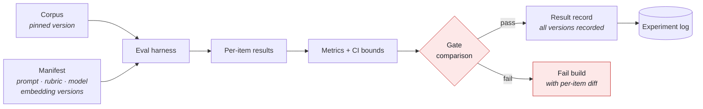
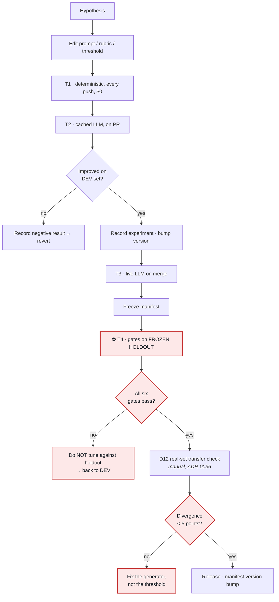

# Phase 9 — AI/ML Pipeline

**Project:** AI Resume Analyzer & Mock Interview Platform
**Status:** Draft — awaiting approval
**Date:** 2026-08-01
**Depends on:** [Phase 3](../requirements/phase-03-requirement-engineering.md) ✅ · [Phase 7](phase-07-ai-system-design.md) ✅ · [Phase 8](phase-08-dataset-strategy.md) ✅

---

## 0. An honest reframe

The charter asks for a training pipeline, transfer learning, fine-tuning, and a model registry.
Applied literally to this product, most of that would be building infrastructure for work we have
already decided not to do — Phase 1 made training foundation models a non-goal, and ADR-0018
rejected self-hosted training infrastructure.

So the honest position, stated up front:

> **We are not training models at MVP. What we have is a *calibration and evaluation* pipeline —
> and for a prompt-and-rules system, that pipeline is more important than a training pipeline would
> be, because it is the only thing standing between "it seems to work" and "we measured it."**

Every charter topic is covered below, including the ones whose answer is "not yet, and here is
exactly when." That answer is only defensible when it comes with reopening conditions, so each one
has them.

---

## 1. Objective

Define how AI quality is measured, calibrated, versioned, and released: the evaluation harness that
runs the six blocking gates, the calibration procedure for every tunable parameter, the prompt
engineering discipline, and the artefact registry that makes any result reproducible.

---

## 2. Why This Phase Matters

Phase 7 designed the AI. Phase 8 built the measuring instruments. **This phase is where a change is
allowed to reach users.**

Three failure modes it prevents:

1. **Tuning until it passes.** With 50 documents and a dozen tunable thresholds, it is trivially
   easy to overfit — adjusting parameters until the gate goes green, then shipping something that
   performs worse in production than the number implies. §7's holdout discipline is the control,
   and it is the single most important thing in this document.
2. **Untracked prompt drift.** Prompt iteration without an experiment record produces the classic
   outcome: forty variants tried, no memory of which worked, and no way to tell whether today's
   version is better than last week's. §11 makes each iteration an experiment with a record.
3. **Unreproducible results.** A metric is meaningless without the corpus, prompt, rubric, and model
   versions behind it. ADR-0038 established this for datasets; §13 completes it for every other
   artefact.

---

## 3. Deliverables

- [x] What is trained, configured, prompted, and rule-based (§4)
- [x] Evaluation harness design and tiered execution (§5–§6)
- [x] Small-data validation strategy and holdout discipline (§7)
- [x] Calibration pipeline for every tunable parameter (§8)
- [x] Feature engineering and the deferred learned classifier (§9)
- [x] Embedding pipeline: chunking, normalisation, re-indexing (§10)
- [x] Prompt engineering discipline and the techniques we reject (§11)
- [x] Transfer learning, fine-tuning, and RAG — verdicts with reopening conditions (§12)
- [x] Artefact registry and experiment tracking (§13–§14)
- [x] Release flow for an AI change (§15)
- [x] ADR-0039 … ADR-0043

---

## 4. What Kind of System Is This, Really

| Component | Mechanism | Learned? | Calibrated? |
|---|---|:--:|:--:|
| Text extraction | Library | ❌ | ❌ |
| Layout analysis | Geometry | ❌ | ✅ thresholds |
| Section detection L1–L2 | Lexicon + typography | ❌ | ✅ thresholds |
| Section detection L3 | Sequence classifier | ⚠️ **deferred** (§9.3) | — |
| Entity extraction | Regex + pretrained spaCy | ◐ pretrained | ✅ confidence floors |
| Skill normalisation | Taxonomy + fuzzy | ❌ | ✅ fuzzy threshold |
| Embeddings | Pretrained model | ◐ pretrained | ❌ |
| Matching | Hybrid retrieval + arithmetic | ❌ | ✅ **floors + fusion weights** |
| ATS scoring | Rubric arithmetic | ❌ | ✅ **point values** |
| Content judgements | Prompted LLM | ❌ | ✅ prompt |
| Guard | Deterministic checks | ❌ | ✅ fuzzy thresholds |
| Question generation | Prompted LLM | ❌ | ✅ prompt |
| Answer evaluation | Prompted LLM + arithmetic | ❌ | ✅ rubric + prompt |

**Nothing is trained from scratch. Two things are pretrained and used as-is. Roughly a dozen
parameters are calibrated.** That dozen is what §8 is about, and it is where quality actually comes
from in a system like this.

---

## 5. The Evaluation Harness

One harness runs every gate, emitting a structured result record.



**Result record** — every field is required, because a missing one makes the number uninterpretable:

```json
{ "run_id": "...", "gate": "section_f1",
  "value": 0.913, "ci_95": [0.871, 0.947], "n": 50, "threshold": 0.90, "passed": true,
  "corpus_version": "1.2.0", "rubric_version": "1.0.0", "prompt_manifest": "2026-08-01-a",
  "model": "<pinned-id>", "embedding_model": "<pinned-id>", "commit": "abc123",
  "cost_usd": 0.42, "duration_s": 118 }
```

**Confidence intervals are reported, not just point estimates** (R-55). At n=50, an F1 of 0.913
carries a 95% interval of roughly ±0.04. Reporting `0.913` alone invites treating a 0.905→0.913
change as an improvement when it is noise. **The gate compares the point estimate to the threshold;
the interval tells you how much to trust the comparison** — and a lower bound below the threshold is
flagged as "passing, but not confidently."

## 6. Tiered Execution — Because Evals Cost Money

Running the full suite on every push would call the LLM hundreds of times per commit. At a
₹8-per-analysis budget and a $150/month ceiling, **eval spend could plausibly exceed production
spend.** That is an absurd outcome, and it is avoided by tiering:

| Tier | When | Contents | Cost | Duration |
|---|---|---|---|---|
| **T1 · Deterministic** | **Every push** | Layout signals, section L1–L2, entities, skills, rubric arithmetic, guard logic — **no model calls at all** | **$0** | < 60 s |
| **T2 · Cached LLM** | Every PR | Full pipeline against a **frozen response cache**; detects prompt/rubric changes without new calls | ~$0 | < 3 min |
| **T3 · Live LLM** | Merge to main + nightly | Full suite with live calls; refreshes the T2 cache | ~$2–5 | ~10 min |
| **T4 · Release** | Before each release | T3 + holdout gates + D12 real-set transfer check (manual, per ADR-0036) | ~$5–10 | ~30 min |

> **T1 exists because Phase 7's deterministic-first design made it possible.** Roughly 70% of the
> pipeline can be fully tested on every push, for free, in under a minute — the practical dividend
> of ADR-0029. A pure-LLM architecture would have no T1 tier at all.

**T2's frozen response cache** is the useful trick: model responses for corpus items are recorded
once and replayed. A prompt change invalidates the affected entries and only those re-run live. So
PR feedback stays fast and free while remaining sensitive to the changes that matter.

---

## 7. Validation With Small Data ⭐

This is the section most likely to be got wrong, and the consequences are invisible until
production.

### The problem

With 50 documents and ~12 tunable parameters, a conventional 60/20/20 split leaves 10 test
documents. One document is 10% of the test metric. And **every time a threshold is adjusted against
the test set, that set is partly consumed** — after twenty such adjustments, the "held-out" score is
optimistic and nobody can say by how much.

This is how a project ships a parser reporting F1 0.92 that performs at 0.84 on real inputs.

### The design ([ADR-0040](../adr/0040-frozen-holdout-and-k-fold-calibration.md))

```
Corpus (50 → 150)
├── DEVELOPMENT SET (70%)  ── k-fold cross-validation for all calibration
│                             looked at freely; iterated on freely
└── FROZEN HOLDOUT (30%)   ── ⛔ touched ONLY at release gates (T4)
                              never used for tuning, never inspected during iteration
```

**Four rules:**

1. **Calibration uses k-fold cross-validation on the development set only.** Every parameter is
   tuned against out-of-fold predictions, never against data used to fit it.
2. **The holdout is opened at release gates only.** Not during iteration. Not "just to check."
3. **Holdout access is logged.** Each access records the manifest version and result. The log makes
   over-consumption visible: if the holdout has been evaluated forty times this month, its score is
   no longer trustworthy and we know it rather than assuming otherwise.
4. **The parameter budget is bounded.** Tuning n parameters against m documents overfits when n is
   large relative to m. Our budget is **≤ 12 tuned parameters against ≥ 50 development documents**.
   Exceeding it requires expanding the corpus first — expansion is a config change (ADR-0035), so
   this is a cheap constraint to honour.

**When the corpus grows** (MINOR bump, ADR-0038), new items are assigned to development or holdout
by a **deterministic hash of the document ID**, not randomly — so an item never migrates between
sets across corpus versions, which would silently contaminate the holdout.

### Leakage hazards specific to us

| Hazard | Control |
|---|---|
| Same synthetic *content* rendered into different templates lands in both sets | Split by **content ID**, not by document — all renderings of one persona stay together |
| Bias-perturbation variants split across sets | D4 variants are a single unit; all 12 stay together |
| LLM response cache built on holdout items during development | Cache is keyed and partitioned by set; the dev cache cannot contain holdout responses |
| The D12 real set used for tuning | ADR-0036 makes it manual and release-only; **validation only, never calibration** |

---

## 8. Calibration Pipeline

Every tunable parameter, its objective, and its method. **Nothing ships as a guess.**

| # | Parameter | Objective | Method | Risk addressed |
|---|---|---|---|---|
| 1 | Layout gutter width threshold | Max F1 on `layout_truth.columns` | Grid over D2 | R-44 |
| 2 | Text-density OCR trigger | Max recall of scanned docs, min false OCR | Grid over D2 | — |
| 3–4 | Section cascade L1/L2 confidence floors | Max section F1 subject to **L4 (LLM) rate ≤ 20%** | Grid, k-fold | R-46, cost |
| 5 | Entity confidence floors | Max accuracy subject to precision ≥ 0.95 | Grid, k-fold | — |
| 6 | Skill fuzzy-match threshold | Max F1 on skill extraction | Grid | — |
| 7–8 | Match `matched` / `partial` floors | Max agreement with D6 human labels | Grid over D6 | **R-47** |
| 9 | RRF fusion weight (lexical vs semantic) | Max NDCG on D6 | Grid over D6 | R-47 |
| 10 | Guard entity fuzzy threshold | **Zero** fabrication misses, min over-trigger on D7's accept cases | Constrained search | **R-49** |
| 11 | Rubric category weights | Max Cohen's κ vs D11 expert ratings | Constrained search | NFR-AI-005 |
| 12 | Rubric rule point values | Max κ, subject to interpretability | Constrained search | NFR-AI-005 |

**Constrained rather than free optimisation, for two of these.** Parameter 10 is optimised subject
to a **hard zero-miss constraint** — fabrication tolerance is not a trade-off against over-trigger
rate. Parameters 11–12 are optimised subject to remaining explainable: a rubric where "missing
education" costs 7.3 points is unpublishable, so values are constrained to a sensible grid. **An
optimiser that produces an unexplainable rubric has optimised the wrong objective.**

**Rubric calibration depends on D11**, the expert rating set. If no expert is available (Phase 8
Q2), NFR-AI-005 is explicitly deferred and rubric weights are set by reasoned judgement with the
gap declared — **not** by measuring our agreement with ourselves, which would be meaningless.

---

## 9. Feature Engineering

### 9.1 Layout features (deterministic, feed the rubric)

Word-level: `x0, x1, top, bottom, font_size, font_name, is_bold`.
Derived per line: `font_size_z_score` (vs document median), `indentation`, `whitespace_above`,
`is_all_caps`, `char_count`, `ends_with_colon`, `y_band_repeats_across_pages`.
Derived per page: `column_count`, `gutter_positions`, `table_regions`, `image_regions`,
`text_coverage_ratio`.

These are not ML features in the usual sense — they *are* the ATS-hostility signals the rubric
consumes directly (Phase 7 §8). They would also be the feature set for §9.3's classifier.

### 9.2 Matching features

Per unit: normalised embedding, lexical tokens, extracted skill IDs, section provenance, recency.
Per requirement: `kind`, `importance`, extracted skills, source span.

### 9.3 The learned classifier — designed, and deliberately deferred

Phase 7's cascade includes a Layer 3 sequence classifier over line features. It is **specified but
not built at MVP** ([ADR-0043](../adr/0043-defer-learned-section-classifier.md)).

**Why defer:** with 50 documents, a supervised classifier risks fitting the generator's conventions
rather than resume structure — and Phase 8 already flags generator homogeneity as R-52. A model that
learns "our templates put Skills after Education" would score well on the corpus and fail on real
documents, and the D12 set is too small to reliably catch it.

**The discipline:** build Layers 1–2, measure, and **only** introduce Layer 3 if the F1 gate is
missed. If rules and typography reach 0.90, a learned layer adds training infrastructure,
non-determinism, and a deployment artefact for no gain.

**Specified for when it is needed:** gradient-boosted trees or a linear-chain CRF over the §9.1
features — not a transformer. Small, fast, CPU-only, interpretable, trainable in seconds, and
deployable as a pickled artefact. A transformer here would add latency and deployment weight for a
task that is fundamentally about typography and ordering.

---

## 10. Embeddings

| Decision | Choice | Reasoning |
|---|---|---|
| **What is embedded** | Units, not documents (ADR-0031) | Document-level cosine is unexplainable and insensitive |
| Unit definition | One bullet, skill entry, or project description; requirements individually | Matches how a recruiter reads |
| Preprocessing | Whitespace normalisation, ligature repair; **no stemming or stop-word removal** | Modern encoders expect natural text |
| Normalisation | L2 to unit length | Makes cosine equal dot product; pgvector `vector_cosine_ops` |
| Dimension | Model-determined, pinned in the manifest | Column type is fixed; changing it is a migration |
| Storage | `matching.embeddings`, HNSW index | Phase 6 §18 |
| Caching | By `text_hash + model_id` | Identical text embeds once, ever |
| Selection criteria | **Retrieval quality on D6**, not public benchmarks | §10.2 |

### 10.1 Re-indexing when the model changes

Embedding model changes are not migrations, because embeddings are derived (Phase 4 §13). The
procedure is expand/contract, exactly as Phase 6 §21 prescribes:

```
1. Add embedding_v2 column with the new dimension
2. Backfill in batches from source text (rate-limited, resumable)
3. Shadow-evaluate: run D6 against both, compare NDCG
4. Switch reads to v2 behind a feature flag
5. Drop v1 in a later release
```

**Thresholds must be re-calibrated after a model change**, not carried across. Similarity scales
differ between models, and a floor tuned for one produces confident nonsense on another (R-47).

### 10.2 The domain-gap question

General-purpose embedding models are trained on web text. Resume and JD language is idiosyncratic —
dense noun phrases, abbreviations, and heavy jargon. Whether a general model handles this well is an
**empirical question, and we treat it as one**: Phase 10 evaluates candidates on D6 retrieval
quality, not on public leaderboards. If retrieval quality is inadequate across all candidates, the
options in order are: strengthen the alias/taxonomy layer (cheap, deterministic, and it improves
explainability too), then consider a domain-adapted model, and only then contemplate fine-tuning
under §12.2's conditions.

---

## 11. Prompt Engineering as a Discipline

### 11.1 Prompts are versioned artefacts

Stored as files under `packages/ai_port/prompts/<task>/<version>.md`, content-hashed, referenced by
a **manifest** that pins every prompt in use. `platform.ai_calls.prompt_version` records which
version produced every artefact (FR-ATS-005's discipline, extended).

### 11.2 The iteration loop

```
Hypothesis → edit prompt → T2 eval on DEV set → compare vs current manifest
   → if improved: record experiment, bump prompt version
   → if regressed: record experiment (negative results are data), revert
   → freeze manifest → T4 gates on HOLDOUT → release
```

**Negative results are recorded.** The most common waste in prompt work is re-trying a variant that
was already tried and failed three weeks ago, because nobody wrote it down.

### 11.3 Techniques used

| Technique | Why |
|---|---|
| **Schema-constrained output** | Non-negotiable; the guard's first check (FR-IMP-007) |
| **Channel separation** with delimiters | The structural injection defence (Phase 7 §23) |
| **Decomposition into decidable questions** | ADR-0030 — the basis of σ ≤ 2 |
| **Grounded few-shot examples** | Demonstrated behaviour must match what the guard enforces |
| **Explicit refusal instructions** | "If the source does not state it, omit it" |
| **Span citation requirements** | Makes evidence a schema field, not a request |
| **Tight `max_tokens` from schema shape** | Cost and latency control |

### 11.4 Techniques deliberately not used

| Technique | Why not |
|---|---|
| **Chain-of-thought in the response** | Costs tokens on every call, leaks reasoning into user-visible output, and **adds variance — directly against σ ≤ 2** |
| **Self-consistency (sample N, take majority)** | N× the cost and latency; and it *manufactures* determinism rather than achieving it, masking an unstable prompt instead of fixing it |
| **Very long system prompts** | Paid on every call; usually a substitute for decomposing the task properly |
| **Model-generated prompts (auto-prompting)** | Optimises against the dev set with no interpretability — an efficient overfitting machine at n=50 |
| **Temperature > 0 for "creativity"** | Every degree of freedom is variance we then have to control elsewhere |

> Rejecting self-consistency deserves a note, because it is a well-regarded technique. It genuinely
> improves accuracy on hard reasoning tasks. Our problem is not reasoning difficulty — it is
> reproducibility and cost. Sampling five times and voting hides an unstable prompt behind
> expensive averaging. **Fix the prompt.**

### 11.5 Prompt regression suite

Every prompt has fixed inputs with expected output *properties* — not exact strings, which would be
brittle: *"returns valid schema", "cites at least one span", "does not introduce a new ORG", "flags
the ambiguous date"*. Runs in T2 on every PR.

---

## 12. Transfer Learning, Fine-Tuning, and RAG

### 12.1 Transfer learning — yes, and it is most of what we use

Everything pretrained is transfer learning: spaCy's NER, the sentence encoder, and the LLM itself.
We use them as-is, with domain adaptation via **rules and taxonomies rather than weight updates** —
cheaper, deterministic, inspectable, and immediately correctable when wrong.

### 12.2 Fine-tuning — no, and here is exactly when that changes

**Not at MVP** ([ADR-0039](../adr/0039-no-finetuning-at-mvp.md)).

Four reasons: we lack the data (ADR-0012 forbids training on user content without opt-in, and
synthetic data would teach the generator's conventions rather than reality); prompting is not yet
exhausted, and you cannot know fine-tuning helps until you have measured what prompting achieves;
a fine-tuned model is an artefact to version, host, monitor, and retrain — infrastructure ADR-0018
rejected; and it defeats the provider-swap portability that ADR-0015's port exists to preserve.

**Reopening conditions — all three must hold:**

1. Prompting has plateaued below a gate after genuine iteration, documented in the experiment log
2. ≥ 5,000 opted-in, de-identified, labelled examples exist for the specific task
3. A cost or latency model shows fine-tuning wins, measured — not assumed

**Most likely first candidate:** section classification, where a small task-specific model could
replace the Layer-4 LLM fallback entirely. That is a bounded, well-defined task with clear labels —
unlike "rewrite this bullet," where fine-tuning would risk eroding the grounding behaviour ADR-0032
depends on.

### 12.3 RAG — a distinction worth being precise about

**Retrieval and RAG are not the same thing, and they get conflated constantly.**

- **Retrieval** = finding relevant items. We do this extensively: hybrid retrieval matches
  requirements to resume evidence (ADR-0031). This is core to the product.
- **RAG** = retrieving external documents to ground a *generation*. **We do not do this, and the
  core loop does not need it** ([ADR-0041](../adr/0041-no-rag-in-core-loop.md)).

Why not: the grounding source for every generation is **the user's own resume and the pasted JD** —
both already in context, both small enough to fit comfortably. Adding a retrieval step would
introduce a corpus to maintain, a new failure mode (retrieving the wrong context), and latency, to
solve a grounding problem that ADR-0032's guard already solves more directly and more verifiably.

**Where RAG genuinely earns its place later**, designed as extension points rather than built:

| Use case | Horizon | Why RAG fits |
|---|---|---|
| **Learning-path recommendations** (F-34) | H2 | Needs a maintained corpus of courses and resources — genuinely external knowledge |
| ATS-behaviour knowledge base | H2/H3 | Vendor-specific parser quirks; grows over time; naturally retrievable |
| Role-specific interview grounding | H3 | A curated bank of question patterns per role |
| Company-specific interview prep | H4 | Retrieval over company research |

The `ai_port` (ADR-0015) already provides the seam: a RAG-backed adapter composes into the existing
decorator chain without touching any module.

---

## 13. The Artefact Registry

For a prompt-and-rules system, "model registry" means something different from a weights store —
and MLflow at MVP would be adopting a tool for a problem we do not have.

**Instead: one pinned manifest, version-controlled**
([ADR-0042](../adr/0042-pinned-manifest-as-registry.md)):

```yaml
# ai-manifest.yaml — the single source of truth for what "the AI" currently is
manifest_version: "2026-08-01-a"
models:
  inference_small:  { provider: <tbd Phase 10>, id: <pinned>, temperature: 0 }
  inference_medium: { provider: <tbd Phase 10>, id: <pinned>, temperature: 0 }
  embedding:        { provider: <tbd Phase 10>, id: <pinned>, dimensions: <tbd> }
prompts:
  section_fallback:   v3
  content_judgements: v7
  jd_requirements:    v4
  rewrite:            v9
  question_generation: v5
  answer_evaluation:  v6
rubrics:
  ats: { version: "1.0.0", locales: [en-IN, en-US] }
  interview: { version: "1.0.0" }
thresholds: { file: calibration/thresholds-v3.yaml }
corpus: "1.2.0"
```

**Why a file rather than a service:** it is diff-reviewable in a pull request (you can *see* that a
model changed), it is atomic with the code, it needs no infrastructure, and reproducing any state is
`git checkout`. Phase 15 revisits tooling if the system outgrows it — the trigger being multiple
concurrent model variants or a genuine A/B testing need.

**Every production artefact and every eval result records the manifest version.** A disputed score
resolves to an exact configuration.

---

## 14. Experiment Tracking

An experiment log — one append-only JSONL file in the repository — recording every attempt:

```json
{ "id": "exp-0042", "date": "2026-08-01", "hypothesis": "Explicit span-citation requirement
  reduces ungrounded rewrites", "changed": "prompts/rewrite v8→v9",
  "dev_metrics": {"fabrication_rate": 0.00, "guard_reject_rate": 0.11},
  "baseline":    {"fabrication_rate": 0.02, "guard_reject_rate": 0.08},
  "verdict": "adopted", "notes": "Reject rate up 3pts — acceptable for eliminating fabrication" }
```

Recorded for **adopted and rejected** experiments alike. The rejected ones are the more valuable
half: they stop the same idea being retried in three months.

Phase 15 evaluates whether MLflow or Weights & Biases earn their place. At one or two engineers
running perhaps a few experiments a week, a text file in Git is genuinely competitive — it is
diffable, greppable, needs no service, and is atomic with the code it describes.

---

## 15. Release Flow for an AI Change



**Step L is the discipline that makes everything else work.** When a holdout gate fails, the
correct response is to return to the development set — never to adjust parameters against the
holdout. Doing so once converts the holdout into a second development set, silently, permanently,
and without anyone noticing.

---

## 16. Best Practices Applied

- **Frozen holdout with logged access** — over-consumption is visible rather than assumed absent
- **Parameter budget bounded relative to corpus size** — overfitting prevented structurally
- **Deterministic split by content ID**, so corpus growth cannot contaminate the holdout
- **Confidence intervals reported**, so noise is not mistaken for progress
- **Tiered evals** — free deterministic checks on every push; live calls only where they earn it
- **Negative experiments recorded**, so failed ideas are not re-tried
- **Constrained optimisation** where the objective has hard limits (zero fabrication) or
  interpretability requirements (publishable rubric)
- **Manifest as a reviewable file** — a model change is visible in a diff
- **Deferred decisions carry reopening conditions**, not vague intentions

---

## 17. Security & Privacy Considerations

| Concern | Control |
|---|---|
| Eval data leaking into training | We do not train; if fine-tuning is ever adopted, ADR-0039's conditions require opted-in, de-identified data |
| Real resumes in the eval pipeline | ADR-0036 — D12 is manual, release-only, never in CI |
| Prompt files containing sensitive data | Prompts are templates; few-shot examples use synthetic content only, checked in CI |
| Injection payloads in the repository (D8) | Clearly marked; executed only inside the eval harness, never against production |
| Cost-based DoS via the eval suite | Tiered execution; T3/T4 spend is capped and alerted like production spend |
| Manifest tampering | Version-controlled and code-reviewed; a model change cannot ship unnoticed |

## 18. Scalability Considerations

- Corpus growth increases T3/T4 duration linearly — mitigated by parallel eval execution and by T2's
  response cache
- Eval cost scales with corpus size; the tiering keeps the frequent tiers free
- Calibration is offline and infrequent — no production path
- Embedding re-index is batched, rate-limited, and resumable; a model change is an operation, not an
  outage
- If eval duration ever exceeds the CI budget, the response is sampling with confidence intervals —
  **explicitly logged as sampled**, never a silent reduction in coverage

---

## 19. Risks (Phase 9 additions)

| ID | Risk | P×I | Mitigation |
|---|---|:--:|---|
| **R-56** | **Holdout gets consumed through repeated access; reported quality is optimistic** | 🔴×🔴 | Access logged and counted; release-gate-only policy; a MAJOR corpus bump resets the baseline |
| **R-57** | Calibration overfits 12 parameters to 50 documents | 🟠×🔴 | k-fold on dev only; parameter budget; **corpus must grow before the budget does** |
| R-58 | Eval spend rivals production spend | 🟠×🟠 | Tiered execution; T1 free and covers ~70%; T3/T4 capped and alerted |
| R-59 | Rubric calibration impossible without an expert panel | 🟠×🟠 | If D11 is unavailable, NFR-AI-005 is **explicitly deferred and declared** — never self-assessed |
| R-60 | Prompt improvements on dev don't transfer to holdout | 🟠×🟠 | Expected sometimes; the flow handles it — return to dev, never tune on holdout |
| R-61 | Embedding model change silently degrades matching | 🟠×🔴 | Shadow evaluation on D6 before switching; thresholds re-calibrated, never carried across |

---

## 20. Production Readiness Checklist — Phase 9 Exit

| # | Criterion | Status |
|---|---|---|
| 1 | Honest account of what is trained vs calibrated vs prompted | ✅ |
| 2 | Eval harness with a complete result record | ✅ |
| 3 | **Tiered execution so eval cost stays bounded** | ✅ |
| 4 | **Frozen holdout discipline with logged access** | ✅ ADR-0040 |
| 5 | Leakage hazards identified and controlled | ✅ |
| 6 | Every tunable parameter has an objective and method | ✅ 12 parameters |
| 7 | Constrained optimisation where hard limits apply | ✅ |
| 8 | Feature engineering specified | ✅ |
| 9 | Learned classifier designed but **gated on measured need** | ✅ ADR-0043 |
| 10 | Embedding pipeline incl. re-indexing procedure | ✅ |
| 11 | Prompt discipline, incl. techniques rejected | ✅ |
| 12 | Transfer learning / fine-tuning / RAG verdicts with reopening conditions | ✅ ADR-0039/0041 |
| 13 | Artefact registry | ✅ ADR-0042 |
| 14 | Experiment tracking incl. negative results | ✅ |
| 15 | Release flow with holdout gates | ✅ |
| 16 | ADR-0039…0043 recorded | ✅ |
| 17 | Corpus built; calibration actually run | ⬜ **S1–S3** |
| 18 | Phase 9 approved | ⬜ |

---

## 21. Open Questions

1. **Holdout proportion** — 30% of 50 is 15 documents, which makes holdout metrics noisy. Options:
   accept wide confidence intervals at MVP, or build 150 documents up front for a 45-document
   holdout. *(Lean: start at 50/30% to answer "is parsing viable" fastest, and expand to 150 before
   the S2 gate, when the score-quality question becomes the binding one.)*
2. **Expert panel (D11)** — still open from Phase 8. It determines whether rubric point values are
   *calibrated* or *reasoned*. Both are defensible; only one is measurable, and I want to state
   which we did.
3. **T3 nightly budget** — a nightly live-eval run at roughly $2–5 is $60–150/month, which against a
   $150 infrastructure ceiling is significant. *(Lean: nightly on main only, not per-branch; T2's
   cache covers PR feedback. Confirm you're comfortable with that spend.)*
4. **Layer 3 classifier** — comfortable deferring it until Layers 1–2 are measured? *(This is the
   one place I'm deliberately declining to build ML, and I'd rather that be an agreed decision than
   a quiet omission.)*

---

## 22. Phase 9 Summary

| Question | Answer |
|---|---|
| **Are we training models?** | No. This is a calibration and evaluation pipeline — and for a prompt-and-rules system, that matters more |
| **What actually gets tuned?** | 12 parameters: layout thresholds, cascade floors, match floors, fusion weights, guard fuzziness, rubric weights and points |
| **How is overfitting prevented?** | Frozen holdout opened only at release gates, access logged; k-fold on dev; parameter budget bounded by corpus size |
| **What if a holdout gate fails?** | Return to the development set. **Never tune against the holdout** — once is enough to destroy it |
| **How is eval cost controlled?** | Four tiers. **T1 is free, runs on every push, and covers ~70%** — the dividend of deterministic-first design |
| **Fine-tuning?** | No, with three explicit reopening conditions. First candidate would be section classification |
| **RAG?** | Not in the core loop — grounding comes from the user's own documents, already in context. Extension points designed for learning paths and an ATS knowledge base |
| **What is the registry?** | A pinned YAML manifest in Git. A model change is visible in a diff, and any state is reproducible with `git checkout` |
| **Biggest new risk?** | R-56: holdout consumption. It fails silently and makes every reported number optimistic |

---

**Do you approve this phase? Shall we move to the next one?**
