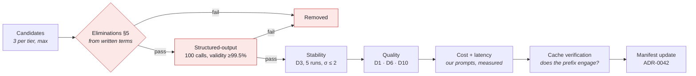

# Phase 10 — Model Comparison

**Project:** AI Resume Analyzer & Mock Interview Platform
**Status:** Draft — awaiting approval
**Date:** 2026-08-01
**Depends on:** [Phase 5](../architecture/phase-05-technology-stack.md) ✅ · [Phase 7](phase-07-ai-system-design.md) ✅ · [Phase 8](phase-08-dataset-strategy.md) ✅ · [Phase 9](phase-09-ai-ml-pipeline.md) ✅

---

## 0. What I can and cannot state precisely

Model IDs and pricing change on a scale of weeks. Rather than answer from memory, I checked the
current Claude model reference; that data is **cached as of 2026-06-24** and is reproduced
verbatim in §7. It is the only pricing in this document I can state as fact.

For every other provider — OpenAI, Google, Mistral, DeepSeek, Meta — I have **not** verified
current model names or per-token pricing, and I will not invent them. Those sections give
**capabilities, licensing, and selection criteria**, tagged `[TO VERIFY]` wherever a number or a
current model name would be needed.

This turns out to be the more useful document anyway. A pricing table dated today is stale next
quarter; **a selection procedure and a bake-off protocol remain valid** — §14 is the deliverable
that actually decides this, and you can re-run it whenever the market moves.

---

## 1. Objective

Select the model classes and providers for every AI-invoking module, with elimination criteria
applied before quality is even measured, a cost model checked against NFR-COST-001, and a bake-off
protocol that makes the choice evidence-based rather than asserted.

---

## 2. Why This Phase Matters

Three failure modes:

1. **Choosing on benchmarks.** Public leaderboards measure general reasoning. Phase 7 needs
   *stable categorical judgement with span citation* (ADR-0030) and *reliable structured output*
   (FR-IMP-007). A model that tops a reasoning benchmark and returns malformed JSON 3% of the time
   is worse for us than a weaker model that never does.
2. **Choosing on price alone.** Phase 5 §22 showed the budget is tight, but a cheaper model that
   fails the S2 determinism gate costs infinitely more, because the product doesn't ship.
3. **Discovering a legal constraint after building.** §5 eliminates candidates on
   **non-negotiable** grounds before any quality evaluation — and §10 contains a licensing finding
   that would have been expensive to hit in month three.

> **Governing principle: eliminate first, then measure, then price.** A model that fails an
> elimination criterion is not a cheap option — it is not an option.

---

## 3. Deliverables

- [x] Hard elimination criteria applied before evaluation (§5)
- [x] Task → model-class mapping (§6)
- [x] Claude model data, verified (§7)
- [x] Other commercial providers: capabilities and criteria (§8)
- [x] Open-weight models: hosted vs self-hosted (§9)
- [x] Specialised models — spaCy, sentence-transformers, BERT/RoBERTa, LayoutLM, Whisper (§10)
- [x] ⚠️ LayoutLM licensing finding (§10.4)
- [x] Embedding model selection procedure (§11)
- [x] Cost model with real arithmetic against NFR-COST-001 (§12)
- [x] Prompt caching as the primary cost lever (§13)
- [x] Bake-off protocol (§14)
- [x] Recommendation (§15)
- [x] ADR-0044 … ADR-0048

---

## 4. Selection Criteria

Weighted, and applied **after** the eliminations in §5.

| # | Criterion | Weight | Origin |
|---|---|:--:|---|
| M1 | **Structured-output reliability** — schema-constrained JSON, ≥99.5% first-attempt validity | 25% | NFR-AI-007, FR-IMP-007 |
| M2 | **Output stability on categorical tasks** — σ ≤ 2 achievable | 20% | NFR-AI-003, ADR-0030 |
| M3 | **Cost per operation** | 20% | NFR-COST-001/002 |
| M4 | **Latency** — fits the 25 s inference budget | 15% | NFR-PERF-004 |
| M5 | **Prompt caching support** | 10% | §13 — the largest cost lever |
| M6 | **Quality on our evals** (D1–D11), not public benchmarks | 10% | Phase 8 |

**Note what is weighted lowest.** General model quality is 10%, because Phase 7's design
deliberately narrowed each call to a decidable question. When the model's job is "does this bullet
start with an action verb, and where," raw reasoning power matters far less than returning valid,
stable, cited JSON.

---

## 5. Hard Eliminations — Applied First

These are not scored. A candidate failing any one is removed before evaluation
([ADR-0044](../adr/0044-model-selection-criteria.md)).

| # | Criterion | Origin | Why it eliminates |
|---|---|---|---|
| **E1** | **Contractual guarantee of no training on our data** | ADR-0012 | We promise users their content is never used for training without opt-in. A provider that trains on API inputs makes that promise false. **Evaluated before accuracy or cost.** |
| **E2** | **DPA available; documented transfer safeguard** | NFR-CMPL-001/003 | India-first + US-hosted inference is an international transfer on every analysis |
| **E3** | **Schema-constrained structured output** | FR-IMP-007 | Without it the guard's first check has nothing to validate against and Phase 7's design does not work |
| **E4** | **Documented data retention ≤ 30 days, deletable** | Phase 3 §7.4 | Our retention promise cannot exceed our sub-processor's |
| **E5** | **Commercially licensed for SaaS** | ADR-0023 | Applies to self-hosted weights — see §9 and §10.4 |
| **E6** | **Published rate limits and a support path** | NFR-CAP-001 | Provider rate limits are our first bottleneck (Phase 4 §23) |

> **E1 is the one that would surprise people.** It is a *gating* criterion, not a preference. A
> provider that is cheaper, faster, and more accurate but trains on API inputs is ineligible,
> because using it would make ADR-0012 a lie. That ADR exists precisely so this decision isn't
> re-argued under cost pressure.

---

## 6. Task → Model Class

From Phase 7 §24, now with the eliminations applied.

| Task | Class | Volume | Why |
|---|---|:--:|---|
| Section-detection fallback (L4) | **Small** | Low (≤20% of docs) | Constrained label set, short spans |
| Content-quality judgements | **Small** | High | Categorical, batched, per ADR-0030 |
| Grammar | **Small** | Medium | Extractive |
| JD requirement extraction | **Medium** | Medium | Structured reasoning over long text |
| **Rewrite generation** | **Medium** | Medium | User-visible quality; guarded |
| Question generation | **Medium** | Medium | Creative but bounded per slot |
| Answer evaluation | **Medium** | High (8×/session) | Judgement with span citation |
| Embeddings | **Embedding** | High | §11 |
| ASR (H2 voice) | **Speech** | H2 only | §10.5 |

**Two LLM tiers, not three.** A "large" tier is not justified: every task is either categorical
(small suffices) or bounded generation with a guard behind it (medium suffices). Adding a large
tier would raise cost against the NFR-COST-001 ceiling for quality we cannot demonstrate we need
([ADR-0045](../adr/0045-two-tier-model-routing.md)).

---

## 7. Claude Models — Verified Data

Reproduced from the Anthropic model reference, **cached 2026-06-24**. Prices per million tokens.

| Model | ID | Context | Input | Output |
|---|---|---|---|---|
| Claude Opus 5 | `claude-opus-5` | 1M | $5.00 | $25.00 |
| Claude Sonnet 5 | `claude-sonnet-5` | 1M | $3.00 *(intro $2.00 through 2026-08-31)* | $15.00 *(intro $10.00)* |
| Claude Sonnet 4.6 | `claude-sonnet-4-6` | 1M | $3.00 | $15.00 |
| **Claude Haiku 4.5** | `claude-haiku-4-5` | 200K | **$1.00** | **$5.00** |

Relevant capabilities: schema-constrained structured outputs (satisfies **E3**); **prompt caching**
with cache reads at ~0.1× input and writes at 1.25× (5-minute TTL) — the basis of §13; batch
processing at 50% of standard price; token counting for pre-flight cost estimation.

**Cache minimums differ by model and are not monotonic across generations** — 512 tokens on
Claude Opus 5, 1024 on Sonnet 5, **4096 on Haiku 4.5**. This matters directly: our cacheable prefix
must clear the minimum of whichever model uses it, and Haiku's is the highest of the three.
Verify against §13's prefix design before assuming a cache hit.

`[TO VERIFY]` E1, E2, and E4 — the no-training guarantee, DPA availability, and retention terms —
must be confirmed against current commercial terms before selection, not assumed from this table.

---

## 8. Other Commercial Providers

**Model names and pricing not verified.** What follows is the evaluation framework and the
questions to answer for each, not a claim about current offerings.

| Provider | Assess for | Key questions |
|---|---|---|
| **OpenAI** | Structured outputs, small-tier cost, caching | Does the current small tier meet E3's schema guarantee? What are the no-training-by-default terms for API traffic (E1)? Retention window (E4)? |
| **Google (Gemini)** | Long context, cost, India region availability | ⭐ Does a **Mumbai/India processing region** exist? That would materially simplify NFR-CMPL-003's transfer story and interacts with ADR-0022's residency trigger. Structured output support? |
| **Mistral** | EU hosting, cost, open-weight option | EU processing helps GDPR; does the hosted API meet E1/E3? Which weights are Apache-2.0 vs restricted? |
| **DeepSeek** | Cost | ⚠️ Where is data processed, under what DPA, with what retention (E2/E4)? For a product holding dense PII, this is a compliance question to answer with documents, not a price comparison. Eliminate on E1/E2/E4 or clear them explicitly |
| **AWS Bedrock / Azure / Vertex** | Aggregators | Route to the same underlying models with the cloud provider's DPA and region controls. **Worth evaluating specifically if data residency becomes binding** (ADR-0022) |

### The evaluation procedure, per provider

1. **Eliminations (§5) first**, from written terms — not marketing pages. Any failure ends it.
2. **Structured-output reliability** — run D7's schema-validity check, 100 calls, measure
   first-attempt validity. Below 99.5% (NFR-AI-007) is a fail.
3. **Stability** — same input, 5 runs, on the D3 determinism set. Feeds the σ ≤ 2 gate.
4. **Quality** — on D1/D6/D10, never on public benchmarks.
5. **Cost and latency** — measured on *our* prompts with `count_tokens`-style pre-flight, not from
   the pricing page's example.

**Aggregators deserve a specific note.** Routing through Bedrock, Azure, or Vertex means the
cloud provider's DPA, region selection, and enterprise terms apply — which can resolve E2 and E4
more cleanly than a direct contract, at some cost premium and feature lag. If ADR-0022's India
residency trigger ever fires, this is likely the path.

---

## 9. Open-Weight Models — Llama, Mistral, DeepSeek

Two distinct questions that get conflated:

### 9.1 Self-hosting: rejected

ADR-0018 rejected self-hosted ML infrastructure, and ADR-0039 rejected fine-tuning. Running weights
ourselves means GPU capacity, an inference server, autoscaling, model versioning, and drift
monitoring — for a 1–2 person part-time team with no on-call rotation and a $150/month ceiling.
**Not at MVP.** The reopening conditions are ADR-0018's.

### 9.2 Open weights via a hosted API: eligible, and worth evaluating

Together, Fireworks, Groq, Bedrock, and others serve these models as APIs. Here the model's *weight
licence* mostly does not bind us — we are a customer of a service, not a redistributor — so **the
eliminations apply to the hosting provider's terms, not the model's licence.**

| Model family | Weight licence `[TO VERIFY]` | Relevance |
|---|---|---|
| **Llama** | Meta community licence — **not OSI-approved**; has use restrictions and a scale threshold | Matters only if self-hosting. Read it before ever doing so |
| **Mistral** | Mixed — some Apache-2.0, some restricted per model | Apache-2.0 variants are the cleanest open-weight option if self-hosting is ever revisited |
| **DeepSeek** | Permissive for weights `[TO VERIFY]` | Weight licence is not the concern; §8's E2/E4 questions are |

**Where they could genuinely help:** the **small tier**. Our high-volume categorical work (content
judgements, grammar, section fallback) is exactly the shape open-weight models handle well and
cheaply. If a hosted open-weight small tier clears the eliminations and passes the §14 bake-off on
structured-output reliability, it is a legitimate cost win — and ADR-0015's port makes trying it a
configuration change.

---

## 10. Specialised Models

Here I can be considerably more confident: these are stable, well-documented open-source projects
whose licences have not changed in years.

### 10.1 spaCy — ✅ adopted (Phase 5)

MIT. Tokenisation, sentence segmentation, NER, rule-based matching. Runs on CPU, fast, deterministic
given a pinned model version. Used in Phase 7's cascade layers and in the guard's entity extraction
(ADR-0032). **No API cost.**

### 10.2 sentence-transformers — ✅ candidate for embeddings

Apache-2.0. Self-hostable embedding models, CPU-runnable at our corpus size.

> **Note the asymmetry with §9.1.** Self-hosting a *generative* model needs GPUs and an inference
> service. Self-hosting a *small embedding* model is a Python library call inside the worker we
> already run — no new service, no new tier, no GPU. **This is a genuinely different decision**, and
> a strong candidate for eliminating our second-largest AI cost line.

### 10.3 BERT / RoBERTa — ◐ evaluated, not adopted

Apache-2.0 / MIT. Encoder-only models, excellent for classification and token labelling.

**Where they'd fit:** the Layer-3 section classifier (ADR-0043) — and ADR-0043 already chose
gradient-boosted trees or a CRF over a transformer for that task, because it is typography and
ordering rather than language understanding, and because a small CPU model deploys and runs far
more cheaply. That reasoning stands. Reconsider only if ADR-0043's three conditions are met and the
non-transformer approach proves insufficient.

### 10.4 LayoutLM — ⚠️ **rejected on licensing**

LayoutLM is the obvious candidate for document-layout understanding: multimodal transformers
combining text, layout, and image, designed for exactly the form and document parsing our wedge
depends on.

**LayoutLMv2 and LayoutLMv3 are released under CC BY-NC-SA 4.0** `[VERIFY BEFORE ANY USE]` — a
**non-commercial** licence. Our product is a commercial SaaS platform (ADR-0005), which puts them
outside permitted use. LayoutLM v1 is more permissively licensed but materially weaker.

**This is the second such finding in the project**, after PyMuPDF's AGPL status (ADR-0023). Both are
cases where the technically best tool for our most important component carries a licence we cannot
use — and both are cheap to catch now and expensive to discover after building on the API.

**We were never going to need it anyway**, which is the more interesting point. Phase 7 §8
established that our layout signals are **pure geometry over word bounding boxes** — column
detection by projection profile, tables by rect density, headers by y-band repetition. That is
deterministic, free, instant, reproducible, and testable in CI. LayoutLM would have replaced a
deterministic method with a probabilistic one, adding a model dependency, latency, and variance to
the one part of the system where determinism is the product
([ADR-0047](../adr/0047-reject-layoutlm-non-commercial.md)).

**If layout heuristics prove insufficient (R-44):** the order is (1) improve the geometry, (2)
evaluate permissively-licensed document-layout models, (3) license a commercial one as a costed
decision. The same escalation ladder as ADR-0023's.

### 10.5 Whisper — deferred to H2, criteria stated

MIT. Speech-to-text; the natural choice for H2 voice interviews (F-51).

**Not selected now**, because voice is deferred (ADR-0006) and selecting a model 6+ months before
use guarantees re-doing it. The criteria are recorded so it's a decision rather than a blank page
([ADR-0048](../adr/0048-defer-asr-selection-to-h2.md)):

| Criterion | Why it matters *for us* |
|---|---|
| **Accented-English WER** | ⭐ India-first (ADR-0005). A model with strong US-English WER and poor Indian-English WER is unusable — and it is the single most important criterion |
| Streaming support | NFR-PERF-007's 2.5 s turn latency |
| Word-level timestamps | Required for pace, pause, and filler-word analytics (F-52) |
| Self-host vs API | Self-hosting Whisper needs GPU for real-time — reopens ADR-0018 |
| Cost per minute | NFR-COST: voice is priced at 2 credits/minute |
| **Text parity preserved** | ADR-0011 — voice never replaces text |

---

## 11. Embedding Model Selection

Governed by ADR-0031: we embed **units** (bullets, requirements), not documents.

| Option | Pros | Cons |
|---|---|---|
| **Self-hosted sentence-transformers** | No per-call cost; no data leaves our infrastructure (helps E1/E2 entirely); CPU-runnable at our scale; deterministic | Model quality may trail hosted; container image grows; we own updates |
| **Hosted embedding API** | Often higher quality; no infrastructure | Per-call cost on our highest-volume operation; another sub-processor for PII |

**Selection is empirical** (Phase 7 §10.2). Candidates are evaluated on **D6 retrieval quality —
NDCG and per-requirement coverage accuracy — not on public benchmarks**, because our text is dense
resume/JD jargon that general benchmarks do not represent.

**Decision inputs, in order:** (1) quality on D6, (2) whether self-hosting keeps PII inside our
boundary — a real compliance simplification, (3) cost at volume, (4) dimensionality, since it fixes
the `vector(n)` column and re-indexing is an operation (Phase 6 §18).

**My prior, to be tested not assumed:** self-hosted sentence-transformers wins unless D6 shows a
material quality gap, because it eliminates a per-call cost on our highest-volume AI operation *and*
removes a sub-processor from the PII path. But the whole point of ADR-0031's calibration step is
that this is measured.

---

## 12. Cost Model

Using the **verified** Claude prices from §7 and the project's own implied rate of **₹8 ≈ $0.10**
(from NFR-COST-001). Token estimates are engineering estimates to be validated with pre-flight
counting.

### Per full analysis

```
Stable prefix (system + rubric + few-shot examples)      ~3,000 tokens  ← cacheable
Resume text + structured extract (varies per request)    ~1,500 tokens
Output (categorical judgements + spans, JSON)              ~800 tokens
Calls per analysis (batched judgements)                    3
```

**Small tier (Haiku 4.5, $1 / $5 per MTok):**

| | Uncached | With prefix cached |
|---|---|---|
| Prefix input | 3,000 × $1/1M = $0.0030 | 3,000 × $0.10/1M = **$0.0003** |
| Variable input | 1,500 × $1/1M = $0.0015 | $0.0015 |
| Output | 800 × $5/1M = $0.0040 | $0.0040 |
| **Per call** | **$0.0085** | **$0.0058** |
| **× 3 calls** | **$0.026 ≈ ₹2.0** | **$0.017 ≈ ₹1.4** |

**Against NFR-COST-001's ≤ ₹8 / ~$0.10: comfortable.** Even routing every judgement through the
medium tier (Sonnet 5 at $3/$15) lands near **₹4–5**, still inside budget — which means we have
headroom to use the better model where quality is user-visible.

### Per interview session (NFR-COST-002 ≤ ₹15)

8 questions generated + 8 answers evaluated, medium tier, with a cached prefix per session:
**≈ ₹8–12 estimated.** Inside budget but with less margin than analysis — which is why F-47 caps
free sessions at 5 questions and Pro at 15.

### What this changes

Phase 5 §22 flagged AI spend as the variable that decides whether we stay under $150/month. **This
arithmetic says the analysis path is comfortably affordable**, and the binding constraint is
volume, not per-unit cost. Three consequences:

- The **credit system** (ADR-0007) remains the right control — it bounds volume, which is what
  actually varies.
- We can afford the **medium tier for user-visible generation** (rewrites, questions) while keeping
  the small tier for high-volume categorical work. That is §6's two-tier split, now cost-justified.
- **Caching cuts the analysis path by ~35%** — meaningful, and §13 shows how to actually get it.

> ⚠️ **These are estimates.** Validate with pre-flight token counting on real prompts during S2,
> before treating the headroom as real.

---

## 13. Prompt Caching — the Cost Lever

Distinct from Phase 7 §25's content-hash cache. That one avoids *repeat work*; this one makes
*first-time work* cheaper, and the two compose.

**The mechanism:** caching is a **prefix match**. Any byte change anywhere in the prefix invalidates
everything after it. Render order is `tools` → `system` → `messages`. Cache reads cost ~0.1× input;
writes cost 1.25× (5-minute TTL). Break-even is two requests.

**Our prompts are unusually well suited**, because Phase 7 already designed them this way:

```
STABLE PREFIX (cache this)                        VOLATILE (after the breakpoint)
├─ System instructions          ~800 tokens       ├─ <<<SOURCE_RESUME>>> …
├─ Rubric rules for this task ~1,200 tokens       ├─ <<<JOB_DESCRIPTION>>> …
├─ Output schema                ~400 tokens       └─ Task-specific parameters
└─ Grounded few-shot examples   ~600 tokens
   ────────────────────────────────────────
   ~3,000 tokens — identical across every user
```

The prefix is **identical for every user and every resume**, because the rubric is versioned data
(ADR-0013) and the prompt is a versioned artefact (Phase 9 §11.1). This is the ideal caching shape,
and it exists as a by-product of decisions made for other reasons.

**Design rules** ([ADR-0046](../adr/0046-prompt-caching-stable-prefix.md)):

1. **Nothing volatile in the prefix.** No timestamp, no user ID, no request ID, no locale
   interpolation. Locale-specific rubrics are *separate prefixes*, not a templated one.
2. **Deterministic serialisation.** Sorted JSON keys; a stable tool list. Non-deterministic
   serialisation silently produces a different prefix every request.
3. **Breakpoint at the prefix boundary** — the last stable block, before untrusted content.
4. **Verify, don't assume.** `cache_read_input_tokens` is a monitored SLI. Zero across repeated
   requests means a silent invalidator, and Phase 20 alerts on it.
5. **Mind the minimum.** Haiku 4.5 requires **4096 tokens** to cache at all — higher than Sonnet 5's
   1024 and Opus 5's 512. Our ~3,000-token prefix **would not cache on Haiku 4.5**. Either the
   prefix grows past the minimum on that tier, or the small tier's caching benefit is forgone. This
   is exactly the kind of detail that invalidates a cost model, and it must be settled in the
   bake-off rather than assumed.

> Point 5 is why §12's cached column is marked as an estimate to validate. The arithmetic is right;
> whether the cache actually engages depends on a per-model minimum that our prefix currently sits
> below on the cheapest tier.

---

## 14. The Bake-Off Protocol

This is what actually decides the selection. It reuses the Phase 9 harness, so it is roughly **two
days of work**, not a research project.



| Stage | Measure | Gate |
|---|---|---|
| 0 · Eliminations | E1–E6 from contracts | Any fail → out |
| 1 · Schema validity | 100 calls, first-attempt valid | ≥ 99.5% (NFR-AI-007) |
| 2 · Stability | D3, 5 runs | σ ≤ 2 (NFR-AI-003) |
| 3 · Quality | D1 F1, D6 NDCG, D10 κ | Meets slice gates |
| 4 · Cost | Measured per operation | ≤ ₹8 analysis, ≤ ₹15 session |
| 5 · Latency | p95 per call | Fits the 25 s stage budget |
| 6 · Caching | `cache_read_input_tokens` > 0 | Prefix actually engages |

**Stages 1 and 2 eliminate more candidates than stage 3.** A model that returns malformed JSON or
unstable judgements is unusable regardless of how well it reasons — and given Phase 7's design,
those are the properties we actually depend on.

**Cap the candidate list at three per tier.** More is a research project, and ADR-0015's port makes
switching cheap enough that an imperfect first choice is recoverable.

---

## 15. Recommendation

**A starting configuration, to be confirmed by §14 — not asserted.**

| Component | Recommendation | Reasoning |
|---|---|---|
| **Small tier** | **Claude Haiku 4.5** (`claude-haiku-4-5`, $1/$5) | Cheapest verified option with structured outputs; 200K context is ample. ⚠️ Verify the 4096-token cache minimum against our prefix (§13.5) |
| **Medium tier** | **Claude Sonnet 5** (`claude-sonnet-5`, $3/$15; intro $2/$10 through 2026-08-31) | Structured outputs, prompt caching, 1M context; §12 shows it fits the budget for user-visible generation |
| **Fallback provider** | **One non-Anthropic candidate, selected by bake-off** | R-05 (vendor lock-in). ADR-0015 requires two adapters to keep the port honest |
| **Embeddings** | **Self-hosted sentence-transformers**, pending D6 | Removes a per-call cost on the highest-volume operation *and* a sub-processor from the PII path |
| **NER / tokenisation** | **spaCy** (MIT) | Already adopted; no API cost |
| **Layout** | **Geometry only** — no model | ADR-0047; the wedge stays deterministic |
| **Layer-3 classifier** | GBT/CRF **if needed** | ADR-0043; not a transformer |
| **ASR (H2)** | **Deferred**, criteria recorded | ADR-0048; accented-English WER is the deciding criterion |

**Why this shape, stated honestly.** The Claude figures are the only pricing I could verify today,
and both tiers demonstrably satisfy E3 and E5 and support the caching §13 depends on — which is why
they are the *starting* configuration. **The bake-off is what decides**, and E1, E2, and E4 must be
confirmed from current commercial terms for any provider including this one. Because ADR-0015 routes
every call through one port, this is a **low-regret decision**: if a candidate wins on cost or
quality, switching is a manifest change (ADR-0042), not a refactor.

**What I am confident about independent of provider:** the two-tier split (§6), geometry over
LayoutLM (§10.4), spaCy for NER, and self-hosted embeddings as the likely answer. Those follow from
the architecture rather than from any vendor's price list.

---

## 16. Best Practices Applied

- **Eliminate before evaluating** — legal and contractual criteria precede quality
- **Verified data marked as verified; everything else tagged** `[TO VERIFY]`
- **Evaluate on our evals, not public benchmarks** — our task shape is unusual
- **Structured-output reliability weighted above raw quality** — it's what the design depends on
- **Licence checked before capability** — the LayoutLM finding, like PyMuPDF's
- **Cost modelled with real arithmetic**, and its assumptions flagged
- **Self-hosting judged per model class** — embeddings ≠ generation
- **The recommendation is a starting point with a protocol**, not an assertion

---

## 17. Security & Privacy Considerations

| Concern | Control |
|---|---|
| Provider trains on our data | **E1 elimination** — contractual, verified before selection |
| PII to a new sub-processor | E2 DPA; published sub-processor list (FR-PRIV-007); minimisation (FR-PRIV-006) |
| Retention beyond ours | **E4** — provider retention ≤ our own |
| Cross-border transfer | E2 safeguard; ADR-0022's residency trigger; §8 flags India-region availability as a real differentiator |
| Self-hosted embeddings | **Reduces exposure** — the highest-volume operation stops leaving our boundary |
| Model change alters scores | Manifest-pinned (ADR-0042); a change is a reviewable diff and re-runs the gates |
| Provider outage | ADR-0015 fallback adapter; Phase 7 §26 degraded mode keeps the wedge alive |

## 18. Scalability Considerations

- **Provider rate limits are our first bottleneck** (Phase 4 §23) — E6 requires published limits and
  a path to raise them
- **Batch processing at 50%** suits the retention/rollup jobs, though not the interactive path
- **Two tiers scale independently** — high-volume categorical work stays on the cheap tier as usage
  grows
- **Self-hosted embeddings scale with our workers**, not with a third party's quota — removing our
  most volume-sensitive external dependency
- **Prompt caching improves with scale**: a hot prefix stays cached across concurrent users

---

## 19. Risks (Phase 10 additions)

| ID | Risk | P×I | Mitigation |
|---|---|:--:|---|
| **R-62** | **Prices or models change after selection** | 🔴×🟡 | Manifest-pinned; bake-off is re-runnable in ~2 days; ADR-0015 makes switching a config change |
| **R-63** | Small tier fails the schema-validity gate, forcing everything to the medium tier | 🟠×🟠 | Cost model shows medium-tier-everywhere still fits (~₹4–5) — a cost hit, not a blocker |
| **R-64** | **Prompt cache doesn't engage on the small tier** (4096-token minimum) | 🟠×🟠 | Verified in bake-off stage 6; either grow the prefix or forgo caching there and re-run §12 |
| R-65 | Self-hosted embeddings materially worse than hosted on D6 | 🟠×🟠 | Decided by measurement; hosted is the fallback with a known cost |
| R-66 | Provider deprecates a pinned model mid-life | 🟠×🟠 | Manifest pinning makes it visible; migration is a gated release through Phase 9's flow |
| R-67 | E1/E2/E4 unverifiable for an otherwise-strong candidate | 🟡×🟠 | Eliminate. **Not negotiable under cost pressure** — that's what ADR-0044 exists for |

---

## 20. Production Readiness Checklist — Phase 10 Exit

| # | Criterion | Status |
|---|---|---|
| 1 | Every charter-listed model addressed | ✅ |
| 2 | **Hard eliminations defined and ordered before quality** | ✅ ADR-0044 |
| 3 | Task → model-class mapping | ✅ Two tiers |
| 4 | Verified data separated from unverified | ✅ |
| 5 | Open-weight: self-host vs hosted separated | ✅ |
| 6 | **Licence audit; LayoutLM rejected** | ✅ ADR-0047 |
| 7 | Embedding selection procedure | ✅ D6-driven |
| 8 | ASR deferred with criteria | ✅ ADR-0048 |
| 9 | Cost model with arithmetic against the NFR | ✅ ₹1.4–5 vs ₹8 |
| 10 | **Prompt caching designed, with the minimum-size caveat surfaced** | ✅ ADR-0046 |
| 11 | Bake-off protocol with gates | ✅ ~2 days |
| 12 | Recommendation with reasoning and reversibility | ✅ |
| 13 | ADR-0044…0048 recorded | ✅ |
| 14 | Bake-off actually run | ⬜ **S2** |
| 15 | E1/E2/E4 confirmed from contracts | ⬜ **before selection** |
| 16 | Phase 10 approved | ⬜ |

---

## 21. Open Questions

1. ⚠️ **Cache minimum vs prefix size (R-64).** Our ~3,000-token prefix sits below Haiku 4.5's 4096
   minimum, so caching would not engage on the cheapest tier. Options: pad the prefix with genuinely
   useful content (more few-shot examples — which also improves grounding), accept no caching there,
   or run the small tier on a model with a lower minimum. *(Lean: add examples. They earn their
   place twice — better grounding and a working cache.)*
2. **Embeddings — self-hosted or hosted?** My prior is self-hosted, for cost *and* because it keeps
   PII inside our boundary. Any objection to the container growing by a few hundred MB?
3. **Second provider for the fallback adapter.** ADR-0015 wants two real adapters. Any preference,
   or shall the bake-off decide purely on the §14 gates?
4. **India-region inference.** If a provider offers Mumbai-region processing, it simplifies
   NFR-CMPL-003 *and* interacts with ADR-0022's residency trigger. Worth weighting explicitly in the
   bake-off, or treat it as a tiebreaker?

---

## 22. Phase 10 Summary

| Question | Answer |
|---|---|
| **How is the choice made?** | Eliminate on contractual criteria → measure schema validity and stability → then quality → then price |
| **What eliminates first?** | **No training on our data** (ADR-0012). Cheaper, faster, better is irrelevant if it makes our privacy promise false |
| **How many tiers?** | Two — small for categorical, medium for guarded generation. A large tier isn't justified |
| **Starting config** | Haiku 4.5 (small) + Sonnet 5 (medium) + a bake-off-selected fallback; self-hosted embeddings; spaCy for NER |
| **Notable finding** | ⚠️ **LayoutLMv2/v3 are non-commercial (CC BY-NC-SA)** — the second licence catch after PyMuPDF. We don't need it: geometry already does the job, deterministically |
| **What does it cost?** | **≈ ₹1.4–2.0 per analysis** against a ₹8 ceiling — comfortable. Volume, not unit price, is the binding constraint |
| **Biggest cost lever?** | Prompt caching on a ~3,000-token stable prefix — with a caveat: it may not engage on Haiku's 4096-token minimum (R-64) |
| **How reversible?** | Very. ADR-0015's port + ADR-0042's manifest make a provider swap a reviewable config diff |
| **Biggest new risk?** | R-62: the market moves. Mitigated by making the *bake-off* the deliverable rather than the answer |

---

**Do you approve this phase? Shall we move to the next one?**
