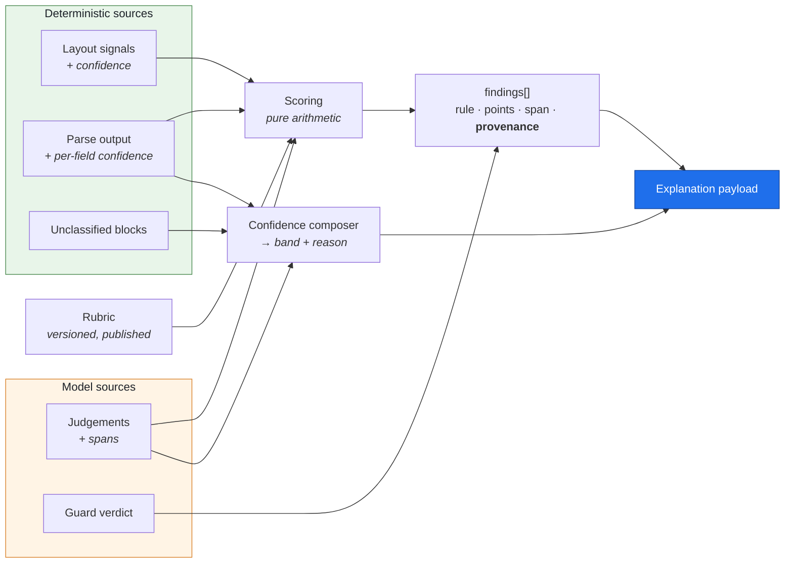

# Phase 11 — Explainable AI

**Project:** AI Resume Analyzer & Mock Interview Platform
**Status:** Draft — awaiting approval
**Date:** 2026-08-02
**Depends on:** [Phase 3](../requirements/phase-03-requirement-engineering.md) ✅ · [Phase 7](phase-07-ai-system-design.md) ✅ · [Phase 8](phase-08-dataset-strategy.md) ✅ · [Phase 9](phase-09-ai-ml-pipeline.md) ✅ · [Phase 10](phase-10-model-comparison.md) ✅

---

## 0. The reframe: explainability is already built

Most projects reach an "explainable AI" phase and start bolting on SHAP plots, attention
visualisations, and confidence bars over a system that was designed opaque.

**We do not have that problem, and it is not luck.** Decisions taken in Phases 6 and 7 for
*other* reasons — determinism, cost, testability — produced an explainable system as a
by-product:

| Decision | Made for | Explainability it delivers |
|---|---|---|
| **ADR-0030** — models emit categorical judgements, never scores | σ ≤ 2 determinism | The score is arithmetic over inspectable judgements |
| **FR-ATS-006** — every deduction cites its source span | Product credibility | "Why?" resolves to a line of the user's resume |
| **ADR-0013** — rubric is versioned, locale-scoped data | Market correctness | The decision rule is a readable document, not code |
| **FR-ATS-005** — rubric/prompt version on every artefact | Score comparability | Any historical score is reproducible |
| **ADR-0032** — guard verifies grounding mechanically | ADR-0004 enforcement | Every rewrite traces to real source text |
| **ADR-0031** — requirement-level matching | Actionable gaps | Every requirement links to the bullet covering it, or to nothing |
| **ADR-0033** — deterministic interview blueprint | Coverage guarantee | "Why this question?" resolves to a ranked gap |
| **Phase 7 §4** — ~70% of the pipeline is deterministic | Cost, latency, testability | Most findings have no model in the causal chain at all |

**So Phase 11's actual job is not to create explainability. It is to:**

1. **Surface** what the system already knows to the user (§5–§8)
2. **Verify** fairness mechanically rather than assert it (§9–§10)
3. **State honestly** what we cannot explain, and refuse to fake it (§8.2)

---

## 1. Objective

Define how the system explains itself: confidence, per-finding provenance, feature contribution,
the limits of model explainability, the fairness measure we actually implement, the ethical
commitments, and what we publish.

---

## 2. Why This Phase Matters

**We produce evaluative judgements about people's employability.** Even under ADR-0002 —
candidate-side only, no hiring decision — a system that quietly penalises certain names,
institutions, or writing styles causes real harm: it tells someone their resume is weak for a
reason that is actually about them, and they act on it.

Three specific drivers:

1. **It is the USP.** Phase 1's third pillar is *"evidence, not vibes."* If a user cannot ask
   "why?" and get a real answer, the product is a scoring toy with a confident tone — which is what
   we said we would not build.
2. **It is a blocking gate.** NFR-AI-006 requires bias variance ≤ 1 point, enforced in CI at slice
   S2. That gate needs a mechanism (§9), not an intention.
3. **It is a regulatory posture.** ADR-0002 keeps us out of the EU AI Act's high-risk employment
   category, but the **transparency obligation** — users must know they are interacting with AI —
   applies regardless. *(Engineering risk assessment, not legal advice; consistent with Phase 3 §7.)*

> **The governing principle: explain the system's decision, not the model's mind.** We can say
> exactly which rule fired, on which line, at which weight, under which rubric version. We cannot
> say why a language model returned a particular judgement — and §8.2 refuses to pretend otherwise.

---

## 3. Deliverables

- [x] The explanation ladder — seven questions and their answers (§5)
- [x] Confidence design, reported as bands (§6)
- [x] Feature contribution, and why SHAP/LIME are rejected (§7)
- [x] Model explainability: what we can and cannot claim (§8)
- [x] Bias detection mechanics and blind spots (§9)
- [x] Fairness definition — invariance, and what we don't implement (§10)
- [x] Ethics: consolidated commitments and the ATS tension (§11)
- [x] Transparency: what we publish (§12)
- [x] Explanation UI contract for Phase 13 (§13)
- [x] ADR-0049 … ADR-0053

---

## 4. What Needs Explaining

| Artefact | Explanation obligation | Difficulty |
|---|---|---|
| ATS score | Full — category breakdown, per-rule contribution, cited spans | ✅ Easy (arithmetic) |
| Parse-fidelity report | Full — it *is* an explanation of what the machine saw | ✅ Trivial |
| Match score | Full — per-requirement coverage, matched via exact/alias/semantic | ✅ Easy |
| Skill gaps | Full — which JD requirement, why uncovered | ✅ Easy |
| Rewrite suggestions | Source span + guard verdict + which finding motivated it | ✅ Easy |
| Interview question | Which gap or resume section it targets | ✅ Easy (blueprint) |
| Answer evaluation | Per-dimension scores with cited spans | ◐ Medium |
| **A specific model judgement** | ⚠️ **Cannot explain the model's reasoning** | ❌ §8.2 |

**Only the last row is hard**, and it is hard for everyone. Everything above it is explainable
because it is arithmetic, geometry, or a documented rule.

---

## 5. The Explanation Ladder

Seven questions a user might ask, and what the system can answer. Each is a data contract for
Phase 13.

| # | Question | Answer available | Source |
|---|---|---|---|
| 1 | *"What's my score?"* | 0–100 + confidence band | `analyses.overall_score`, §6 |
| 2 | *"Why that score?"* | Category breakdown with weights | `category_scores` (FR-ATS-007) |
| 3 | *"Why that deduction?"* | The rule, its points, and **the resume line that triggered it** | `findings.source_span` (FR-ATS-006) |
| 4 | *"What is that rule?"* | The published rubric entry, with version | `rubrics.definition` (§12) |
| 5 | *"How sure are you?"* | Confidence band + stated limitations | §6 |
| 6 | *"What would improve it?"* | Impact-ranked suggestions with estimated point gain | `suggestions.estimated_impact` |
| 7 | ⭐ *"Was AI involved in this?"* | **Per-finding provenance label** | §5.1 |

### 5.1 Per-finding provenance — the novel one

Every finding is labelled with how it was produced:

| Label | Meaning | Example |
|---|---|---|
| 📐 **Measured** | Deterministic geometry or rules. No model involved | "Two-column layout detected" |
| 📋 **Rule** | Deterministic check against the rubric | "No Experience section found" |
| 🤖 **AI judgement** | A model returned a categorical judgement, guard-verified | "3 of 12 bullets lack an action verb" |

This costs nothing — Phase 7's `detector: deterministic | llm` field already records it in the
rubric ([ADR-0051](../adr/0051-per-finding-provenance-labelling.md)). Three consequences:

- **Users calibrate trust appropriately.** "We measured your layout has two columns" warrants more
  confidence than "we judged this bullet to be vague," and pretending otherwise is a small dishonesty
  repeated on every report.
- **It satisfies the AI-transparency obligation precisely** rather than with a blanket
  "AI-powered" banner — the user learns *which* parts involved AI.
- ⭐ **It makes the wedge legible.** A report where the highest-impact findings are labelled
  **Measured** communicates something a competitor's opaque score cannot: *this is not a chatbot's
  opinion, it is what the machine actually saw.*

---

## 6. Confidence

### 6.1 The trap

The easy implementation is to ask the model for a confidence value. **That number is not
calibrated** — a self-reported 0.8 does not mean the judgement is right 80% of the time, and
presenting it as though it does is a false claim dressed as rigour.

### 6.2 Our design: derived from measurable signals

Confidence is computed deterministically from things we actually know:

| Signal | Direction | Why |
|---|---|---|
| Parse confidence (mean per-field, FR-PARSE-006) | ↑ | Bad extraction ⇒ everything downstream is shaky |
| Unclassified content ratio | ↓ | Content we couldn't place may hold what we're missing |
| Share of score from 🤖 AI-judged rules | ↓ | Deterministic findings are more reliable than judged ones |
| OCR used | ↓ | OCR output is materially noisier |
| Locale match (document vs rubric) | ↓ if mismatched | An `en-US` rubric on an Indian resume is less applicable |
| Document length outside corpus range | ↓ | Outside the distribution we validated |

### 6.3 Bands, not decimals

Reported as **High / Medium / Low with the reason**, not as a number
([ADR-0049](../adr/0049-confidence-bands-not-decimals.md)):

> **Confidence: Medium** — we couldn't place 14% of your resume text, so some findings may be
> incomplete. This is usually caused by a layout our parser struggled with.

**Why bands.** A displayed `0.73` implies calibration we have not demonstrated: that 73%-confidence
findings are correct about 73% of the time. We have no data supporting that, and manufacturing it
would violate the same honesty principle as ADR-0004. Bands make a qualitative claim we can actually
defend, and the *reason* is more actionable than any number.

**Promotion to numeric confidence requires calibration** against the D11 expert panel — measuring
whether findings in each band are correct at the implied rate. That is an H2 project, and until it
exists the bands stay.

---

## 7. Feature Contribution

### 7.1 It falls out of the rubric

For a rubric-based score, feature importance is not a research problem — **each triggered rule's
`points_delta` *is* its contribution**, exactly and by construction:

```
Your ATS score: 62 / 100

  Parseability      40/100 × 35% weight  →  14.0
    ✗ 📐 Multi-column layout detected                    −18   [see line]
    ✗ 📐 Contact details inside page header               −8   [see line]
  Structure         85/100 × 25% weight  →  21.3
    ✗ 📋 "Achievements" heading not recognised            −8   [see line]
  Content           72/100 × 25% weight  →  18.0
    ✗ 🤖 4 of 14 bullets lack an action verb             −12   [see 4 lines]
    ✗ 🤖 Only 2 bullets contain a measurable outcome      −8   [see lines]
  Hygiene           59/100 × 15% weight  →   8.9
    ✗ 📋 Inconsistent date formats (3 variants)           −6   [see lines]
                                              ─────
                                   Total       62.2 → 62
```

Every number traces to a published rule, a weight, and a span. **This is a complete explanation of
the decision** — not an approximation of one.

### 7.2 SHAP and LIME: rejected, with reasoning

Both are the standard answers to "explain the model." Both are **post-hoc approximation methods
that exist because the underlying model is opaque.** They fit a simple local surrogate around a
black box and report what *the surrogate* attends to.

Our score is not a black box. It is a sum of documented rule contributions
([ADR-0050](../adr/0050-rubric-is-the-explanation.md)). Applying SHAP would replace an **exact**
explanation with an **approximate** one, add compute cost, and introduce a new artefact users would
have to be taught to read — for strictly worse fidelity.

**Where they would become necessary:** if ADR-0043's learned Layer-3 classifier is ever built, or if
ADR-0039's fine-tuning conditions are ever met. Both are deferred; if either is adopted, its
explanation method comes with it. Recorded so the omission is a decision, not an oversight.

---

## 8. Model Explainability

### 8.1 What we can state about a model judgement

| Attribute | Available |
|---|---|
| Which judgement was returned | ✅ Stored |
| Which span it cited | ✅ `findings.source_span` |
| Which prompt version produced it | ✅ `prompt_version` |
| Which model and tier | ✅ `platform.ai_calls` |
| Whether the guard accepted it | ✅ `guard_report` |
| Whether it came from cache | ✅ `cache_hit` |
| Whether it is reproducible | ✅ Determinism suite, σ ≤ 2 |

That is a full **provenance** record. It answers "what happened and can it be reproduced."

### 8.2 What we do not claim — and why chain-of-thought is not an explanation

**We cannot explain why a language model returned a particular judgement.** We have no faithful
access to its internal computation, and we will not pretend otherwise.

The tempting workaround is to ask the model to explain itself — chain-of-thought, or a `rationale`
field — and display that as the explanation. **We do not do this**, for three reasons, the third of
which is the one that matters here:

1. **Cost** — reasoning tokens on every call (Phase 9 §11.4).
2. **Variance** — free-form generation works against the σ ≤ 2 gate.
3. ⭐ **It would be misleading.** A model-generated rationale is a *plausible narrative*, not a
   verified account of the computation that produced the answer. Presenting it as an explanation
   would be presenting a guess as evidence — precisely the failure mode ADR-0004 forbids elsewhere.
   **A confident false explanation is worse than an honest "we can't say."**

**What we say instead**, in plain language on the report:

> Findings marked 🤖 come from an AI judgement. We show you the exact text it was looking at and
> what it concluded, and we verify that text exists in your resume — but we can't show you *why* it
> reached that conclusion. Findings marked 📐 and 📋 are measured or rule-based: for those, the
> reason is exactly the rule shown.

That sentence is more honest than any competitor's explainability claim, and it costs nothing.

---

## 9. Bias Detection

### 9.1 The mechanism (blocking gate at S2)

Dataset D4 from Phase 8: **15 base resumes × 12 variants, content byte-identical**, varying only:

| Axis | Variation |
|---|---|
| **Name** | Across gender and ethnic association — Indian, East Asian, European, African, Hispanic |
| **Institution** | Highly-ranked (IIT/NIT) vs lesser-known regional college |
| Pronouns | Where present |
| Photograph | Present/absent — a locale-scoped rule that must not fire outside its scope |

**Assertion: score variance ≤ 1 point across all variants** (NFR-AI-006). Blocking in CI at S2.

This works *only because the corpus is synthetic* (ADR-0035). Holding content byte-identical while
varying a name is trivial with generated data and impossible with real resumes — one of the clearest
cases where the synthetic-first choice bought something real.

**FR-ATS-009 is the structural defence**: name, gender, photo, age, nationality, and institution
prestige are excluded from scoring inputs by construction. D4 verifies the exclusion held rather
than assuming it.

### 9.2 What this does **not** catch

Stated plainly, because a bias test that is believed to be complete is more dangerous than no test:

| Blind spot | Why perturbation misses it | Mitigation |
|---|---|---|
| **Bias in the rubric itself** | Every variant is scored by the same rubric. If a rule is culturally biased, all 12 variants are equally penalised and variance is zero | §9.3 rubric fairness review |
| **Bias in advice quality** | Scores may be equal while suggestions are more useful for one group | §10.2 — needs usage data (H2) |
| **Intersectional effects** | Single-axis perturbation misses interactions (e.g. name × institution together) | Add paired-axis variants; acknowledged gap |
| **Bias in question generation** | D4 covers scoring, not the interview module | Extend perturbation to D10 (H2) |
| **Language-background effects** | Non-native English phrasing may trip content rules legitimately or illegitimately — the boundary is genuinely unclear | §9.3 review; flagged as unresolved |

### 9.3 Rubric fairness review — the second layer

Because §9.2's first row is the most serious blind spot, **every rubric rule is reviewed against a
fairness checklist before publication**, and the review is recorded with the rubric version:

1. Does this rule measure something an ATS actually does, or a stylistic preference?
2. Is it locale-appropriate, or a US-centric norm applied globally? *(ADR-0013's photo rule is the
   worked example.)*
3. Does it systematically disadvantage a group without serving the stated purpose — non-native
   English speakers, career-gap returners, non-linear careers, non-elite institutions?
4. Would we be comfortable publishing this rule and its rationale? *(We do publish it — §12.)*

Question 3 has a hard case worth naming: **career gaps**. A resume with an unexplained two-year gap
does score worse in real ATS and recruiter screening. Penalising it reflects reality; penalising it
silently punishes carers, people with health events, and returners. **Our resolution: surface it as
an observation with context, never as a silent deduction** — "recruiters often ask about gaps; a one-
line note explaining it is usually enough." Informative, not punitive.

---

## 10. Fairness — Which Definition We Actually Use

Most products invoke "fairness" without saying which one. The formal definitions —
demographic parity, equalised odds, calibration within groups — are defined for **classifiers that
make decisions with outcomes**. We make no decision about anyone (ADR-0002), so they do not apply
directly, and claiming them would be borrowed credibility.

### 10.1 What we implement: **invariance**

> **Identical content must receive an identical score, regardless of identity signals.**

Formally: for content *c* and identity attributes *a*, `|score(c, a₁) − score(c, a₂)| ≤ 1` for all
*a₁, a₂*. This is exactly what D4 tests and NFR-AI-006 gates
([ADR-0052](../adr/0052-fairness-as-invariance.md)).

It is a **strong** property for our system, because it forbids *any* dependence on identity, not
merely balanced error rates across groups.

### 10.2 What we do not implement — and why

| Measure | Why not |
|---|---|
| Demographic parity | Requires a decision and group outcomes; we produce advice, not decisions |
| Equalised odds | Requires ground-truth labels of "good candidate" — we have none, and constructing them would embed exactly the bias we're guarding against |
| Calibration within groups | Requires outcome data we do not collect; and we deliberately do not collect demographics |
| **Advice equity** | ⭐ **Genuinely applicable, not yet measurable.** Do suggestions help different groups equally? Needs usage and outcome data — an H2 project, declared here as an open gap rather than quietly skipped |

### 10.3 The uncomfortable question

**We model a system — ATS screening — that may itself be biased. Is helping people succeed within a
flawed system ethical?**

The honest answer has two parts, and both belong in the product:

- **For the individual: yes.** A job seeker is not served by our refusing to explain the filter
  they are actually subject to. Withholding that knowledge does not fix the system; it just leaves
  them uninformed while better-connected candidates learn it anyway. **Our wedge is precisely the
  redistribution of knowledge that is currently unevenly held.**
- **For the system: we should not pretend it is fine.** So we are explicit in the product that ATS
  screening has known flaws, that a low score means "this document is hard for parsers to read,"
  **not "you are a weak candidate"** — and that distinction is stated on the report, not buried in a
  FAQ.

We refuse the framings that would resolve the tension dishonestly: no keyword stuffing, no
fabrication (ADR-0004), no "beat the ATS" positioning. **We explain the filter; we do not help
anyone deceive it.**

---

## 11. Ethics — Consolidated

The commitments made across earlier phases, gathered so they can be read as one position:

| Commitment | Source | Enforcement |
|---|---|---|
| Never fabricate experience | ADR-0004 | Guard + CHECK constraint + zero-tolerance CI gate |
| Candidate-side only; no employer screening | ADR-0002 | Scope; H4 legal gate |
| No facial or emotion inference | ADR-0003 | Not built |
| No training on user content without opt-in | ADR-0012 | Contractual elimination criterion (ADR-0044) |
| No auto-apply, no live interview assistance | Phase 1 §11.3 | Non-goals |
| No scoring on identity or prestige | FR-ATS-009 | D4 gate |
| **No outcome guarantees** | Phase 1 §11.3 | Copy review |
| **State limitations, don't overclaim** | §6, §8.2 | Confidence bands; provenance labels |

### 11.1 The advice-quality duty — new here

Everything above is a prohibition. There is also a positive duty, and it deserves naming:

> **We tell people what to do with their careers. Bad advice has real cost — wasted effort, a worse
> resume, a lost opportunity — and the user cannot easily tell good advice from bad. That asymmetry
> is the whole reason they came to us.**

Three consequences, each already implemented elsewhere:

1. **Confidence must be honest** (§6) — a Low-confidence finding presented with the same certainty
   as a Measured one is a small betrayal repeated at scale.
2. **Suggestions must be reversible** — we never modify the user's resume; we propose, they decide.
3. **Advice quality is measured**, not assumed — the D11 expert panel and NFR-AI-005's κ ≥ 0.6 exist
   for this. If that panel is unavailable, the gap is **declared** (Phase 9 §21 Q2) rather than
   papered over.

---

## 12. Transparency — What We Publish

| Artefact | Published? | Reasoning |
|---|---|---|
| ⭐ **The ATS rubric** — rules, weights, points, locale scope | ✅ **Yes**, versioned | [ADR-0053](../adr/0053-publish-the-rubric.md) |
| Which findings are AI vs measured | ✅ Per finding | §5.1 |
| Model and prompt versions | ◐ On request / support | Available; not front-of-report noise |
| Limitations statement | ✅ Prominent | §6, §8.2 |
| Sub-processor list | ✅ | FR-PRIV-007 |
| "How this works" explainer | ✅ | Also serves SEO (R-07) |
| Contest / feedback channel | ✅ Per finding | Phase 3 §7.3 |
| Prompt text | ❌ | Injection-attack surface |
| Internal confidence thresholds | ❌ | Would let the guard be reverse-engineered |

### Publishing the rubric — the argument

The objections are real: a competitor can copy it, and a user could "optimise" against it.

**The competitor objection is weak.** Phase 1 §9 already established that prompts and rubrics are
not a moat — copyable in a weekend. The actual moats are the parse-failure corpus, longitudinal
data, and the eval harness. Publishing costs us little.

**The gaming objection dissolves on inspection.** What does "gaming" our rubric mean? Removing a
second column. Adding an Experience heading. Starting bullets with action verbs. Fixing date
formats. **Every one of those genuinely improves ATS-readability — that is the product working.**
Our rubric is not a proxy for quality that can be gamed; it is a description of machine-readability
that can only be satisfied by actually becoming machine-readable.

The exception is the Content category, where "optimising" could mean writing hollow bullets that
pattern-match. That is why ADR-0004's guard exists and why suggestions are grounded in the user's
own material.

**And publishing is what makes the rest credible.** FR-ATS-004 requires a published rubric; a score
whose rule set is secret is exactly the opacity we criticise ATS vendors for.

---

## 13. Explanation Data Contract (for Phase 13)



Every field is already persisted (Phase 6) — the explanation payload is a **projection over stored
data, not a recomputation.** It costs one query, is byte-identical every time it is viewed, and
survives the AI provider being down.

---

## 14. Best Practices Applied

- **Explainability as architectural consequence**, not a bolt-on layer
- **Exact explanation preferred over approximated** — the rubric beats SHAP because it *is* the rule
- **Refusing to fake what we can't explain** — no model-generated rationale presented as evidence
- **Confidence bands until calibrated** — no false precision
- **Per-finding provenance**, so users calibrate trust per finding rather than globally
- **Fairness definition stated explicitly**, with the measures we don't implement listed
- **Bias-test blind spots documented** — a test believed complete is worse than no test
- **The uncomfortable question answered in the product**, not just in the doc
- **Rubric published** — the transparency that makes every other claim checkable

---

## 15. Security Considerations

| Concern | Control |
|---|---|
| Published rubric enables gaming | §12 — satisfying our rubric *is* improving readability; Content category guarded by ADR-0032 |
| Explanations leak other users' data | Explanations are projections of the user's own artefacts only; no cross-user content anywhere (ADR-0041) |
| Confidence thresholds reverse-engineered | Internal thresholds not published; only bands and reasons |
| Prompt text exposure | Never published — injection surface |
| Span citations leak PII into logs | Spans are offsets, not content; content stays in the primary store (FR-PRIV-009) |
| Contest channel abused for scraping | Rate-limited; feedback is free-text, not a rubric-query API |

## 16. Scalability Considerations

- Explanations are **stored artefacts**, not recomputed — one query, no inference
- **Survives provider outage**: the explanation payload for a completed analysis is fully available
  during a total AI outage (Phase 7 §26)
- D4's bias suite is 180 documents × 5 runs — a bounded CI cost that grows only when the corpus does
- Provenance labelling adds a single enum column, no runtime cost
- The rubric fairness review is per-rule-change, not per-request

---

## 17. Risks (Phase 11 additions)

| ID | Risk | P×I | Mitigation |
|---|---|:--:|---|
| **R-68** | **Rubric itself is biased; D4 shows zero variance and we conclude we're fair** | 🟠×🔴 | §9.3 review per rule, recorded with the version; the blind spot is documented so the gate is not over-trusted |
| **R-69** | Confidence bands are ignored; users treat every finding as equally certain | 🟠×🟠 | Provenance icons per finding; band + **reason**, since the reason is what's actionable |
| R-70 | Publishing the rubric invites keyword-stuffing advice from competitors | 🟡×🟡 | Their problem; ADR-0004 keeps ours honest and is a stated differentiator |
| R-71 | Intersectional bias undetected by single-axis perturbation | 🟠×🟠 | Documented gap; paired-axis variants added when corpus expands to 150 |
| R-72 | Advice equity never measured because usage data is thin | 🟠×🟠 | Declared as an H2 gap rather than claimed; §10.2 |
| R-73 | Career-gap handling reads as punitive despite the design | 🟡×🟠 | Surfaced as context not deduction (§9.3); test with real users in the D12 conversations |

---

## 18. Production Readiness Checklist — Phase 11 Exit

| # | Criterion | Status |
|---|---|---|
| 1 | Explainability traced to existing architecture | ✅ §0 |
| 2 | Explanation ladder — all 7 questions answerable | ✅ |
| 3 | **Per-finding provenance labelling** | ✅ ADR-0051 |
| 4 | Confidence derived from measurable signals, not self-reported | ✅ |
| 5 | **Bands not decimals until calibrated** | ✅ ADR-0049 |
| 6 | Feature contribution exact; SHAP/LIME rejected with reasoning | ✅ ADR-0050 |
| 7 | **Model-explainability limits stated honestly; CoT rejected as explanation** | ✅ |
| 8 | Bias detection mechanism + blocking gate | ✅ D4, NFR-AI-006 |
| 9 | **Bias blind spots documented** | ✅ §9.2 |
| 10 | Rubric fairness review process | ✅ §9.3 |
| 11 | Fairness definition explicit; unimplemented measures listed | ✅ ADR-0052 |
| 12 | Ethical commitments consolidated; advice-quality duty added | ✅ |
| 13 | ATS-optimisation tension answered in-product | ✅ §10.3 |
| 14 | Publication decisions made | ✅ ADR-0053 |
| 15 | Explanation data contract for Phase 13 | ✅ |
| 16 | ADR-0049…0053 recorded | ✅ |
| 17 | Rubric fairness review actually run on v1 | ⬜ **S2** |
| 18 | Phase 11 approved | ⬜ |

---

## 19. Open Questions

1. **Career gaps (§9.3, R-73).** My resolution is to surface a gap as context — *"recruiters often
   ask; a one-line note usually suffices"* — never as a silent deduction. It costs a little accuracy
   against how real ATS behave, in exchange for not punishing carers and returners. Comfortable with
   that trade?
2. **Publishing the rubric.** I argue it's low-cost and high-credibility (§12), but it is genuinely
   irreversible — once published, it's public. Confirm?
3. **Confidence bands vs a number.** Bands are honest; a number looks more precise and some users
   prefer it. *(Lean: bands, until D11 lets us calibrate. False precision is the failure mode this
   product exists to avoid.)*
4. **Intersectional bias (R-71).** Adding paired-axis variants roughly doubles D4 to ~360 documents
   and its eval cost. Worth it at MVP, or add when the corpus grows to 150?

---

## 20. Phase 11 Summary

| Question | Answer |
|---|---|
| **How much explainability did we build here?** | Almost none — Phases 6 and 7 built it for other reasons. This phase **surfaces, verifies, and bounds** it |
| **Can a user ask "why?"** | Yes, to seven levels — down to the resume line and the published rule that fired |
| **What's the novel bit?** | ⭐ **Per-finding provenance** — 📐 measured / 📋 rule / 🤖 AI-judged. Free, and it makes the wedge legible |
| **How is confidence computed?** | From parse quality, unclassified ratio, AI-rule share, OCR use, locale match — **never self-reported by a model** |
| **Why bands, not numbers?** | A decimal implies calibration we haven't demonstrated. Bands claim only what we can defend |
| **SHAP/LIME?** | Rejected. They approximate opaque models; our rubric **is** the exact explanation |
| **Can we explain a model judgement?** | **No — and we say so.** A model-generated rationale is a plausible narrative, not evidence. A confident false explanation is worse than an honest "we can't say" |
| **What fairness measure?** | **Invariance** — identical content, identical score. Stronger than parity for our shape. Advice equity declared as an unmeasured H2 gap |
| **The uncomfortable question?** | We explain the filter, we don't help anyone deceive it — and we say plainly that a low score means "hard for parsers to read," not "you're a weak candidate" |
| **Biggest new risk?** | R-68: a biased rubric produces *zero* D4 variance. The gate can't catch it — only the §9.3 review can |

---

**Do you approve this phase? Shall we move to the next one?**
