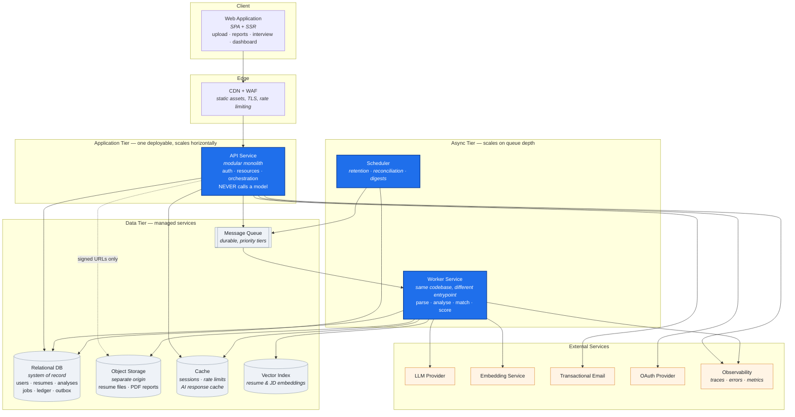
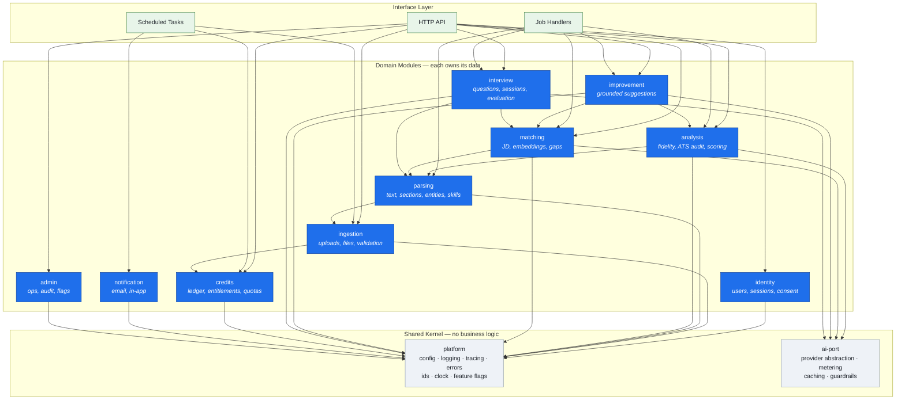
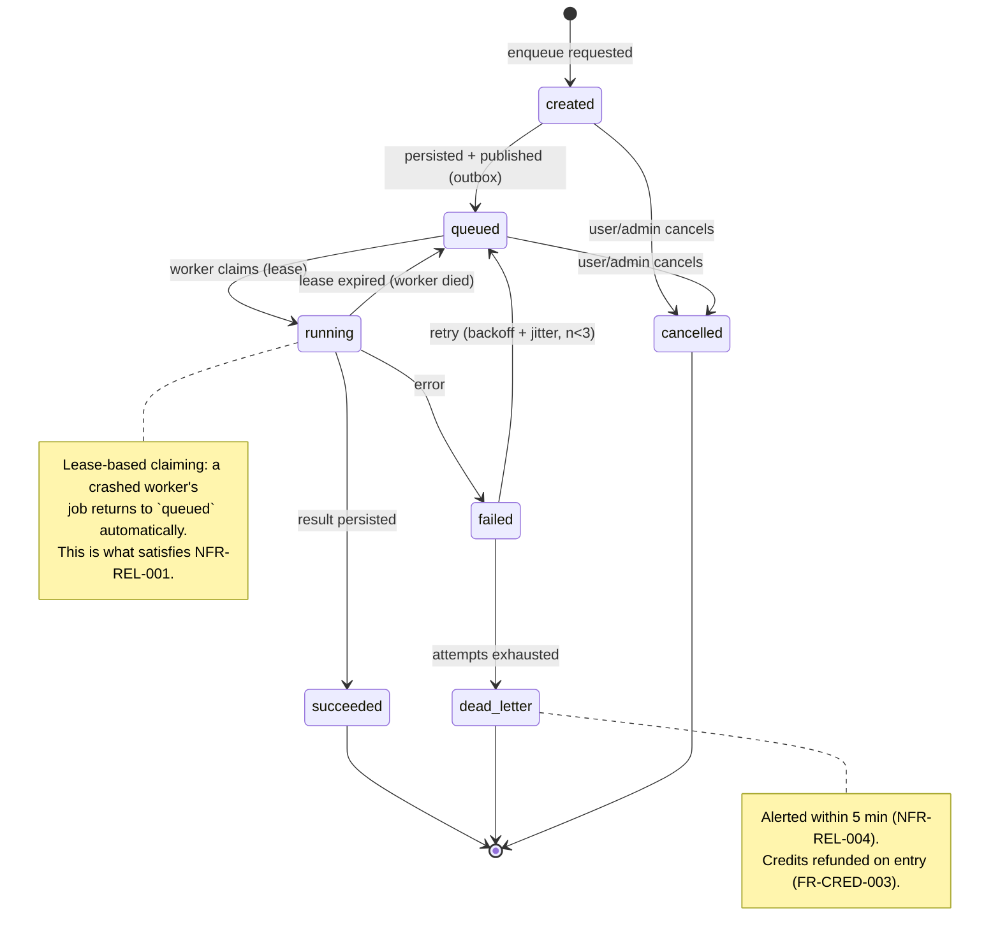
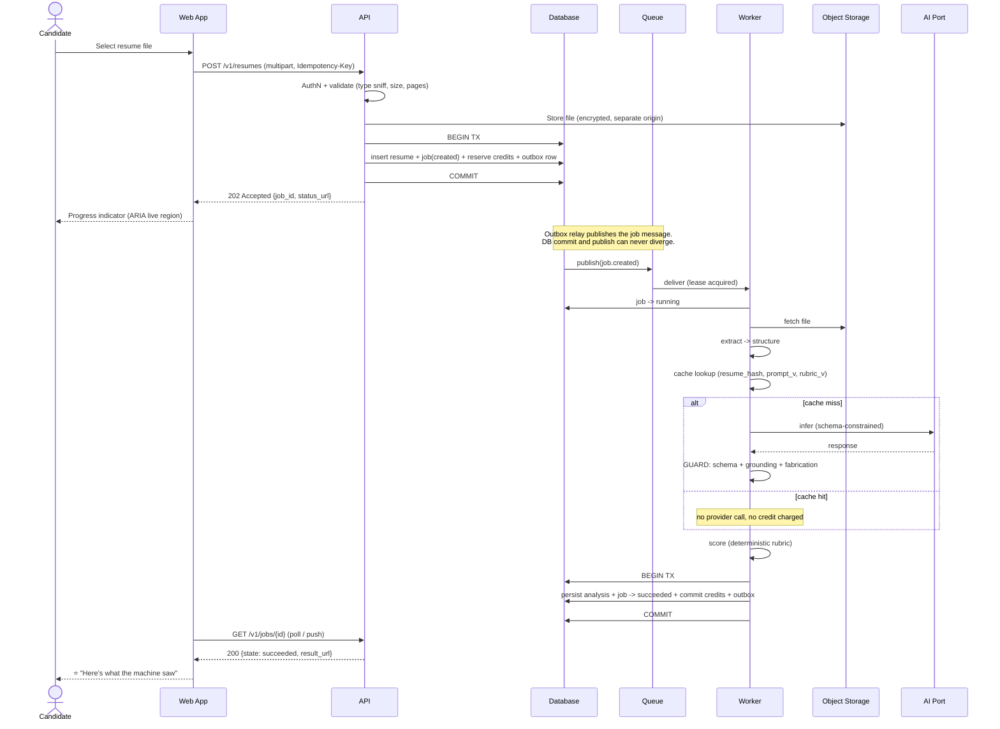
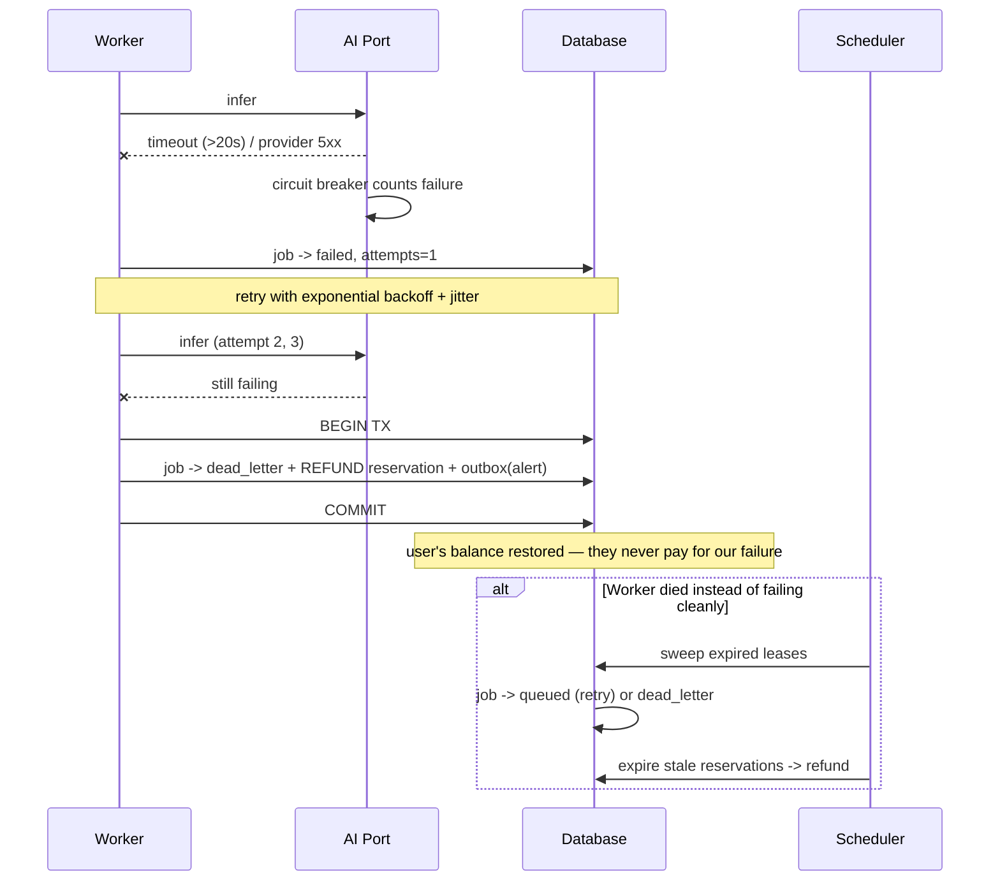
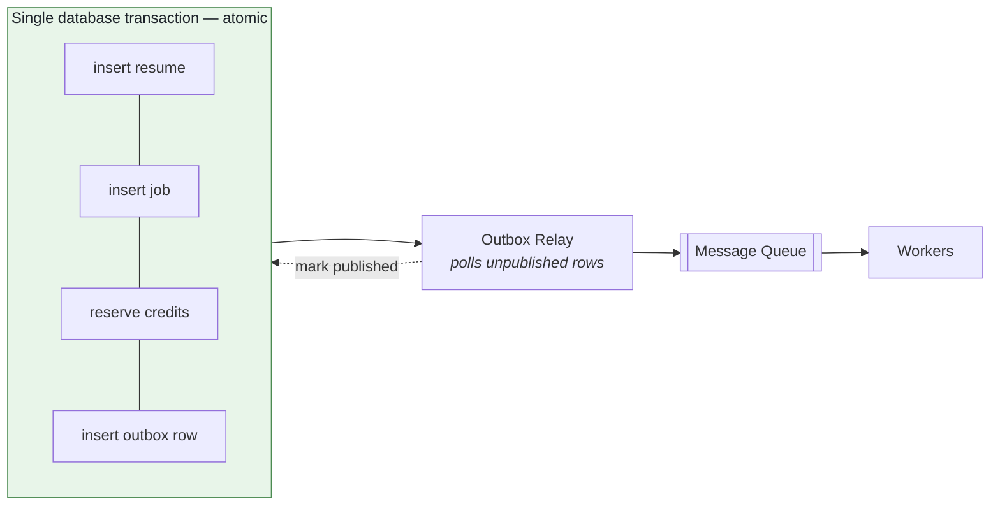
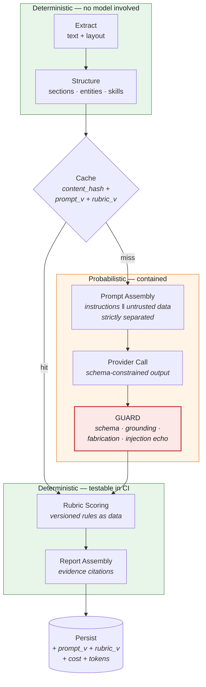
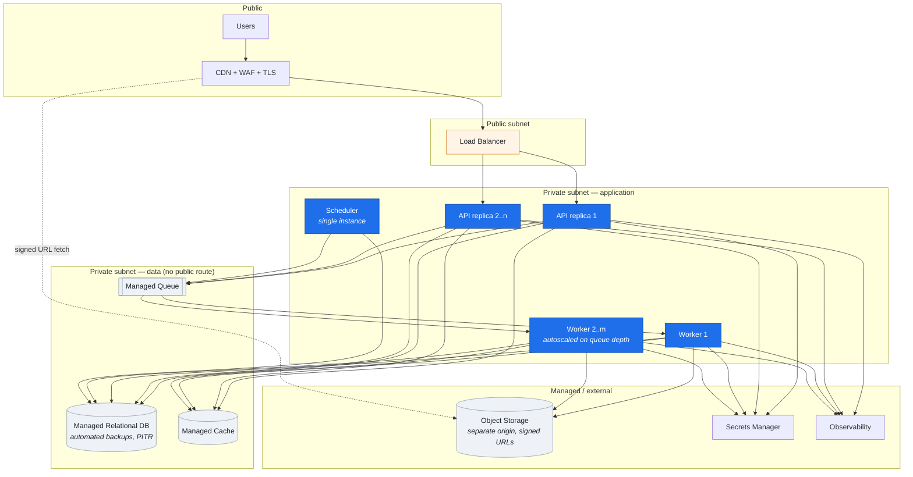
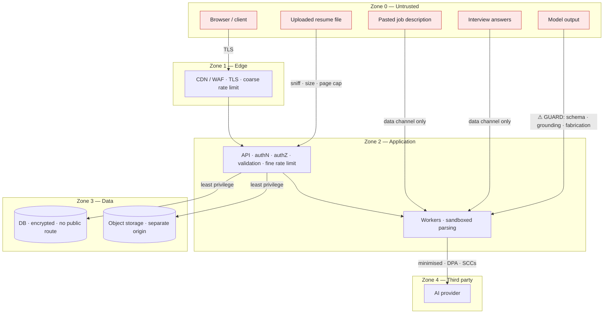

# Phase 4 — System Architecture

**Project:** AI Resume Analyzer & Mock Interview Platform
**Status:** Draft — awaiting approval
**Date:** 2026-07-31
**Depends on:** [Phase 1](../phase-01-problem-definition.md) ✅ · [Phase 2](../product/phase-02-product-planning.md) ✅ · [Phase 3](../requirements/phase-03-requirement-engineering.md) ✅

---

## 0. A discipline note: architecture *before* technology

Phase 5 chooses the technology stack. This document deliberately names **no framework, no
database product, and no cloud vendor.**

That ordering is not ceremony. If you pick the stack first, the architecture becomes a
rationalisation of the stack ("we use Django, so we'll use Django's job runner"). If you
derive the architecture from the requirements first, Phase 5 becomes a genuine evaluation:
*which technology best implements this design?*

Everything below is expressed as **components, responsibilities, contracts, and flows.** Where
a concrete product is unavoidable for clarity, it appears as a *capability* — "a durable
message queue", not a brand.

---

## 1. Objective

Define the system's structure: what components exist, what each is responsible for, how they
communicate, where the boundaries are, and how data and control flow through them — such that
Phase 5 can choose technology against a real design, Phase 6 can design a schema against real
access patterns, and Phase 12/13 can implement without re-deciding anything structural.

---

## 2. Why This Phase Matters

Architecture is the set of decisions that are **expensive to reverse.** Adding a feature is
cheap; changing how modules depend on each other after 40 files import across the boundary is
not.

Three things this phase specifically prevents:

1. **Architecture by accident.** Without a deliberate design, structure emerges from whichever
   file someone edited first. The result is a system where every change touches everything —
   the state most projects reach by month six.
2. **NFRs that were written and then ignored.** Phase 3 produced 62 NFRs. An NFR only becomes
   real when a component exists to satisfy it. §4 makes that mapping explicit: **every
   significant architectural decision below traces to a numbered requirement**, not to taste.
3. **Premature distribution.** The opposite failure — reaching for microservices, Kubernetes,
   and event sourcing at MVP — is equally fatal for a part-time team, and more fashionable.
   §17 records what we deliberately are *not* building, and the conditions under which that
   would change.

> **The governing principle: design for the load you have, with seams for the load you expect.**
> Not seams everywhere (that's distribution without benefit), and not a ball of mud (that's
> a rewrite waiting to happen).

---

## 3. Deliverables

- [x] Architectural drivers — NFR → structural consequence (§4)
- [x] Architectural style decision with alternatives (§5)
- [x] C4 Level 1 context (§6) and Level 2 container diagram (§7)
- [x] C4 Level 3 component/module design with enforced boundaries (§8)
- [x] Low-level design of the four critical mechanisms (§9)
- [x] Sequence diagrams: analysis, auth, credits, interview turn (§10)
- [x] API architecture and contracts (§11)
- [x] Event flow with the transactional outbox pattern (§12)
- [x] Data flow, transaction boundaries, caching layers (§13)
- [x] Authentication and authorisation architecture (§14)
- [x] AI pipeline architecture (§15)
- [x] Deployment topology (§16)
- [x] Microservice-readiness: extraction seams and triggers (§17)
- [x] Cross-cutting concerns (§18)
- [x] Full folder structure (§19)
- [x] Patterns explicitly adopted **and explicitly rejected** (§20)
- [x] Security architecture with trust boundaries (§22)
- [x] Bottleneck analysis (§23)
- [x] ADR-0014 … ADR-0018

---

## 4. Architectural Drivers

The architecture is *derived*, not invented. Each row is a requirement from Phase 3 and the
structure it forces.

| Driver (Phase 3) | Constraint | Architectural consequence |
|---|---|---|
| **NFR-PERF-004** — 60 s p95, 42% in a third-party call | Cannot complete in a request | **Separate worker tier + durable queue.** API never blocks on inference (ADR-0010) |
| **NFR-REL-001** — jobs survive crash/deploy | Work must outlive the process | **Job state persisted before ack**; at-least-once delivery |
| **NFR-REL-002** — no double-charge on redelivery | At-least-once ⇒ duplicates | **Idempotency keys** on every job and mutating endpoint |
| **NFR-CAP-002** — scale on queue depth | Web and compute load are uncorrelated | **API and workers scale independently** |
| **NFR-CAP-004** — free must not starve Pro | Shared queue = head-of-line blocking | **Priority queues by tier** |
| **NFR-AVL-004** — degraded mode | Read path must not depend on inference | **Inference is off the read path**; results are persisted artefacts |
| **NFR-COST-004** — ≥30% cache hit | Repeat work must be free | **Content-hash cache keyed on (resume_hash, jd_hash, prompt_version, rubric_version)** |
| **NFR-COST-006** — cost attributable per feature/user | Must tag at call site | **All provider calls go through one metered adapter** |
| **FR-CRED-003** — refund on failure | Credits coupled to job lifecycle | **Ledger transitions driven by job state machine** |
| **FR-IMP-004 / FR-IMP-007** — zero fabrication, schema-valid | Model output is untrusted | **Mandatory guard stage** between inference and persistence |
| **FR-MATCH-006 / FR-INT-011** — untrusted input to LLM | Injection risk | **Instruction/data separation** in the prompt assembler |
| **FR-ATS-005** — score records rubric version | Comparability over time | **Prompt and rubric versions are first-class, stored with every artefact** |
| **FR-PRIV-002/003** — erasure ≤30 days | Data must be findable and deletable | **Every PII-bearing row traces to a user; deletion is a designed cascade, not a script** |
| **FR-ADM-006** — admins can't read content | Content access is privileged | **Content access behind a separate, audited capability** |
| **NFR-SEC-010** — uploads not served from app origin | Stored XSS via uploaded files | **Separate storage origin + signed URLs** |
| **NFR-AVL-001** — 99.5%, part-time team | No on-call rotation | **Managed services over self-hosted**; single region; simple topology (ADR-0009) |
| **NFR-MNT-003** — 30-min onboarding | Local env must be trivial | **One compose file; no cloud dependency to run locally** |
| **NFR-I18N-011** — locale-parameterised rubric | Rules vary by market | **Rubric is data, not code** |

> Read the right-hand column top to bottom and you have the architecture. Everything in §5–§18
> elaborates these rows.

---

## 5. Architectural Style

### Options considered

| Style | Pros | Cons | Verdict |
|---|---|---|---|
| **Single-process monolith** (AI inline) | Simplest possible; one deploy | Cannot meet NFR-PERF-004 or NFR-REL-001; web tier pinned on network waits | ❌ Fails hard requirements |
| **Monolith + background workers** | Simple; meets the async requirement | Without internal boundaries it degrades into a ball of mud by month 6 | ◐ Right shape, insufficient discipline |
| **Modular monolith + worker tier** ✅ | One deployable unit, but enforced internal boundaries; independent worker scaling; extraction seams ready | Boundary discipline must be *enforced*, not merely intended | ✅ **Chosen** |
| **Microservices** | Independent scaling and deployment per service | Distributed transactions, network failure modes, N pipelines, N repos, N on-calls — for a 1–2 person part-time team this is self-harm | ❌ Rejected (ADR-0018) |
| **Serverless functions** | Scales to zero; low idle cost | Cold starts hurt the interactive path; 60 s+ jobs strain execution limits; local development and debugging degrade sharply | ❌ Rejected for core; may suit isolated scheduled tasks |

### Decision

**A modular monolith for the request-serving application, plus a separately-deployable worker
tier, communicating through a durable queue** ([ADR-0014](../adr/0014-modular-monolith-with-enforced-boundaries.md)).

Two properties make this different from "just a monolith":

1. **Modules own their data.** No module reads another module's tables. Cross-module access
   goes through a published interface. This is the single rule that makes future extraction
   possible — and its absence is why most "we'll split it later" monoliths never split.
2. **Boundaries are machine-enforced.** An import-linting rule fails the build on a forbidden
   cross-module import. A boundary that depends on developer memory is not a boundary.

### Layering within each module (Clean / Hexagonal)

```
        ┌──────────────────────────────────────────────┐
        │  Interface     HTTP handlers, job handlers,  │  ← knows about transport
        │                CLI, schedulers                │
        ├──────────────────────────────────────────────┤
        │  Application   Use cases, orchestration,     │  ← knows about the domain
        │                transactions, authorisation    │
        ├──────────────────────────────────────────────┤
        │  Domain        Entities, value objects,      │  ← knows nothing external
        │                invariants, rubric rules       │
        ├──────────────────────────────────────────────┤
        │  Infrastructure  Repositories, provider      │  ← implements domain ports
        │                  adapters, queue, storage     │
        └──────────────────────────────────────────────┘

        Dependency rule: source-code dependencies point INWARD only.
        Domain defines PORTS (interfaces); infrastructure provides ADAPTERS.
```

**Why this matters concretely here, not as theory:** the scoring rubric is domain logic. If it
imports the LLM client, then testing the rubric requires an API key, determinism testing
becomes impossible, and NFR-AI-003 (σ ≤ 2) can never be verified in CI. Keeping the domain
free of infrastructure is what makes the blocking quality gates *testable*.

---

## 6. C4 Level 1 — System Context

Established in [Phase 1 §13](../phase-01-problem-definition.md). Unchanged: candidates, admins,
and (future) institutions interact with one system, which depends on an LLM provider, an
embedding service, object storage, transactional email, an OAuth provider, and observability
backends.

---

## 7. C4 Level 2 — Containers



### Container responsibilities

| Container | Responsibility | Explicitly NOT responsible for | Scales on |
|---|---|---|---|
| **Web Application** | Rendering, client state, progress UX, accessibility | Any authorisation decision; any limit enforcement | CDN |
| **API Service** | AuthN/AuthZ, validation, resource CRUD, credit reservation, job enqueue | **Calling any model** (ADR-0010); long-running work | Request rate |
| **Worker Service** | Parsing, inference, scoring, matching, report generation | Serving user requests; holding session state | Queue depth |
| **Scheduler** | Retention purges, ledger reconciliation, reservation expiry, DLQ sweeps | Business logic (it enqueues jobs, it doesn't do the work) | Fixed |
| **Relational DB** | System of record, transactions, the outbox | Blobs; full-text-heavy search | Vertical, then read replicas |
| **Object Storage** | Resume files, generated PDFs — served from a **separate origin** | Being reachable from the app origin (NFR-SEC-010) | Managed |
| **Cache** | Sessions, rate-limit counters, AI response cache | Being a system of record — must be safely losable | Memory |
| **Message Queue** | Durable job delivery, priority tiers, DLQ | Storing results | Managed |
| **Vector Index** | Embedding similarity for JD matching | Being authoritative — rebuildable from the DB | Index size |

> **"API never calls a model" is the most load-bearing rule in this table.** It is what makes
> the latency budget achievable, the SLO honest, and the degraded mode possible. It is also the
> rule that will be under constant pressure ("it's just one quick call"). Hence ADR-0010.

---

## 8. C4 Level 3 — Modules and Boundaries

### Module map



### Boundary rules (machine-enforced)

| Rule | Rationale | Enforcement |
|---|---|---|
| A module MUST NOT import another module's internals | Internals are free to change | Import lint: only `<module>/api` is importable |
| A module MUST NOT read or write another module's tables | Data ownership is what makes extraction possible | Schema-per-module + repository review; DB grants in H2 |
| Cross-module reads go through a **published interface** | Explicit contract, mockable in tests | Interface lives in `<module>/api` |
| Cross-module writes are **asynchronous via domain events** | Avoids distributed transactions inside the monolith | Outbox (§12) |
| No module may import the interface layer | Dependency rule points inward | Import lint |
| `platform` and `ai-port` may be imported by anyone; they import no domain module | Shared kernel stays acyclic | Import lint |
| A module owns its migrations | Independent evolution | Migration path convention |

> **The enforcement column is the whole point.** "We agreed not to do that" is not an
> architecture. A CI rule that fails the build is.

### Module ownership

| Module | Owns (conceptually — schema in Phase 6) | Publishes events |
|---|---|---|
| `identity` | users, sessions, consent records | `UserRegistered`, `UserDeleted`, `ConsentChanged` |
| `ingestion` | resumes, files, upload jobs | `ResumeUploaded`, `ResumeDeleted` |
| `parsing` | parsed documents, sections, entities, skills | `ResumeParsed`, `ParseFailed` |
| `analysis` | analyses, scores, deductions, fidelity reports | `AnalysisCompleted` |
| `matching` | job descriptions, match results, gaps | `MatchCompleted` |
| `improvement` | suggestions, rewrites, source spans | `SuggestionsGenerated` |
| `interview` | sessions, questions, answers, evaluations, reports | `SessionCompleted` |
| `credits` | ledger entries, reservations, plans, quotas | `CreditsReserved/Committed/Refunded`, `QuotaExhausted` |
| `notification` | outbound messages, delivery state | — |
| `admin` | audit log, feature flags, break-glass records | `AuditEvent` |

---

## 9. Low-Level Design — The Four Critical Mechanisms

Most of the system is straightforward CRUD over the modules above. Four mechanisms carry
almost all the architectural risk and are designed here in detail.

### 9.1 The Job Engine

Every asynchronous unit of work is a **Job** with a persisted state machine.



**Job record (conceptual):** `id · type · state · attempts · idempotency_key · lease_owner ·
lease_expires_at · payload_ref · result_ref · credit_reservation_id · created_at · timestamps`.

**Why lease-based claiming rather than simple dequeue:** if a worker is killed mid-job (deploy,
OOM, spot reclaim), a plain dequeue loses the job. A lease that expires returns it to the
queue automatically. This is the mechanism that makes NFR-REL-001 true rather than aspirational,
and it is directly verified by the Phase 19 chaos test.

**Idempotency:** every job carries a key derived from `(user, operation, content_hash)`.
Re-delivery of an already-succeeded job returns the stored result and performs no work and no
charge (NFR-REL-002).

### 9.2 The Analysis Pipeline

A pipeline of **pure, individually-testable stages**. Each stage has a typed input and output,
a timeout, and a cost tag.

```mermaid
graph LR
    A["1 · Fetch<br/><i>file from storage</i>"] --> B["2 · Validate<br/><i>type, size, pages</i>"]
    B --> C["3 · Scan<br/><i>malware, structure</i>"]
    C --> D["4 · Extract<br/><i>text + layout</i>"]
    D --> E["5 · Structure<br/><i>sections, entities, skills</i>"]
    E --> F{"6 · Cache?<br/><i>hash lookup</i>"}
    F -->|hit| I
    F -->|miss| G["7 · Infer<br/><i>LLM, schema-constrained</i>"]
    G --> H["8 · GUARD<br/><i>schema · grounding · fabrication</i>"]
    H --> I["9 · Score<br/><i>deterministic rubric</i>"]
    I --> J["10 · Persist<br/><i>+ commit credits</i>"]
    J --> K["11 · Notify<br/><i>event + push</i>"]

    classDef guard fill:#fde8e8,stroke:#c53030,color:#1c2128,stroke-width:2px
    classDef cache fill:#fff4e5,stroke:#d9822b,color:#1c2128
    classDef det fill:#e8f5e9,stroke:#4c8b52,color:#1c2128
    class H guard
    class F cache
    class I det
```



Three stages deserve emphasis:

**Stage 6 — Cache.** Keyed on `(resume_hash, jd_hash, prompt_version, rubric_version)`. A hit
skips inference entirely: zero cost to us, zero credits charged (FR-CRED-005), and near-zero
latency. This single stage delivers NFR-COST-004 and is the largest cost lever we have.
Including the *version* fields in the key is essential — otherwise a rubric change silently
serves stale results.

**Stage 8 — Guard.** ⚠️ **Non-bypassable.** Model output is untrusted input. This stage:
- validates against the declared response schema; on violation, retries then fails the job
  (FR-IMP-007) — raw model output is never surfaced;
- verifies **grounding**: every rewrite's `source_span` must resolve to text actually present
  in the source resume;
- runs **fabrication checks**: no employer, title, date, credential, or metric absent from the
  source (FR-IMP-004, ADR-0004);
- strips any content that looks like an injected instruction echo.

> Without this stage, ADR-0004 is a promise. With it, ADR-0004 is a mechanism.

**Stage 9 — Score.** Deterministic and free of infrastructure. Given the same structured input
and rubric version, it produces the same score. This is what makes NFR-AI-003 (σ ≤ 2) testable
in CI without an API key — and it is why the rubric lives in the domain layer, as *data*
(NFR-I18N-011), not as code entangled with the model client.

### 9.3 The Credit Ledger

Implements [ADR-0007](../adr/0007-credit-ledger-model.md) against the job lifecycle.

```
Ledger entries are append-only. Balance = SUM(entries). Nothing is ever updated.

  grant      +100   (plan renewal / admin grant)
  reserve      -3   (job enqueued;   ref: job_id)
  commit        0   (job succeeded;  reservation finalised)
  refund       +3   (job failed/expired/cancelled; ref: reservation_id)
  expire      -20   (unused allowance at period end)

available_balance = SUM(entries) - SUM(open_reservations)
```

| Transition | Trigger | Atomicity requirement |
|---|---|---|
| `reserve` | Job enqueue | Same DB transaction as job creation + outbox row — **all three or none** |
| `commit` | Job → `succeeded` | Same transaction as result persistence |
| `refund` | Job → `failed`/`dead_letter`/`cancelled`, or reservation lease expiry | Idempotent — a duplicate refund must be a no-op |
| `expire` | Scheduler, at period end | Idempotent per period |

**The reconciliation job matters.** Nightly, the scheduler asserts: no open reservation whose
job reached a terminal state; no job in a terminal state without a matching commit or refund;
derived balances match the ledger sum (NFR-REL-005/008). Any drift alerts. Money-adjacent
systems without reconciliation drift silently, and you discover it from a user complaint.

### 9.4 The AI Provider Port

A single **port** (interface) with swappable adapters — the concrete answer to R-05 (vendor
lock-in) and the enforcement point for NFR-COST-006.

```
        Domain / Application
                 │  depends on the PORT only
                 ▼
      ┌────────────────────────────┐
      │  InferencePort             │   complete(request) -> ValidatedResponse
      │  EmbeddingPort             │   embed(texts)      -> Vectors
      └────────────────────────────┘
                 │ implemented by
                 ▼
      ┌────────────────────────────────────────────────┐
      │  MeteredCachingAdapter  (decorator chain)      │
      │    ├─ cache lookup / store                     │
      │    ├─ prompt assembly (instruction/data split) │
      │    ├─ token + cost metering  → NFR-COST-006    │
      │    ├─ timeout + retry + circuit breaker        │
      │    ├─ structured-output enforcement            │
      │    └─ fallback to secondary provider           │
      └────────────────────────────────────────────────┘
                 │ delegates to
                 ▼
        PrimaryProviderAdapter │ SecondaryProviderAdapter │ FakeAdapter (tests, S0)
```

**Every provider call in the system passes through this chain — there is no direct client use
anywhere.** That single constraint gives us: complete cost attribution, uniform caching,
uniform timeouts and circuit breaking, provider swap as a configuration change, and — critically
for slice S0 — a `FakeAdapter` that lets the entire pipeline be built and tested before any
provider is chosen in Phase 10.

---

## 10. Sequence Diagrams

### 10.1 Golden path — upload to analysis



### 10.2 Failure path — credits are made whole



### 10.3 Authentication

```mermaid
sequenceDiagram
    actor U as User
    participant W as Web App
    participant A as API
    participant D as Database
    participant C as Cache

    U->>W: email + password
    W->>A: POST /v1/auth/login
    A->>A: rate-limit check (per IP + per account)
    A->>D: fetch user
    A->>A: verify password (memory-hard KDF)
    Note over A: constant-time response regardless of<br/>whether the email exists (FR-AUTH-008)
    A->>D: create session (family_id, device, ip_hash)
    A->>C: cache session
    A-->>W: Set-Cookie: access (short TTL, httpOnly, Secure, SameSite)<br/>Set-Cookie: refresh (long TTL, httpOnly, path=/auth)

    Note over W,A: --- later: access token expired ---
    W->>A: POST /v1/auth/refresh (refresh cookie)
    A->>D: validate token; check not already used
    alt token reuse detected
        A->>D: revoke ENTIRE session family
        A-->>W: 401 — re-authenticate
        Note over A: reuse implies theft; kill every<br/>descendant session, not just this one
    else valid
        A->>D: rotate: invalidate old, issue new
        A-->>W: new access + refresh cookies
    end
```

### 10.4 Interview turn

```mermaid
sequenceDiagram
    actor U as Candidate
    participant W as Web App
    participant A as API
    participant D as Database
    participant Q as Queue
    participant K as Worker

    U->>W: Submit answer to Q4
    W->>A: POST /v1/interviews/{id}/answers (Idempotency-Key)
    A->>D: BEGIN TX; persist answer; job(evaluate); reserve 1 credit; outbox; COMMIT
    A-->>W: 202 {job_id}
    D->>Q: publish
    Q->>K: deliver
    K->>K: evaluate vs rubric + generate next question<br/>(answer treated as untrusted input)
    K->>K: GUARD
    K->>D: persist evaluation + next question; session.cursor = Q5; commit credit
    W->>A: GET /v1/interviews/{id}
    A-->>W: 200 {evaluation, next_question, cursor: 5}

    Note over U,D: Session state lives in the DB, not in memory.<br/>Close the browser, return in 2 days, resume at Q5 (FR-INT-006).
```

---

## 11. API Architecture

### Principles

| Principle | Rule |
|---|---|
| **Contract-first** | OpenAPI is generated from code and CI-verified as current (NFR-MNT-005) |
| **Resource-oriented** | Nouns, not verbs: `/resumes`, `/analyses`, `/interviews` |
| **Versioned** | `/v1/` from day one — adding versioning later breaks every client |
| **Async by contract** | Work-initiating endpoints return `202 + job_id + status_url`, never inline results (ADR-0010) |
| **Idempotent mutations** | `Idempotency-Key` header required on POST that costs money or creates work |
| **Uniform errors** | One envelope, machine-readable code, human message, correlation ID |
| **Cursor pagination** | Stable under concurrent inserts, unlike offset |
| **Server-side authority** | Every entitlement, quota, and limit is checked server-side (FR-CRED-006) |

### Resource surface (MVP)

```
POST   /v1/auth/register · login · refresh · logout · logout-all · reset
GET    /v1/me                      PATCH /v1/me            DELETE /v1/me
GET    /v1/me/export               GET   /v1/me/consents   PUT /v1/me/consents

POST   /v1/resumes            → 202   GET /v1/resumes   GET/DELETE /v1/resumes/{id}
GET    /v1/resumes/{id}/parse-fidelity          ⭐
POST   /v1/resumes/{id}/analyses  → 202
GET    /v1/analyses/{id}

POST   /v1/job-descriptions        GET /v1/job-descriptions
POST   /v1/matches            → 202   GET /v1/matches/{id}
POST   /v1/matches/{id}/suggestions → 202

POST   /v1/interviews         → 202   GET /v1/interviews/{id}
POST   /v1/interviews/{id}/answers → 202
GET    /v1/interviews/{id}/report

GET    /v1/jobs/{id}                          (universal status endpoint)
GET    /v1/credits/balance                    (outcome language, FR-DASH-005)
GET    /v1/dashboard

GET    /v1/admin/...                          (elevated auth, audited)
GET    /health/live   /health/ready           (probes, not public)
```

### Error envelope

```json
{
  "error": {
    "code": "INSUFFICIENT_CREDITS",
    "message": "You've used all 3 analyses in your free plan this month.",
    "details": { "required": 3, "available": 1, "resets_at": "2026-08-01T00:00:00Z" },
    "correlation_id": "01J8XQ2R7K9V3M",
    "docs": "https://.../errors/INSUFFICIENT_CREDITS"
  }
}
```

Every error carries a **correlation ID that appears in logs, traces, and the user's screen**.
When a user reports a problem, that single string retrieves the entire distributed trace — the
difference between a five-minute diagnosis and an afternoon of guessing.

---

## 12. Event Flow — and the Transactional Outbox

### The problem this solves

An operation must do two things atomically: **persist state** and **publish a message**. Two
systems, no shared transaction. The naive implementation:

```
tx.commit()          # resume + job saved
queue.publish(msg)   # ← process dies HERE
```
The job exists in the database but no worker will ever run it. Credits stay reserved. The user
watches a spinner forever. Reverse the order and you get the opposite bug: a message for work
that was never persisted.

### The solution

**Write the message to an `outbox` table inside the same transaction as the state change.** A
relay process reads unpublished outbox rows and publishes them, marking them sent.



**Guarantee: at-least-once delivery.** A crash between publish and mark-published republishes
the message — which is exactly why every consumer is idempotent (§9.1). At-least-once plus
idempotency gives effectively-once behaviour without distributed transactions.

> This is the single highest-value structural pattern in the document. It costs one table and
> one background loop, and it eliminates an entire category of "the job vanished" bugs that are
> extremely hard to diagnose in production.

### Domain event catalogue

| Event | Producer | Consumers | Purpose |
|---|---|---|---|
| `ResumeUploaded` | ingestion | parsing | Trigger parse |
| `ResumeParsed` | parsing | analysis, notification | Trigger analysis |
| `ParseFailed` | parsing | credits, notification | Refund + inform |
| `AnalysisCompleted` | analysis | notification, analytics | Push result, emit `analysis_viewed` funnel data |
| `MatchCompleted` | matching | improvement, interview | Enable gap-targeted questions |
| `SessionCompleted` | interview | notification, analytics | Report + progress |
| `CreditsExhausted` | credits | notification | Upgrade prompt (`credit_wall_hit`) |
| `UserDeleted` | identity | **all modules** | Cascade erasure (FR-PRIV-002) |
| `JobDeadLettered` | platform | admin, credits | Alert + refund |

> **`UserDeleted` is the architecturally significant one.** Erasure fans out to every module
> that holds user data. Designing it as an event from the start — rather than a deletion script
> written in week 11 — is what makes FR-PRIV-003's 30-day guarantee achievable. Every new module
> must handle it; that is a boundary obligation, not an afterthought.

---

## 13. Data Flow

### Write path

```
Client → API (validate) → DB transaction { domain rows + job + credit reserve + outbox }
                                   → outbox relay → queue → worker
                                   → worker DB transaction { results + job state + credit commit + outbox }
```
**Transaction rule:** a transaction never spans a network call to an external service. Provider
calls happen *between* transactions, never inside one — otherwise a slow provider holds database
locks and the connection pool collapses under load.

### Read path

```
Client → API → cache → DB (indexed by user_id, then resource)
                     → signed URL for object storage (never proxied through the API)
```
**Files are never proxied through the application.** The API mints a short-lived signed URL and
the client fetches directly from storage. Proxying would put a 5 MB transfer through a request
handler for every report view — wasteful, slow, and a needless availability coupling.

### Caching layers

| Layer | Contents | Invalidation | If lost |
|---|---|---|---|
| CDN | Static assets | Content hash in filename | Rebuild |
| API response | Dashboard aggregates | TTL 60 s + event-driven bust | Recompute |
| **AI response** | Inference by `(content_hash, prompt_v, rubric_v)` | **Immutable — version change = new key** | Recompute (costs money) |
| Session | Session records | On logout/revoke | Re-read from DB |
| Rate limit | Counters | Window expiry | Fail-open with a lower static cap |

**Every cache must be safely losable.** The cache is never a system of record. If the cache
disappears, the system is slower and more expensive, never wrong.

### Vector index

The vector index holds embeddings for resumes and JDs, used for semantic matching. It is
**derived, not authoritative** — rebuildable from the database. That means a corrupted or lost
index is an operational inconvenience, not data loss, and it means we can change embedding
models (Phase 10) by re-indexing rather than by migration.

---

## 14. Authentication & Authorisation Architecture

### Token strategy

| Decision | Choice | Why |
|---|---|---|
| Session transport | **httpOnly + Secure + SameSite cookies** | Not readable by JavaScript ⇒ XSS cannot exfiltrate the session. `localStorage` tokens are a single XSS away from full account takeover |
| CSRF defence | SameSite=Lax + double-submit token on state-changing requests | Cookies are auto-sent, so CSRF protection is mandatory — this is the cost of the choice above |
| Access token | Short-lived (~15 min), signed, minimal claims | Limits the blast radius of a leak |
| Refresh token | Long-lived, **rotating**, family-tracked | Rotation + reuse detection turns a stolen token into a detectable event |
| Reuse detection | Revoke the **entire session family** | A replayed refresh token means theft; killing only that token leaves the attacker's descendant tokens alive |
| Revocation | Session records in DB, cached | "Log out everywhere" (FR-AUTH-006) requires server-side session state; pure stateless JWT cannot do it |
| Admin | **Separate elevated authentication**, short session, re-auth for break-glass | FR-ADM-007 |

> **Note the honest trade-off:** cookies solve XSS exfiltration and create a CSRF obligation.
> Stateless JWTs are simpler but cannot satisfy FR-AUTH-006. We accept server-side session
> state — a cache lookup — as the price of revocability. Documented in
> [ADR-0017](../adr/0017-cookie-sessions-with-rotating-refresh.md).

### Authorisation model

Three layers, checked in order, all server-side:

1. **Authentication** — is there a valid session?
2. **Ownership** — does this resource belong to this user? *(Checked on every resource access —
   this is the IDOR defence, NFR-SEC-007. It is a repository-level concern: queries are scoped
   by `user_id` by construction, not filtered afterwards.)*
3. **Entitlement** — does the plan permit this, and are credits available? *(Never derived from
   a client claim; always read from the ledger, FR-CRED-006.)*

Roles for MVP: `candidate`, `admin`, `support` (read-only, no content access). `institution` and
`recruiter` are reserved but unimplemented — defining the enum now avoids a migration later.

---

## 15. AI Pipeline Architecture

Phase 7 designs the AI modules in depth. Phase 4's concern is **where they sit and what
contains them.**



**The organising idea: push as much as possible into the deterministic zones, and contain the
probabilistic zone behind a guard.**

Consequences that matter:

- **Scoring is deterministic**, so NFR-AI-003 (σ ≤ 2) is achievable and CI-testable without a
  provider. If the model produced the score directly, reproducibility would be unattainable and
  the ⭐ progress feature would be built on sand.
- **The model's job is extraction and judgement, not arithmetic.** It identifies *that* a
  two-column layout exists; the rubric decides *how many points* that costs. This also makes the
  rubric auditable and locale-parameterisable (NFR-I18N-011).
- **Prompt and rubric versions are persisted with every artefact** (FR-ATS-005), so historical
  scores remain interpretable and comparable.
- **Injection defence is structural** — instructions and untrusted data occupy separate,
  clearly-delimited channels in the assembled prompt, and the guard strips instruction echoes
  (FR-MATCH-006).

---

## 16. Deployment Topology

Technology-neutral; Phase 16 selects the provider and Phase 14 the pipeline.



### Environments

| Env | Purpose | Data | Scale |
|---|---|---|---|
| **Local** | Development | Seeded synthetic; `FakeAdapter` for AI | One container each (NFR-MNT-003) |
| **CI** | Automated tests | Ephemeral; all externals faked | Per-run |
| **Staging** | Pre-release verification | Synthetic only — **never production data** | Minimal |
| **Production** | Live | Real | Per §7 |

**Staging never receives production data.** Copying real resumes into a lower-trust environment
creates a second PII estate with weaker controls — a common and entirely avoidable breach vector.

### Key deployment properties

- **Single region, managed services** — justified by the 99.5% SLO (ADR-0009). Multi-region at
  99.5% is money spent on a guarantee we haven't promised.
- **API and workers deploy from the same image, different entrypoints** — no drift between the
  code that enqueues and the code that consumes.
- **The data subnet has no public route.** Nothing reaches the database except from the app
  subnet.
- **Brief downtime during deploys is acceptable** — the error budget explicitly covers it, so
  blue-green machinery is deferred to H2 (ADR-0009).
- **The scheduler is a single instance** with leader election or a simple lock. Two schedulers
  running the retention purge concurrently is a bad day.

---

## 17. Microservice Readiness

### What makes extraction possible

The modular monolith is genuinely extractable, because four conditions already hold:

1. Modules own their data; no cross-module table access (§8)
2. Cross-module communication is already through published interfaces or events
3. No distributed transactions exist to unpick — the outbox pattern already models
   cross-boundary consistency asynchronously
4. Workers already run as a separate process consuming a queue

Extraction becomes: change an in-process interface call to a network call, and move the tables.

### Extraction order, when the time comes

| Rank | Candidate | Why first | Trigger |
|---|---|---|---|
| 1 | **Parsing/Inference workers** | Different scaling profile (CPU/GPU-ish, bursty), different dependencies, already isolated | Worker scaling conflicts with API deploys |
| 2 | **Interview engine** | Becomes stateful and streaming with voice in H2 | Voice launch |
| 3 | **Credits/billing** | Compliance isolation; different change cadence | Payments + institutional invoicing |
| 4 | **Identity** | Only if SSO/multi-tenancy demands it | H3 institutions |

### When we would extract — and not before

Extract only when **at least two** of these are true:

- A module's scaling needs conflict with the rest (already partly true for workers — hence the
  separate tier)
- Team size exceeds ~6 engineers and merge contention is real
- A module needs an independent release cadence for compliance
- One module's failures repeatedly take down unrelated functionality

> **None of these are true today**, and premature extraction would multiply operational surface
> for a part-time team while delivering nothing users can see. Recorded as a deliberate
> non-decision in [ADR-0018](../adr/0018-rejected-architectural-patterns.md).

---

## 18. Cross-Cutting Concerns

| Concern | Design |
|---|---|
| **Correlation** | A correlation ID is generated at the edge, propagated through HTTP → outbox → queue → worker, present in every log line and error response (NFR-OBS-001) |
| **Tracing** | Spans across API → queue → worker → provider; the provider call is always its own span, since it's 42% of the budget (NFR-OBS-002) |
| **Configuration** | 12-factor: environment variables only, validated at startup, **fail fast on missing config**. No config file baked into an image |
| **Secrets** | Injected from a secrets manager at runtime; never in images, code, or logs; scanned in CI (NFR-SEC-003) |
| **Feature flags** | Runtime-evaluated, no redeploy (FR-ADM-005). Every AI feature has a kill switch — when a provider misbehaves, disabling a feature must take seconds |
| **Error taxonomy** | `ValidationError` (4xx) · `AuthError` (401/403) · `NotFound` (404) · `ConflictError` (409) · `QuotaError` (402/429) · `DependencyError` (502/503, retryable) · `InternalError` (500). Retryability is a property of the error type, not a guess at the call site |
| **Idempotency** | Client-supplied key on paid/creating POSTs; stored with the response for a TTL; a replay returns the original response |
| **Rate limiting** | At the edge (coarse, per IP) and in the API (fine, per account/endpoint). Two layers because the edge can't see plan tiers |
| **Time** | UTC everywhere; a `Clock` port so time-dependent logic (expiry, retention) is testable without sleeping |
| **IDs** | Sortable, non-sequential identifiers — sequential integers leak volume and invite enumeration |
| **Logging** | Structured JSON; **PII and content are structurally excluded** by a serialiser denylist, not by developer care (FR-PRIV-009) |

---

## 19. Folder Structure

Language-neutral shape; Phase 5 fixes file extensions and package manifests.

```
Summer Project 1/
├── README.md
├── docs/                          # phases 1–22 (as established)
├── .github/workflows/             # CI: lint, types, test, a11y, boundaries, security
│
├── apps/
│   ├── api/                       # HTTP entrypoint  → composes modules
│   │   ├── main.*                 # bootstrap, DI container, middleware chain
│   │   ├── routes/                # thin: validate → call use case → serialise
│   │   ├── middleware/            # auth, correlation, rate limit, error mapping
│   │   └── openapi/               # generated spec (CI-verified current)
│   │
│   ├── worker/                    # queue consumer entrypoint (same image as api)
│   │   ├── main.*
│   │   └── handlers/              # one per job type; thin, delegate to modules
│   │
│   ├── scheduler/                 # retention · reconciliation · lease sweeps
│   │   └── tasks/
│   │
│   └── web/                       # frontend (structure detailed in Phase 13)
│       ├── src/{routes,components,features,lib,i18n}/
│       └── tests/
│
├── modules/                       # ← the modular monolith. One folder = one boundary.
│   ├── identity/
│   │   ├── api/                   # ⬅ THE ONLY IMPORTABLE SURFACE
│   │   ├── application/           # use cases, transactions, authorisation
│   │   ├── domain/                # entities, value objects, ports, invariants
│   │   ├── infrastructure/        # repositories, adapters
│   │   ├── migrations/            # module owns its schema
│   │   └── tests/
│   ├── ingestion/                 # (same internal shape)
│   ├── parsing/
│   ├── analysis/
│   │   └── domain/rubrics/        # ⭐ rubric as versioned, locale-scoped DATA
│   ├── matching/
│   ├── improvement/
│   ├── interview/
│   ├── credits/
│   ├── notification/
│   └── admin/
│
├── packages/
│   ├── platform/                  # config · logging · tracing · errors · ids · clock · flags
│   ├── ai-port/                   # ports + metered/caching/guarding adapters + FakeAdapter
│   ├── job-engine/                # state machine · lease claiming · retry · outbox relay
│   └── contracts/                 # shared DTOs / generated API types
│
├── infra/                         # IaC (Phase 14/16)
├── tools/
│   ├── boundary-lint/             # ⬅ enforces §8 module rules in CI
│   └── seed/                      # local + staging synthetic data
├── tests/
│   ├── e2e/                       # golden path
│   ├── load/                      # NFR-CAP validation
│   └── chaos/                     # kill-worker-mid-job (NFR-REL-001)
├── evals/                         # ⬅ AI quality gates (Phases 8/9/19)
│   ├── golden-corpus/             # 50 labelled resumes (NFR-AI-001)
│   ├── fabrication/               # zero-tolerance set (NFR-AI-004)
│   ├── bias/                      # name/institution perturbation (NFR-AI-006)
│   └── injection/                 # adversarial prompts (NFR-AI-008)
└── docker-compose.yml             # one command to full local env (NFR-MNT-003)
```

**Three deliberate choices worth naming.** `modules/*/api` as the sole importable surface is
what `tools/boundary-lint` enforces. `evals/` is a **first-class top-level directory**, not a
subfolder of tests — because the AI quality gates are blocking release criteria, and burying
them signals otherwise. And `modules/analysis/domain/rubrics/` holds the rubric as versioned
data, which is what makes it locale-parameterisable and diff-reviewable.

---

## 20. Patterns Adopted — and Explicitly Rejected

### Adopted

| Pattern | Why here |
|---|---|
| Modular monolith | Right complexity for team size, with real seams (ADR-0014) |
| Clean / Hexagonal layering | Keeps the rubric testable without infrastructure |
| Ports & Adapters | Provider swap as configuration; answers R-05 (ADR-0015) |
| Repository pattern | Ownership-scoped queries by construction (IDOR defence) |
| **Transactional outbox** | Eliminates the dual-write bug class (ADR-0016) |
| Job state machine with leases | Crash-safe async work (NFR-REL-001) |
| Idempotency keys | Makes at-least-once safe |
| Circuit breaker + timeout + backoff | Contains third-party failure |
| Decorator chain on the AI port | Cross-cutting cache/meter/guard in one place |
| Cache-aside | Cache is never authoritative |

### Rejected — and why ([ADR-0018](../adr/0018-rejected-architectural-patterns.md))

| Pattern | Superficial appeal | Why not |
|---|---|---|
| **Microservices** | "Scalable", modern | Distributed failure modes and N pipelines for a 1–2 person team. Seams without the cost (§17) |
| **Event sourcing** | Perfect audit trail | We need an audit *log*, not a rebuildable event history. Enormous conceptual overhead; the ledger already gives immutability where it matters |
| **CQRS** | Read/write scaling | Our reads are simple and low-volume. Two models to maintain, zero current benefit |
| **Kubernetes** | Industry default | A cluster to operate for ~2 services. Managed containers meet 99.5% with a fraction of the effort |
| **GraphQL** | Flexible clients | One first-party client, well-known access patterns; adds N+1 risk, caching complexity, and query-cost attack surface |
| **Service mesh** | Observability, mTLS | Nothing to mesh |
| **Multi-region active-active** | Resilience | Not promised at 99.5%; would dominate the budget |
| **Own ML training infra** | "Real AI" | Phase 1 non-goal. Rent inference, own the rubric and evals |
| **Saga orchestration** | Distributed consistency | No distributed transactions exist to coordinate |

> **Rejections are recorded with reasons because they will be re-proposed.** Someone will ask
> "shouldn't this be microservices?" in month four. The answer, with conditions under which it
> changes, is written down.

---

## 21. Best Practices Applied

- **Architecture derived from NFRs** (§4), traceable row by row, not chosen by preference
- **Technology deliberately deferred** to Phase 5 so the stack serves the design
- **Boundaries machine-enforced**, because agreements decay and CI rules don't
- **Rejections documented** alongside adoptions
- **Deterministic and probabilistic zones separated**, with a guard between them
- **Every cache safely losable**; no cache is a system of record
- **No transaction spans a network call** to an external service
- **Erasure designed as an event cascade** from day one, not a script written later
- **PII exclusion from logs is structural** (serialiser denylist), not procedural
- **A fake AI adapter exists from S0**, so the pipeline is built and tested before a provider is chosen

---

## 22. Security Architecture

### Trust boundaries



> **Model output sits in the untrusted zone.** That is the non-obvious classification and the
> reason the guard stage is mandatory. Treating an LLM response as trusted because "we called
> it" is how injection and fabrication reach users.

### Defence in depth

| Layer | Controls |
|---|---|
| Edge | TLS 1.2+, HSTS, WAF, coarse rate limits, bot mitigation |
| Transport | TLS everywhere including internal hops; no plaintext in the VPC |
| Application | Schema validation at the boundary, ownership-scoped repositories, server-side entitlements, CSRF tokens, security headers |
| **AI** | Instruction/data separation, schema-constrained output, **guard stage**, injection eval suite |
| Data | Encryption at rest, least-privilege service identities, no public route to data subnet, signed URLs with short TTL |
| Operational | Secret scanning, dependency scanning, audit log, break-glass with justification, spend circuit breaker |

### Threat notes specific to this system

| Threat | Control |
|---|---|
| Malicious PDF/DOCX (zip bomb, XXE, malformed streams) | Sandboxed worker, resource caps, structure scan, page limits |
| Stored XSS via uploaded file served from app origin | Separate storage origin, signed URLs, `Content-Disposition` (NFR-SEC-010) |
| Prompt injection via JD or answer | Channel separation, guard, adversarial evals |
| Cost-based DoS | Credits, per-account daily cap, global circuit breaker |
| IDOR across users' resumes | Repository queries scoped by owner *by construction* |
| Session theft via XSS | httpOnly cookies; refresh rotation with family revocation |
| Admin account compromise | Elevated auth; content not readable by default; break-glass audited |

---

## 23. Scalability & Bottleneck Analysis

### Scaling axes

| Component | Axis | Limit | Next step |
|---|---|---|---|
| Web/CDN | Horizontal (managed) | Effectively none | — |
| API | Horizontal replicas | DB connections | Connection pooler |
| **Workers** | **Horizontal on queue depth** | **Provider rate limits** | **Request higher limits; multi-provider** |
| Queue | Managed | Very high | Partition by job type |
| Database | Vertical, then read replicas | Write throughput | Replicas → partition analyses by time |
| Object storage | Managed | None practical | — |
| Vector index | Index size | Memory | Managed vector service |

### Where it breaks first, in order

1. **AI provider rate limits.** Long before our own infrastructure strains, the provider caps
   us. Mitigations, in order of preference: cache aggressively (≥30% hit target), queue and
   smooth rather than burst, request higher limits, add a second provider through the existing
   port.
2. **Database connections.** Many API replicas × pool size exhausts a managed instance's
   connection limit. A pooler is the standard fix and is cheap.
3. **Worker CPU during extraction.** Parsing is CPU-bound; the 2 vCPU-minute cap (NFR-CAP-005)
   prevents one pathological resume from starving the pool.
4. **Database write throughput.** Not before well past MVP scale.

> **Note the shape of this list: our first three bottlenecks are all in the async path, and the
> first one isn't ours at all.** That is the correct reading of the latency budget in Phase 3 and
> it is why the AI port's caching and multi-provider capability are architectural rather than
> optional.

---

## 24. Risks (Phase 4 additions)

| ID | Risk | P×I | Mitigation |
|---|---|:--:|---|
| **R-26** | **Module boundaries erode under deadline pressure; monolith becomes a ball of mud** | 🔴×🟠 | `tools/boundary-lint` as a **CI gate from S0** — the boundary is only real if the build fails |
| **R-27** | Outbox relay lags or stalls; jobs appear to vanish | 🟠×🟠 | Relay lag is a monitored SLI with alerting; scheduler sweeps unpublished rows older than a threshold |
| R-28 | Async complexity slows S0 more than estimated | 🟠×🟡 | Exactly why S0 exists as its own slice with a fake analyser — the estimate gets tested in week 1 |
| R-29 | Cache key omits a version field ⇒ stale results after a rubric change | 🟠×🟠 | Version fields are part of the key by construction; a test asserts a rubric bump changes the key |
| R-30 | Scheduler runs twice (deploy overlap) and double-purges | 🟡×🔴 | Single instance + advisory lock; all scheduled tasks idempotent |
| R-31 | Provider port abstraction leaks provider-specific concepts, defeating swappability | 🟠×🟠 | Port defined from *our* domain's needs; a second adapter (even a fake) exists from S0 to keep it honest |

---

## 25. Production Readiness Checklist — Phase 4 Exit

| # | Criterion | Status |
|---|---|---|
| 1 | Every architectural decision traces to a numbered requirement | ✅ §4 |
| 2 | Architectural style chosen with alternatives compared | ✅ §5 |
| 3 | C4 context, container, and component views | ✅ §6–§8 |
| 4 | Module boundaries defined **and enforcement mechanism specified** | ✅ §8 |
| 5 | Critical mechanisms designed in detail | ✅ §9 |
| 6 | Sequence diagrams incl. **failure paths** | ✅ §10 |
| 7 | API contracts, versioning, error envelope, idempotency | ✅ §11 |
| 8 | Event flow with dual-write problem solved | ✅ §12 outbox |
| 9 | Data flow, transaction boundaries, cache invalidation | ✅ §13 |
| 10 | Auth architecture with revocation and reuse detection | ✅ §14 |
| 11 | AI pipeline containment and guard stage | ✅ §15 |
| 12 | Deployment topology and environment isolation | ✅ §16 |
| 13 | Extraction seams and triggers documented | ✅ §17 |
| 14 | Cross-cutting concerns specified | ✅ §18 |
| 15 | Complete folder structure | ✅ §19 |
| 16 | Patterns adopted **and rejected**, with reasons | ✅ §20 |
| 17 | Trust boundaries and defence in depth | ✅ §22 |
| 18 | Bottleneck order identified | ✅ §23 |
| 19 | ADR-0014…0018 recorded | ✅ |
| 20 | Technology selected | ⬜ **Phase 5** |
| 21 | Schema designed against these access patterns | ⬜ **Phase 6** |
| 22 | Phase 4 approved | ⬜ |

---

## 26. Open Questions

1. **Vector index placement** — a dedicated vector service, or vector support inside the primary
   database? *(Phase 5 decides the product; the architectural question is whether matching gets
   its own datastore. My lean: keep it in the primary database at MVP — one fewer system to
   operate, and our corpus is small. Extract when index size or query latency demands it.)*
2. **Push vs poll for job status** — polling is simpler and sufficient at MVP; server-sent
   events give a better feel. *(Lean: poll with backoff in S0, upgrade to SSE in S4 when the
   interview loop makes latency perceptible.)*
3. **Boundary enforcement strictness** — should `boundary-lint` block the build from S0, or warn
   for the first two slices? *(Lean: block from S0. A warning is a rule nobody follows, and R-26
   is rated high for exactly this reason.)*
4. Still open from earlier phases: golden-corpus source (Phase 3 Q2 — **this is now blocking
   S1**), availability target confirmation, retention window, locale default.

---

## 27. Phase 4 Summary

| Question | Answer |
|---|---|
| **What shape is the system?** | Modular monolith + separate worker tier + durable queue |
| **What forced that?** | 60 s p95 with 42% in a third-party call; crash-durable jobs; independent scaling |
| **What makes it microservice-ready?** | Modules own their data; machine-enforced boundaries; events already asynchronous |
| **What's the most valuable pattern here?** | The **transactional outbox** — one table that eliminates a whole class of vanished-job bugs |
| **What contains the AI?** | Deterministic zones either side of a contained probabilistic zone, with a **non-bypassable guard** |
| **Why is scoring deterministic?** | So σ ≤ 2 is testable in CI without a provider — the ⭐ progress feature depends on it |
| **What did we deliberately not build?** | Microservices, event sourcing, CQRS, Kubernetes, GraphQL, service mesh, multi-region |
| **Where does it break first?** | AI provider rate limits — before any component we own |
| **Biggest new risk?** | R-26: boundary erosion. Mitigated by a CI gate, not by good intentions |

---

**Do you approve this phase? Shall we move to the next one?**
