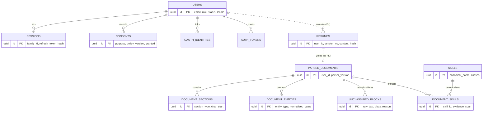
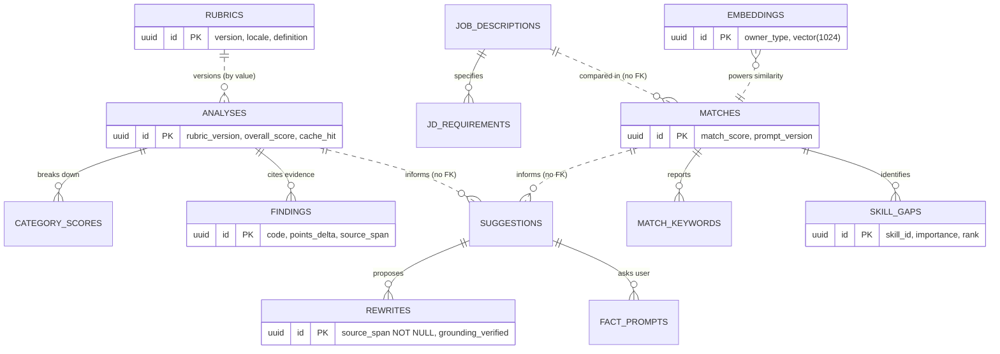
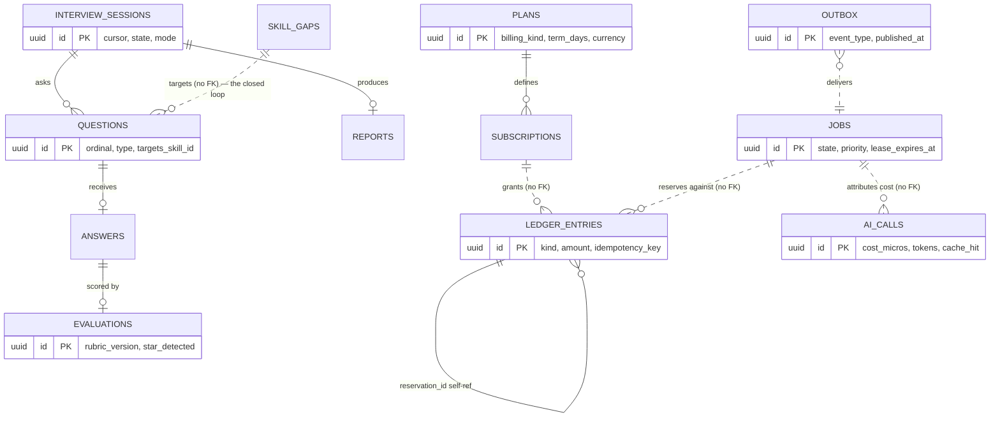

# Phase 6 — Database Design

**Project:** AI Resume Analyzer & Mock Interview Platform
**Status:** Draft — awaiting approval
**Date:** 2026-08-01
**Depends on:** [Phase 3](../requirements/phase-03-requirement-engineering.md) ✅ · [Phase 4](phase-04-system-architecture.md) ✅ · [Phase 5](phase-05-technology-stack.md) ✅

---

## 1. Objective

Design the complete PostgreSQL schema: every table, its ownership, its constraints, its indexes,
and the access patterns those indexes exist to serve — such that Phase 7 can persist AI artefacts,
Phase 12 can implement repositories, and Phase 19 can test against a schema that enforces its own
invariants.

---

## 2. Why This Phase Matters

The schema is the most expensive artefact in the system to change. Code can be rewritten in an
afternoon; a schema with production data in it cannot.

Four things this phase decides that are painful to reverse:

1. **Whether erasure is possible.** FR-PRIV-002/003 requires deleting a user and all their data
   within 30 days. Whether that is a single fan-out or an archaeology project is decided **here**,
   by whether every PII-bearing table can be reached from a `user_id`. §7 makes this a deliberate,
   documented denormalisation rather than something we hope works.
2. **Whether the modular monolith is real.** ADR-0014 says modules own their data. If tables are
   in one flat namespace with foreign keys crossing freely, the boundaries exist only in the code
   — and extraction later becomes a rewrite. §5 makes ownership physical.
3. **Whether the ledger can be trusted.** ADR-0007's append-only guarantee is a schema property,
   not a coding convention. §11 designs it so that "update a balance" is not an available
   operation.
4. **Whether historical scores remain comparable.** FR-ATS-005 requires rubric versions stored
   with scores. Miss it, and the ⭐ progress feature silently starts lying the first time the
   rubric changes.

> **The governing principle: put invariants in the database.** Anything the schema can enforce —
> uniqueness, referential integrity within a module, value ranges, immutability — should be
> enforced there, because application code is bypassable and databases outlive applications.

---

## 3. Deliverables

- [x] Design conventions: identifiers, time, money, enums, naming (§4)
- [x] Schema-per-module layout and the cross-module reference rule (§5)
- [x] Normalisation policy: when 3NF, when JSONB (§6)
- [x] Erasure architecture (§7)
- [x] All 38 tables across 9 schemas (§8–§16)
- [x] Access-pattern catalogue and the indexes derived from it (§17)
- [x] Vector index design (§18)
- [x] ER diagrams, per module cluster (§19)
- [x] Retention implementation (§20)
- [x] Migration strategy (§21)
- [x] Concurrency and locking design (§22)
- [x] Security, scalability, risks, checklist (§24–§28)
- [x] ADR-0024 … ADR-0028

---

## 4. Design Conventions

| Concern | Convention | Reasoning |
|---|---|---|
| **Primary keys** | **UUIDv7**, generated in application code | Time-sortable (good B-tree locality, unlike UUIDv4), non-sequential (no enumeration or volume leakage, per Phase 4 §18). PostgreSQL 16 has no native `uuidv7()`, so generation is in Python ([ADR-0025](../adr/0025-uuidv7-primary-keys.md)) |
| **Naming** | `snake_case`, plural tables, singular columns, `<table>_id` for references | Predictable; SQLAlchemy-friendly |
| **Timestamps** | `TIMESTAMPTZ`, always UTC, named `*_at` | NFR-I18N-004. `TIMESTAMP` without zone is a bug generator |
| **Standard columns** | `created_at`, `updated_at` on mutable tables; **`created_at` only on immutable ones** | The absence of `updated_at` documents immutability |
| **Money** | `BIGINT` minor units + `CHAR(3)` currency | Never floating point. Currency is first-class per ADR-0008's regional pricing |
| **Enums** | `TEXT` + `CHECK` constraint, **not** PostgreSQL `ENUM` | Adding a value to a PG enum requires DDL and cannot be done in a transaction with other work; a `CHECK` is a one-line migration |
| **Booleans** | `NOT NULL DEFAULT false` | Three-valued boolean logic is a recurring source of bugs |
| **Soft delete** | **Avoided.** `deleted_at` only where a grace period is a product requirement | Soft delete plus GDPR erasure is a contradiction — see §7 |
| **JSONB shapes** | Every JSONB column carries a sibling `*_schema_version` | ADR-0027 — undocumented JSONB becomes a landfill |
| **Vector columns** | `vector(n)` from pgvector, dimension fixed per model | Changing model ⇒ new column or re-index (ADR-0020 follow-up) |

---

## 5. Schema Layout — Ownership Made Physical

ADR-0014 requires that modules own their data. We implement that with **one PostgreSQL schema per
module**:

```
identity.*      ingestion.*    parsing.*      analysis.*     matching.*
improvement.*   interview.*    credits.*      notification.*  admin.*
platform.*      (shared infrastructure: jobs, outbox, ai_calls, flags)
reference.*     (shared read-only reference data: skills taxonomy)
```

### The cross-module rule

> **Foreign keys may not cross a schema boundary.** Cross-module references are stored as plain
> UUID columns, with integrity maintained by the application and verified nightly.

This is [ADR-0024](../adr/0024-schema-per-module-no-cross-schema-fks.md), and it is a **real
trade-off, stated plainly**: we give up database-enforced referential integrity across modules in
exchange for extraction being mechanical rather than a rewrite.

| | Within a module | Across modules |
|---|---|---|
| Reference style | `REFERENCES` with `ON DELETE CASCADE` | Plain `UUID` column, indexed |
| Integrity enforced by | PostgreSQL | Application + nightly reconciliation (NFR-REL-008) |
| Example | `parsing.document_sections.parsed_document_id` → `parsing.parsed_documents.id` | `analysis.analyses.resume_id` → *(ingestion.resumes.id, no FK)* |

**Mitigation for the integrity we gave up:** the scheduler runs a nightly orphan check across every
cross-module reference. Drift alerts rather than accumulating silently. This is the same discipline
as the ledger reconciliation job — cheap to run, and the only way to notice.

Per-schema database roles arrive in Horizon 2 (`GRANT` per module), at which point the boundary is
enforced by the database itself, not only by lint.

---

## 6. Normalisation Policy

**Third normal form for anything queried, filtered, aggregated, or joined. JSONB for structures
that are irregular, deeply nested, evolving, and read as a whole.**

The rule we apply, in order:

| Question | If yes → |
|---|---|
| Will we `WHERE`, `ORDER BY`, or `JOIN` on it? | **Column** |
| Does it have a stable, known shape? | **Column** |
| Is it a repeating group we'll count or aggregate? | **Child table** |
| Is it irregular, nested, versioned, and consumed whole? | **JSONB** (+ `*_schema_version`) |
| Are we unsure? | **Column** — promoting JSONB to a column later is easy; the reverse is not |

**Deliberate denormalisations, each with a stated reason:**

| Denormalisation | Why |
|---|---|
| `user_id` on **every** PII-bearing table | Erasure fan-out (§7) — the single most important one |
| `canonical_name` copied alongside `skill_id` | Skills taxonomy evolves; historical reports must not silently change |
| `rubric_version` / `prompt_version` on every AI artefact | FR-ATS-005 comparability |
| `balance_snapshots` cache | Avoids summing the whole ledger per request |
| `analysis.analyses.overall_score` | Derived from category scores, but read on every dashboard |

---

## 7. Erasure Architecture ⭐

FR-PRIV-003 gives us 30 days to delete a user completely. The failure mode is well known: PII
scattered across 30 tables, some reachable only through four joins, and a deletion script that
misses two of them.

### The design: every PII table carries `user_id`

```
identity.users (id)
      │
      └─ user_id column present on EVERY table holding personal data,
         even where it is transitively derivable.

  ingestion.resumes.user_id            parsing.document_sections.user_id
  parsing.parsed_documents.user_id     parsing.unclassified_blocks.user_id
  analysis.analyses.user_id            analysis.analysis_findings.user_id
  matching.matches.user_id             interview.interview_answers.user_id
  credits.credit_entries.user_id       notification.notifications.user_id     … etc.
```

This is **redundant by normalisation standards and correct by compliance standards**
([ADR-0026](../adr/0026-user-id-on-every-pii-table.md)). `parsing.document_sections.user_id` is
derivable via `parsed_documents → resumes → users`, but requiring that join chain means erasure
depends on every intermediate row still existing and on the developer remembering the path.

**With this design, erasure is:**

```sql
-- one predicate per module, no joins, no path knowledge required
DELETE FROM parsing.document_sections WHERE user_id = $1;
```

### The erasure flow

```mermaid
sequenceDiagram
    actor U as User
    participant API
    participant DB as PostgreSQL
    participant OB as Outbox
    participant M as Each module
    participant R2 as Object Storage
    participant SCH as Scheduler

    U->>API: DELETE /v1/me (confirmed)
    API->>DB: users.status = 'pending_deletion'; insert outbox(UserDeleted)
    OB->>M: UserDeleted event fan-out
    M->>DB: DELETE FROM <schema>.<table> WHERE user_id = $1
    M->>R2: delete objects under user prefix
    Note over M,DB: target: complete within 24 h (AC-7)
    SCH->>DB: verification sweep — assert zero rows remain
    SCH->>DB: retain anonymised billing aggregate only
    SCH->>U: confirmation email
    Note over SCH: backups rotate out within 30 days (AC-7)
```

**What survives deletion, and why:** an anonymised financial aggregate (`credits.billing_records`
— amounts, dates, currency, **no user reference**) is retained for the 7-year financial
record-keeping obligation in the Phase 3 retention schedule. It is non-reidentifiable, which is
what makes retention lawful.

**Verification is part of the design, not an afterthought.** A registry table lists every
`(schema, table)` holding user data; the sweep iterates it and asserts zero remaining rows. When a
new PII table is added, adding it to the registry is a migration-checklist item — and a test fails
if a table with a `user_id` column is missing from the registry.

---

## 8. `identity` — Users, Sessions, Consent

**`identity.users`**

| Column | Type | Notes |
|---|---|---|
| `id` | `UUID` PK | UUIDv7 |
| `email` | `CITEXT` | `UNIQUE`; case-insensitive |
| `email_verified_at` | `TIMESTAMPTZ` | FR-AUTH-002 — no credits before verification |
| `password_hash` | `TEXT` | Argon2id; `NULL` for OAuth-only accounts |
| `display_name`, `target_role` | `TEXT` | FR-AUTH-012 |
| `experience_level` | `TEXT` | `CHECK IN ('fresher','mid','senior')` |
| `locale` | `TEXT` | Default `en-IN`; drives rubric selection (NFR-I18N-011) |
| `timezone` | `TEXT` | IANA name; UTC storage, local rendering |
| `role` | `TEXT` | `CHECK IN ('candidate','support','admin')`; `institution`/`recruiter` reserved |
| `status` | `TEXT` | `CHECK IN ('active','suspended','pending_deletion')` |
| `created_at`, `updated_at` | `TIMESTAMPTZ` | |

**`identity.sessions`** — implements ADR-0017

| Column | Type | Notes |
|---|---|---|
| `id`, `user_id` | `UUID` | |
| `family_id` | `UUID` | ⭐ **Rotation lineage.** Reuse detection revokes the whole family |
| `refresh_token_hash` | `TEXT` | SHA-256. **Never store the token itself** |
| `parent_session_id` | `UUID` | Self-reference; the rotation chain |
| `device_label`, `ip_hash`, `user_agent_hash` | `TEXT` | Hashed — recognisable to the user, not identifying in a leak |
| `issued_at`, `expires_at`, `last_used_at` | `TIMESTAMPTZ` | |
| `revoked_at`, `revoked_reason` | `TIMESTAMPTZ`, `TEXT` | `'logout' \| 'logout_all' \| 'reuse_detected' \| 'admin'` |

```sql
-- reuse detection, as a single statement
UPDATE identity.sessions SET revoked_at = now(), revoked_reason = 'reuse_detected'
WHERE family_id = (SELECT family_id FROM identity.sessions WHERE id = $1)
  AND revoked_at IS NULL;
```

**`identity.consents`** — **append-only** (ADR-0012: "revocation is an event, not an update")

`id · user_id · purpose ('terms'|'privacy'|'model_training'|'marketing') · policy_version ·
granted (bool) · occurred_at · source_ip_hash`

Current state is the latest row per `(user_id, purpose)`. The full history is preserved, which is
what makes consent defensible under audit.

**`identity.oauth_identities`** — `id · user_id · provider · provider_subject · linked_at`,
`UNIQUE (provider, provider_subject)`

**`identity.auth_tokens`** — single table for password-reset and email-verification tokens:
`id · user_id · purpose · token_hash · expires_at · used_at · created_at`. Hashed, single-use,
time-limited (FR-AUTH-009).

---

## 9. `ingestion` — Uploaded Files

**`ingestion.resumes`**

| Column | Type | Notes |
|---|---|---|
| `id`, `user_id` | `UUID` | |
| `version_no` | `INT` | `UNIQUE (user_id, version_no)` — powers the ⭐ score-delta feature (FR-DASH-003) |
| `original_filename` | `TEXT` | Sanitised on display |
| `mime_type`, `byte_size`, `page_count` | | Validated pre-storage (FR-UPL-002/003/004) |
| `content_hash` | `TEXT` | SHA-256 of bytes. ⭐ **The cache key component** (FR-CRED-005) |
| `storage_key`, `storage_bucket` | `TEXT` | R2 object reference; **file bytes are never in the database** |
| `scan_status` | `TEXT` | `CHECK IN ('pending','clean','infected','error')` — parsing is gated on `'clean'` (FR-UPL-007) |
| `uploaded_at`, `last_accessed_at` | `TIMESTAMPTZ` | `last_accessed_at` drives the 12-month retention clock |

> **`last_accessed_at`, not `created_at`, drives retention.** The Phase 3 schedule says "12 months
> after last access" — a returning user's data should not vanish because they uploaded it a year
> ago and used it last week.

---

## 10. `parsing` — Structured Extraction

**`parsing.parsed_documents`** — `id · user_id · resume_id (no FK) · parser_version ·
extraction_method ('text'|'ocr') · status · extracted_text · layout JSONB · layout_schema_version ·
overall_confidence · created_at`

**`parsing.document_sections`** — `id · user_id · parsed_document_id · section_type · ordinal ·
char_start · char_end · raw_text · confidence`
`section_type CHECK IN ('contact','summary','experience','education','skills','projects','certifications','other')`

**`parsing.document_entities`** — `id · user_id · parsed_document_id · section_id · entity_type ·
raw_value · normalized_value JSONB · confidence · source_span JSONB`

`entity_type`: `name, email, phone, url, organization, job_title, date_range, degree, institution`.
`normalized_value` holds the canonical form — and for dates, **an `is_ambiguous` flag rather than a
guess** (FR-PARSE-004).

**`parsing.unclassified_blocks`** ⭐ — the table that makes the wedge possible

| Column | Type | Notes |
|---|---|---|
| `id`, `user_id`, `parsed_document_id` | `UUID` | |
| `raw_text` | `TEXT` | Content we extracted but could not classify |
| `bbox` | `JSONB` | Page and coordinates, for highlighting in the UI |
| `reason` | `TEXT` | `'unknown_section' \| 'in_table' \| 'in_image' \| 'header_footer' \| 'multi_column_ambiguity'` |

> **This table is the direct implementation of FR-PARSE-007 and the backbone of the parse-fidelity
> report.** A parser that silently discards what it cannot understand cannot tell a user what the
> machine missed. Persisting failure is what turns a parsing limitation into the product's
> differentiating feature. The invariant `classified_text + unclassified_text = extracted_text`
> (AC-1) is asserted in tests against these rows.

**`parsing.document_skills`** — `id · user_id · parsed_document_id · skill_id (→ reference) ·
canonical_name (copied) · evidence_span JSONB · confidence`

**`reference.skills`** — shared taxonomy, not user data: `id · canonical_name · category ·
aliases TEXT[] · is_active`. GIN index on `aliases` for alias lookup (`K8s` → `Kubernetes`).

---

## 11. `analysis` — Scoring ⭐

**`analysis.rubrics`** — the rubric as versioned data (ADR-0013, NFR-I18N-011)

`id · version · locale · status ('draft'|'published'|'retired') · definition JSONB ·
definition_schema_version · published_at`
`UNIQUE (version, locale)`

**`analysis.analyses`**

| Column | Type | Notes |
|---|---|---|
| `id`, `user_id` | `UUID` | |
| `resume_id`, `parsed_document_id` | `UUID` | Cross-module, no FK |
| `rubric_version`, `rubric_locale` | `TEXT` | ⭐ **FR-ATS-005** — without this, history becomes incomparable |
| `prompt_version` | `TEXT` | Reproducibility |
| `overall_score` | `SMALLINT` | `CHECK BETWEEN 0 AND 100` |
| `confidence` | `NUMERIC(4,3)` | FR-ATS-010 |
| `cache_hit` | `BOOLEAN` | Feeds the NFR-COST-004 SLI |
| `status`, `created_at` | | |

**`analysis.category_scores`** — `id · user_id · analysis_id · category · weight · raw_score ·
weighted_score` (FR-ATS-007)

**`analysis.findings`** — evidence-cited deductions (FR-ATS-006)

`id · user_id · analysis_id · code · category · severity · points_delta · title · detail ·
source_span JSONB · source_section_id`

`source_span` is what makes "this deduction came from *this line*" true rather than claimed. A
finding without a resolvable span fails validation.

**The fidelity report is a view, not a table.** It is a projection over `document_sections`,
`unclassified_blocks`, and `findings` — deriving it guarantees it cannot drift from its sources.

---

## 12. `matching` — Job Descriptions & Embeddings

**`matching.job_descriptions`** — `id · user_id · title · company · raw_text · content_hash ·
source ('paste'|'url') · created_at`

**`matching.jd_requirements`** — `id · user_id · job_description_id · text · kind ('hard'|'nice') ·
skill_id · importance` (FR-MATCH-004)

**`matching.matches`** — `id · user_id · resume_id · parsed_document_id · job_description_id ·
match_score · rubric_version · prompt_version · cache_hit · status · created_at`

**`matching.match_keywords`** — `id · user_id · match_id · keyword · matched · matched_via
('exact'|'alias'|'semantic') · evidence_span JSONB`

**`matching.skill_gaps`** — `id · user_id · match_id · skill_id · canonical_name · importance ·
rank` — consumed by the interview module for gap-targeted questions (FR-INT-004), the closed loop.

**`matching.embeddings`** — `id · user_id · owner_type ('resume'|'job_description') · owner_id ·
model · dimensions · embedding vector(1024) · created_at`

Derived and rebuildable (Phase 4 §13), so a model change in Phase 10 is a re-index, not a
migration.

---

## 13. `improvement` — Grounded Suggestions

**`improvement.suggestions`** — `id · user_id · analysis_id · match_id · rank · category ·
estimated_impact · title · rationale · status ('new'|'viewed'|'applied'|'dismissed')`

**`improvement.rewrites`** ⭐ — where ADR-0004 becomes a schema constraint

| Column | Type | Notes |
|---|---|---|
| `id`, `user_id`, `suggestion_id` | `UUID` | |
| `before_text`, `after_text` | `TEXT` | |
| `source_span` | `JSONB` | **`NOT NULL`** — FR-IMP-003 |
| `grounding_verified` | `BOOLEAN` | **`NOT NULL`**, and a `CHECK` requires it `true` to persist |
| `guard_report` | `JSONB` | What the guard stage checked and concluded |

```sql
CONSTRAINT rewrite_must_be_grounded CHECK (grounding_verified = true)
```

> **An ungrounded rewrite cannot physically be stored.** ADR-0004 is enforced at the guard stage in
> code and again by the database — defence in depth for the commitment the product's credibility
> rests on.

**`improvement.fact_prompts`** — `id · user_id · suggestion_id · field · question · answered_value ·
answered_at` — implements FR-IMP-005: ask for the real number rather than inventing one.

---

## 14. `interview` — Sessions

**`interview.sessions`** — `id · user_id · resume_id · job_description_id · match_id · mode
('text')¹ · difficulty · planned_questions · cursor · state ('active'|'paused'|'completed'|'abandoned') ·
rubric_version · started_at · last_activity_at · completed_at`

¹ `mode` exists now with a single value so voice (H2) is an enum addition, not a migration.

**`interview.questions`** — `id · user_id · session_id · ordinal · question_type
('behavioural'|'technical'|'hr') · difficulty · text · targets_skill_id · generation_basis JSONB`
`UNIQUE (session_id, ordinal)`

**`interview.answers`** — `id · user_id · session_id · question_id · answer_text · submitted_at ·
compose_duration_ms`

**`interview.evaluations`** — `id · user_id · answer_id · session_id · rubric_version ·
overall_score · star_detected · dimension_scores JSONB · feedback · created_at`

**`interview.reports`** — `id · user_id · session_id · summary JSONB · pdf_storage_key ·
generated_at`

> **`cursor` plus persisted answers is what satisfies FR-INT-006** (resume in two days at question
> 4). Session state lives in the database, never in worker memory — which is also what makes the
> workers stateless and horizontally scalable.

---

## 15. `credits` — Ledger, Plans, Payments

**`credits.plans`** — `id · code · name · currency · price_minor · billing_kind
('free'|'recurring'|'fixed_term') · interval_months · term_days · monthly_credits · region ·
is_active`

`billing_kind = 'fixed_term'` with `term_days = 90` is how ADR-0008's Job Search Pass is
represented. Building the concept in now avoids the migration that a recurring-only schema would
force.

**`credits.subscriptions`** — `id · user_id · plan_id · status · starts_at · **ends_at** ·
cancel_at · external_ref · currency · region`

Entitlement checks read `ends_at`, not "is subscribed" — the ADR-0008 follow-up.

**`credits.ledger_entries`** ⭐ — **append-only, no `UPDATE`, no `DELETE`, ever**

| Column | Type | Notes |
|---|---|---|
| `id`, `user_id` | `UUID` | |
| `kind` | `TEXT` | `CHECK IN ('grant','reserve','commit','refund','expire','adjust')` |
| `amount` | `INTEGER` | **Signed.** Balance is `SUM(amount)` |
| `reservation_id` | `UUID` | Self-reference to the originating `reserve` entry |
| `job_id`, `feature_code` | | Cost attribution (NFR-COST-006) |
| `expires_at` | `TIMESTAMPTZ` | On `reserve` rows — drives automatic refund |
| `idempotency_key` | `TEXT` | `UNIQUE` — makes duplicate delivery a no-op (NFR-REL-002) |
| `created_at` | `TIMESTAMPTZ` | No `updated_at`; its absence documents immutability |

```sql
-- reserve : amount = -3, kind='reserve', reservation_id = its own id
-- commit  : amount =  0, kind='commit', reservation_id = <reserve id>   (the -3 already applied)
-- refund  : amount = +3, kind='refund', reservation_id = <reserve id>

balance      = SELECT COALESCE(SUM(amount),0) FROM credits.ledger_entries WHERE user_id = $1;
open_reserve = reserve rows with no commit/refund referencing them;
available    = balance  (already net of open reserves, since reserve is negative)
```

**Why `commit` carries `amount = 0`:** the reservation already debited. Committing is an assertion
that the work happened, not a second charge. This keeps `SUM(amount)` correct at every instant with
no compensating arithmetic — the property that makes the ledger auditable.

**Immutability is enforced by the database:**
```sql
REVOKE UPDATE, DELETE ON credits.ledger_entries FROM app_role;
CREATE TRIGGER ledger_immutable BEFORE UPDATE OR DELETE ON credits.ledger_entries
  FOR EACH ROW EXECUTE FUNCTION platform.raise_immutable();
```

**`credits.balance_snapshots`** — `user_id · balance · last_entry_id · computed_at`. A cache, fully
rebuildable, never authoritative.

**`credits.payments`** (H2) — `id · user_id · subscription_id · provider ('razorpay'|'stripe') ·
external_id · amount_minor · currency · status · occurred_at · provider_payload JSONB`
`UNIQUE (provider, external_id)` — webhook idempotency.

**`credits.billing_records`** — the anonymised aggregate that survives erasure (§7): amount, date,
currency, plan code, **no user reference**.

---

## 16. `platform`, `notification`, `admin`

### `platform.jobs` — the state machine from Phase 4 §9.1

| Column | Type | Notes |
|---|---|---|
| `id`, `user_id` | `UUID` | |
| `type`, `state` | `TEXT` | `CHECK IN ('created','queued','running','succeeded','failed','dead_letter','cancelled')` |
| `priority` | `SMALLINT` | Tier-based — NFR-CAP-004 |
| `attempts`, `max_attempts` | `SMALLINT` | |
| `idempotency_key` | `TEXT` | `UNIQUE` |
| `payload`, `error` | `JSONB` | |
| `lease_owner`, `lease_expires_at` | `TEXT`, `TIMESTAMPTZ` | ⭐ Crash recovery (NFR-REL-001) |
| `reservation_id` | `UUID` | Links to the credit reserve entry |
| `created_at`, `started_at`, `finished_at` | | |

### `platform.outbox` — ADR-0016

`id · aggregate_type · aggregate_id · event_type · payload JSONB · created_at · published_at ·
publish_attempts`

```sql
-- the relay's only query; the partial index keeps it O(unpublished), not O(table)
CREATE INDEX ix_outbox_unpublished ON platform.outbox (created_at)
  WHERE published_at IS NULL;
```

### `platform.ai_calls` — cost attribution (NFR-COST-006)

`id · user_id · job_id · feature_code · provider · model · prompt_version · input_tokens ·
output_tokens · cost_micros · latency_ms · cache_hit · outcome · created_at`

Every call through the `ai_port` writes one row. This table *is* the admin cost dashboard
(FR-ADM-004) and the source for NFR-COST-001/002/004.

### `platform.idempotency_keys`, `platform.feature_flags`

`idempotency_keys`: `key · user_id · endpoint · request_hash · response_status · response_body ·
expires_at` — a replay returns the original response (Phase 4 §18).
`feature_flags`: `key · enabled · rules JSONB · updated_at · updated_by` — runtime kill switches
(FR-ADM-005).

### `notification.notifications` / `notification.preferences`

`id · user_id · channel · template · payload JSONB · state · scheduled_for · sent_at ·
provider_message_id · error`

### `admin.audit_log` ⭐ — tamper-evident by hash chain

| Column | Type | Notes |
|---|---|---|
| `id`, `seq` | `UUID`, `BIGSERIAL` | `seq` gives strict ordering |
| `actor_type`, `actor_id` | | `'user' \| 'admin' \| 'system'` |
| `action`, `target_type`, `target_id` | | |
| `subject_user_id` | `UUID` | Whose data was touched |
| `reason` | `TEXT` | **`NOT NULL` for admin actions** (FR-ADM-002) |
| `ip_hash`, `metadata` | | |
| `prev_hash`, `row_hash` | `TEXT` | ⭐ `row_hash = SHA256(prev_hash ‖ canonical(row))` |

> **The hash chain is what makes NFR-SEC-009's "tamper-evident" claim true rather than decorative**
> ([ADR-0028](../adr/0028-hash-chained-audit-log.md)). Altering or deleting any historical row
> breaks every subsequent hash, and a nightly verifier detects it. Append-only permissions stop the
> honest mistake; the chain detects the dishonest one.

### `admin.content_access_log` — break-glass (FR-ADM-006)

`id · admin_user_id · subject_user_id · resource_type · resource_id · justification (NOT NULL) ·
accessed_at · notified_user_at`

A separate table from the general audit log because these events are qualitatively different: they
are the ones a user has a right to be told about.

### On "Analytics" and "Tokens" from the charter

**Analytics** lives in two places, deliberately. *Product* analytics (the Phase 2 §13 event
taxonomy) go to PostHog — pseudonymous, bucketed, **no PII, no resume content** (FR-PRIV-009).
*Business* analytics are SQL views over the operational tables (`analysis.analyses`,
`platform.ai_calls`, `credits.ledger_entries`), materialised nightly into
`admin.daily_rollups`. Duplicating the product event stream into PostgreSQL would create a second
PII estate for no benefit.

**"Tokens"** in the charter is ambiguous; all three readings are covered: *auth tokens* →
`identity.sessions` + `identity.auth_tokens` (hashed, never stored raw); *AI tokens* →
`platform.ai_calls.input_tokens/output_tokens`; *credit tokens* → `credits.ledger_entries`.

---

## 17. Access Patterns & Indexes

**Indexes are derived from queries, not guessed.** Every index below exists to serve a listed
access pattern; an index without one is removed.

| # | Access pattern | Frequency | Index |
|---|---|---|---|
| A1 | Log in by email | High | `users(email)` UNIQUE (CITEXT) |
| A2 | Validate a session | Very high | `sessions(refresh_token_hash)` UNIQUE |
| A3 | Revoke a session family | Low | `sessions(family_id) WHERE revoked_at IS NULL` |
| A4 | List a user's resumes | High | `resumes(user_id, version_no DESC)` |
| A5 | Cache lookup by content | High | `resumes(content_hash)` |
| A6 | **Claim the next job** | **Very high** | `jobs(priority, created_at) WHERE state='queued'` |
| A7 | Sweep expired leases | Every minute | `jobs(lease_expires_at) WHERE state='running'` |
| A8 | **Relay unpublished outbox rows** | **Very high** | `outbox(created_at) WHERE published_at IS NULL` |
| A9 | Score history for a user | High | `analyses(user_id, created_at DESC)` |
| A10 | Findings for an analysis | High | `findings(analysis_id)` |
| A11 | Compute balance | High | `ledger_entries(user_id, created_at)` |
| A12 | Find open reservations | Every minute | `ledger_entries(reservation_id) WHERE kind='reserve'` + partial on `expires_at` |
| A13 | Idempotency check | High | `ledger_entries(idempotency_key)` UNIQUE |
| A14 | Semantic JD match | Medium | HNSW on `embeddings(embedding)` (§18) |
| A15 | Skill alias lookup | Medium | GIN on `reference.skills(aliases)` |
| A16 | Resume an interview session | Medium | `sessions(user_id, state) WHERE state IN ('active','paused')` |
| A17 | **Erasure fan-out** | Rare, critical | `(user_id)` on **every** PII table |
| A18 | Retention sweep | Daily | `resumes(last_accessed_at)`, `analyses(created_at)` |
| A19 | Cost by feature/day | Daily | `ai_calls(created_at, feature_code)` |
| A20 | Audit trail for a subject | Rare | `audit_log(subject_user_id, seq)` |

**Partial indexes carry disproportionate weight here.** A6 and A8 are the hottest queries in the
system, and both filter to a small subset of a large table. `WHERE state='queued'` and
`WHERE published_at IS NULL` keep those indexes proportional to *pending work* rather than to
*total history* — the difference between a queue that stays fast at 10 million rows and one that
degrades steadily.

---

## 18. Vector Index Design

```sql
CREATE INDEX ix_embeddings_hnsw ON matching.embeddings
  USING hnsw (embedding vector_cosine_ops)
  WITH (m = 16, ef_construction = 64);
```

| Choice | Reasoning |
|---|---|
| **HNSW over IVFFlat** | Better recall/latency at our scale; no training step, so it works from the first row — IVFFlat needs a populated table before its lists are meaningful |
| **Cosine distance** | Standard for text embeddings; magnitude carries no meaning |
| `m=16, ef_construction=64` | Balanced defaults; tune against measured recall in Phase 10 |
| Dimension fixed per model | A model change means a new column and a re-index — cheap, because embeddings are derived (Phase 4 §13) |

Filtering is by `owner_type` and `user_id` **before** the vector search where selectivity allows,
since pre-filtering a small candidate set beats post-filtering a large ANN result.

---

## 19. ER Diagrams

One diagram per module cluster. A single diagram of 38 tables would be unreadable, which defeats
the purpose. Dashed lines are cross-module references with **no** foreign key (ADR-0024).

### Identity → Ingestion → Parsing



### Analysis → Matching → Improvement



### Interview · Credits · Platform



---

## 20. Retention Implementation

The Phase 3 §7.4 schedule, made operational. **Retention is enforced by code, not by intention**
(FR-PRIV-010).

**`platform.retention_policies`** — `table_name · schema_name · date_column · retention_days ·
condition_sql · is_active · last_run_at`

The scheduler iterates this table nightly. Adding a table means adding a row, which is far harder
to forget than adding a branch to a purge script.

| Data | Column driving the clock | Window |
|---|---|---|
| Resume files (R2) + `resumes` | `last_accessed_at` | 12 months |
| `parsed_documents` + children | `created_at` | 12 months |
| `analyses`, `matches` | `created_at` | 12 months |
| **Free-tier history** | `created_at` | **30 days** (FR-DASH-006) |
| Interview sessions/reports | `created_at` | 12 months |
| `ledger_entries`, `payments` | `created_at` | **7 years** (financial) |
| `audit_log`, `content_access_log` | `created_at` | 12 months |
| `outbox` (published) | `published_at` | 7 days |
| `idempotency_keys` | `expires_at` | 24 hours |
| `jobs` (terminal) | `finished_at` | 90 days |

**A registry test guards the design:** any table with a `user_id` column that appears in neither
`retention_policies` nor the erasure registry fails CI. New PII cannot be added silently.

---

## 21. Migration Strategy

**Alembic**, one migration chain, with each module's migrations in its own directory
(`modules/<name>/migrations/`) merged into a single ordered history — because a single database
needs a single ordering, even with per-module ownership.

**Expand / contract**, always, so a migration never requires the application and schema to deploy
simultaneously:

```
1. EXPAND    add the new column/table, nullable, no constraint
2. BACKFILL  populate in batches (never one long transaction)
3. DUAL      application writes both, reads old
4. SWITCH    application reads new
5. CONTRACT  drop the old column, add NOT NULL   ← a later, separate release
```

Rules: every migration is reversible (NFR-MNT-004) · no long-held locks (`CREATE INDEX
CONCURRENTLY`; `lock_timeout` set) · no data migrations inside DDL migrations · every migration
tested against a production-shaped seed in CI · destructive steps are their own release.

---

## 22. Concurrency & Locking

| Operation | Mechanism | Why |
|---|---|---|
| **Claim next job** | `SELECT … FOR UPDATE SKIP LOCKED LIMIT 1` | Multiple workers claim concurrently with no contention and no double-processing |
| Lease renewal | `UPDATE … WHERE id = $1 AND lease_owner = $2` | A worker cannot renew a lease it has lost |
| Credit reservation | Insert-only, `UNIQUE(idempotency_key)` | No row lock at all — **append-only removes the contention that a mutable balance would create** |
| Scheduler singleton | `pg_advisory_lock` | Two schedulers running the retention purge is a bad day (R-30) |
| Outbox relay | `FOR UPDATE SKIP LOCKED` on the partial index | Relay can be scaled out without duplicate publishing |
| Session family revoke | Single `UPDATE … WHERE family_id` | Atomic; no read-modify-write race |

> **The ledger's append-only design is also a concurrency design.** A mutable `balance` column
> would be a per-user hot row with lock contention under concurrent jobs. Insert-only rows have no
> contention at all — auditability and concurrency turn out to be the same decision.

Isolation level: **Read Committed** (PostgreSQL default) is sufficient everywhere, because no
operation does a read-modify-write on a value another transaction can change. That property is a
consequence of the append-only and idempotency-key designs, not an accident.

---

## 23. Folder Structure (Phase 6 additions)

```
modules/<module>/
├── infrastructure/
│   ├── models.py            # SQLAlchemy ORM — lives here, never in domain/
│   ├── repositories.py      # returns DOMAIN objects, not ORM rows
│   └── queries.py           # read-model / view queries
└── migrations/versions/     # Alembic revisions owned by this module

docs/architecture/
├── phase-06-database-design.md      ← this document
├── er-diagrams/                     # exported diagrams
└── data-dictionary.md               # generated from the schema, CI-verified current
```

---

## 24. Security Considerations

| Concern | Design |
|---|---|
| **Encryption at rest** | Managed PostgreSQL volume encryption + R2 object encryption. **Column-level encryption of `extracted_text` is rejected** — that text must be tokenised, matched, and analysed, so encrypting it would break the product. Mitigation is access control plus short retention, and this trade-off is stated rather than hidden |
| Password storage | Argon2id only (FR-AUTH-003) |
| Token storage | **Only hashes** for refresh, reset, and verification tokens |
| IP / user-agent | Hashed — useful to the user, useless to an attacker |
| **Admin content access** | `content_access_log` with mandatory justification; general admin views never join to `extracted_text` (FR-ADM-006) |
| **Ledger immutability** | `REVOKE UPDATE, DELETE` + trigger — enforced by the database, not by convention |
| **Audit integrity** | Hash chain + nightly verification (ADR-0028) |
| IDOR prevention | Every repository query is scoped by `user_id` **in the repository**, never filtered afterwards |
| SQL injection | Parameterised queries only; ORM or explicitly bound SQL — no string interpolation, enforced by lint |
| PII in logs | Serialiser denylist covers `extracted_text`, `raw_text`, `answer_text`, `email`, `password_hash` (FR-PRIV-009) |
| Backup encryption | Managed provider encryption; restore drills verify monthly (NFR-REL-009) |

---

## 25. Scalability Considerations

| Growth | Response | Trigger |
|---|---|---|
| `ledger_entries` grows unbounded | `balance_snapshots` watermark caps the summed range | Already designed |
| `analyses` / `findings` volume | Time-partition by month | > ~50M rows |
| `ai_calls` volume | Roll up to `daily_rollups`, then partition | > ~10M rows |
| `outbox` growth | Pruned at 7 days; partial index keeps the relay O(pending) | Already designed |
| Vector index memory | HNSW is memory-resident | Extract to a vector service (ADR-0018 conditions) |
| Read load | Read replicas for dashboards and history | Measured contention |
| Connection exhaustion | PgBouncer (Phase 5 §27) | API replica count × pool size |

**Deliberately not done at MVP:** partitioning, sharding, replicas, or materialised views beyond
`daily_rollups`. At Phase 3's load model (50–500 analyses/day), all of these are complexity without
benefit. Triggers are recorded so they are decisions rather than emergencies.

---

## 26. Risks (Phase 6 additions)

| ID | Risk | P×I | Mitigation |
|---|---|:--:|---|
| **R-38** | **Cross-module orphans accumulate** — the cost of ADR-0024's no-FK rule | 🟠×🟠 | Nightly reconciliation across every cross-module reference; drift alerts (NFR-REL-008) |
| **R-39** | **A new PII table is added and missed by erasure/retention** | 🟠×🔴 | CI test: any table with `user_id` absent from both registries **fails the build** |
| R-40 | JSONB columns become a landfill | 🟠×🟡 | Every JSONB column carries `*_schema_version`; shapes documented and validated (ADR-0027) |
| R-41 | `balance_snapshots` drifts from the ledger | 🟡×🔴 | Snapshot is a cache; nightly reconciliation recomputes and alerts on mismatch |
| R-42 | Embedding model change invalidates all vectors | 🟠×🟡 | Embeddings are derived; re-index job with dual-column expand/contract |
| R-43 | Retention purge deletes data a user is actively using | 🟡×🟠 | Clock is `last_accessed_at`, not `created_at`; warning email before purge |

---

## 27. Production Readiness Checklist — Phase 6 Exit

| # | Criterion | Status |
|---|---|---|
| 1 | All charter entities designed (users, resumes, jobs, sessions, feedback, analytics, subscriptions, payments, tokens, audit, notifications, admin) | ✅ 38 tables |
| 2 | Schema organised per module; no cross-schema FKs | ✅ ADR-0024 |
| 3 | Normalisation policy stated; denormalisations justified | ✅ |
| 4 | **Erasure is a designed fan-out, verifiable** | ✅ ADR-0026 |
| 5 | Ledger append-only, enforced by permissions + trigger | ✅ |
| 6 | Rubric/prompt versions stored with every AI artefact | ✅ FR-ATS-005 |
| 7 | Grounding enforced by a CHECK constraint | ✅ |
| 8 | Job state machine, leases, outbox tables designed | ✅ |
| 9 | Indexes derived from a written access-pattern catalogue | ✅ 20 patterns |
| 10 | Vector index chosen with reasoning | ✅ HNSW |
| 11 | ER diagrams per module cluster | ✅ |
| 12 | Retention driven by a policy table, CI-guarded | ✅ |
| 13 | Migration strategy (expand/contract, reversible) | ✅ |
| 14 | Concurrency: SKIP LOCKED, advisory locks, no hot rows | ✅ |
| 15 | Audit log tamper-evident | ✅ ADR-0028 |
| 16 | ADR-0024…0028 recorded | ✅ |
| 17 | Seed + fixture data for local/CI | ⬜ **S0** |
| 18 | Phase 6 approved | ⬜ |

---

## 28. Open Questions

1. **Embedding dimension** — `vector(1024)` is a placeholder until Phase 10 picks a model. If you
   have a preference between a smaller/cheaper model (384–768 dims) and a larger/more accurate one
   (1024–1536), it changes index memory and cost. *(Lean: decide in Phase 10 on measured match
   quality; the column is easy to add alongside.)*
2. **Free-tier history at 30 days** — this deletes a free user's score history, which is exactly the
   ⭐ progress feature that drives retention. **I think this is worth reconsidering**: keeping
   *scores* (tiny rows) while purging *resume files and extracted text* (the expensive, sensitive
   parts) would preserve the retention hook at near-zero cost and lower risk. Shall I revise
   FR-DASH-006 accordingly?
3. **Retention at 12 months** — still unconfirmed from Phase 3 Q4.
4. ⚠️ **Golden corpus** — now blocking S1's gate, R-21, R-32, and the seed fixtures. **This remains
   the most urgent unanswered question in the project.**

---

## 29. Phase 6 Summary

| Question | Answer |
|---|---|
| **How is module ownership physical?** | One PostgreSQL schema per module; **no foreign keys cross a schema** (ADR-0024) |
| **What did that cost?** | DB-enforced cross-module integrity — bought back with a nightly reconciliation job |
| **How is erasure guaranteed?** | `user_id` on **every** PII table — deliberate denormalisation, so deletion is one predicate per module with no join paths to remember |
| **What makes the wedge storable?** | `parsing.unclassified_blocks` — persisting what the parser *failed* to understand is what turns a limitation into the differentiating feature |
| **How is the ledger trustworthy?** | Append-only, signed amounts, `REVOKE UPDATE/DELETE` + trigger; balance is `SUM(amount)` — and being insert-only removes lock contention too |
| **How is ADR-0004 enforced in data?** | `CHECK (grounding_verified = true)` — an ungrounded rewrite cannot physically be stored |
| **What keeps the hot queries fast?** | Partial indexes on `jobs(state='queued')` and `outbox(published_at IS NULL)` — sized to pending work, not to history |
| **Biggest new risk?** | R-39: a future PII table missed by erasure — mitigated by a CI test that fails the build |

---

**Do you approve this phase? Shall we move to the next one?**
