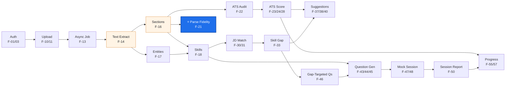
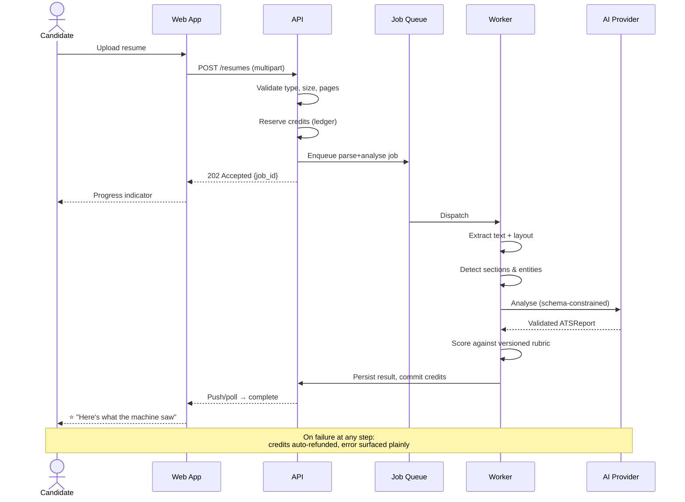

# Phase 2 — Product Planning

**Project:** AI Resume Analyzer & Mock Interview Platform
**Status:** Draft — awaiting approval
**Date:** 2026-07-31
**Depends on:** [Phase 1 — Problem Definition](../phase-01-problem-definition.md) ✅ Approved

---

## 0. Standing on unanswered questions

Phase 1 §22 raised 8 open questions. Phase 1 was approved without answers, so per Operating
Rule 6 I am **not silently assuming** — I am adopting explicit, recorded defaults
([ADR-0005](../adr/0005-default-product-assumptions.md)) and marking every decision that
depends on one. Correct any of these at any time and I will revise the affected sections.

| Q | Default adopted | Sections it drives | Cost to change later |
|---|---|---|---|
| Q1 Commercial intent | **Real monetisable SaaS** | §8–§11 pricing, credits, billing | 🟢 Low if changed before Phase 6 (drop billing tables) |
| Q2 Geography | **India-first, English, global-capable** | §9 pricing tiers, currency, gateway | 🟡 Medium (pricing/gateway rework) |
| Q3 Team & time | **1–2 devs part-time, ~12 weeks to v0.3** | §6 slices, §12 roadmap | 🟢 Low (rescale slices) |
| Q4 Budget | **≤ $150/mo infra + AI** | §10 credit costs, §16 scalability | 🟡 Medium (model tier choice, Phase 10) |
| Q5 Facial analysis | **Dropped** ([ADR-0003](../adr/0003-no-facial-emotion-analysis.md)) | §5 feature catalogue | 🔴 High if reversed (DPIA, legal, geo-gating) |
| Q6 Wedge | **"Show what the ATS actually saw"** | Everything | 🔴 High — this is the product's spine |
| Q7 Recruiter panel | **Deferred to H4** | §7 | 🟢 Low |
| Q8 Mandated tech | **None** | Phase 5 | 🟢 Low |

⚠️ **Q5 and Q6 are the two that are expensive to reverse.** If you have any hesitation about
either, say so now rather than after Phase 7.

---

## 1. Objective

Convert the approved problem statement into a **buildable, sequenced, priced product plan**:
a complete feature catalogue with owners and tiers, a defensible MVP boundary, a release
plan in shippable slices, a monetisation model that survives the unit economics, and the
scope of each surface (candidate dashboard, admin, institution, recruiter).

Phase 1 answered *what problem and for whom*. Phase 2 answers ***what exactly we build,
in what order, and who pays for what***.

---

## 2. Why This Phase Matters

**R-01 (scope explosion) is the top risk in the register, and this is the phase that either
contains it or lets it loose.** Concretely, three decisions are made here that are painful
to reverse later:

1. **The MVP cut line.** Everything after this — architecture, schema, AI design, testing —
   sizes itself to the feature list produced here. A list 30% too long produces an
   architecture 30% too complex and a timeline 100% too long, because complexity compounds.
2. **The monetisation model.** Credits vs seats vs unlimited is not a pricing detail — it's a
   **database schema decision** (Phase 6), an **API design decision** (Phase 12), and a
   **security control** (Phase 17, cost-based DoS). Retrofitting a credit ledger onto a live
   system with real balances is one of the genuinely nasty migrations in SaaS.
3. **The event taxonomy.** Activation is our ⭐ metric (≥70%). You cannot measure a funnel
   retroactively — events not emitted in v0.1 are data permanently lost. Deciding *now* what
   we instrument is why this phase includes §13.

There is also a sequencing reason. Phase 3 (requirements) must have a bounded feature set to
write requirements *against*, or it degenerates into a wish list. This phase produces that
bound.

---

## 3. Deliverables

- [x] Prioritisation method chosen and justified (§4)
- [x] Complete feature catalogue, 58 features with IDs, tier, effort, Kano class (§5)
- [x] MVP definition + the golden path it must deliver (§6)
- [x] Release plan in 6 vertical slices with exit criteria (§6.3)
- [x] Surface scopes: candidate dashboard, admin, institution, recruiter (§7)
- [x] Premium/tiering principle and tier matrix (§8)
- [x] Pricing model with competitor anchoring and India/global tiers (§9)
- [x] AI credit system: economics, costs, UX rules, abuse controls (§10)
- [x] Usage limits table (§11)
- [x] Roadmap with metric gates (§12)
- [x] Event taxonomy for activation instrumentation (§13)
- [x] Feature dependency graph + golden-path flow (§14)
- [x] Security, scalability, risks, checklist (§18–§21)
- [x] ADR-0005 … ADR-0008

---

## 4. Prioritisation Method

### Frameworks considered

| Method | What it's good at | Why it does / doesn't fit us |
|---|---|---|
| **RICE** (Reach × Impact × Confidence ÷ Effort) | Ranking a backlog when you have usage data | ❌ **Reach and Confidence are pure guesses pre-launch.** RICE with invented inputs is false precision — a spreadsheet that launders opinion into a number |
| **MoSCoW** (Must/Should/Could/Won't) | Fast, communicates a cut line clearly | ◐ Useful as *output*, weak as *analysis* — everything drifts into "Must" |
| **Kano model** (Basic / Performance / Delighter) | Distinguishing "absence kills you" from "presence wins you" | ✅ **Exactly our problem.** Our wedge is a delighter; our parser is a basic. Treating them the same is fatal |
| **Value vs Effort matrix** | Sequencing within a fixed set | ✅ Good second pass once Kano has classified |
| **Story mapping** | Keeping a coherent user journey when slicing | ✅ Prevents the classic MVP failure: shipping 60% of every feature and 100% of no journey |

### Chosen: **Kano → Value/Effort → Story-mapped slices → MoSCoW label**

**Why this combination:** Kano prevents the most expensive error available to us. In a Kano
frame, **basic (must-be) features earn zero satisfaction when present and destroy the product
when absent** — resume parsing that mangles a two-column PDF is not a "quality issue", it's a
product that doesn't exist. **Delighters** — the parse-fidelity view, the closed loop — are
what people tell their friends about, but they are worthless bolted onto a broken basic.

The practical rule this yields:

> **Basics must be excellent before delighters are attempted. Performance features are where
> ongoing investment goes. Ship one delighter in MVP — not three.**

Story mapping then guarantees we ship a *complete thin journey* rather than a fat
half-journey, and MoSCoW is applied last purely as a communication label.

---

## 5. Feature Catalogue

**Legend** — Kano: `B` Basic · `P` Performance · `D` Delighter | Effort: `S` <1d · `M` 1–3d ·
`L` 4–8d · `XL` >8d | Tier: `F` Free · `Pro` · `Inst` Institution · `—` internal

### 5.1 Identity & Account

| ID | Feature | Kano | Effort | Tier | Release |
|---|---|:--:|:--:|:--:|:--:|
| F-01 | Email + password signup, verification | B | M | F | v0.1 |
| F-02 | Google OAuth sign-in | B | S | F | v0.2 |
| F-03 | Session management, refresh, logout-all | B | M | F | v0.1 |
| F-04 | Password reset flow | B | S | F | v0.2 |
| F-05 | Profile: name, target role, experience level | P | S | F | v0.2 |
| F-06 | **Export all my data** (GDPR/DPDP) | B | M | F | v0.3 |
| F-07 | **Delete my account & data** (right to erasure) | B | M | F | v0.3 |
| F-08 | Consent capture + privacy policy acceptance | B | S | F | v0.3 |
| F-09 | MFA (TOTP) | P | M | Pro | H2 |

> F-06/F-07/F-08 are **basics, not compliance chores.** A product handling this much PII that
> cannot delete it on request is not shippable to a public beta.

### 5.2 Resume Ingestion

| ID | Feature | Kano | Effort | Tier | Release |
|---|---|:--:|:--:|:--:|:--:|
| F-10 | Upload PDF / DOCX, ≤5 MB, drag-drop | B | M | F | v0.1 |
| F-11 | File validation: type sniffing, size, page cap | B | M | F | v0.1 |
| F-12 | Malware / structure scan before parsing | B | M | — | v0.3 |
| F-13 | Async parse job with live progress UI | B | L | F | v0.1 |
| F-14 | Text extraction with layout preservation | B | L | F | v0.2 |
| F-15 | OCR fallback for image-only PDFs | P | L | Pro | v0.3 |
| F-16 | Section detection (experience/education/skills/…) | B | L | F | v0.2 |
| F-17 | Entity extraction (contact, dates, orgs, titles) | B | L | F | v0.2 |
| F-18 | Skill extraction + normalisation to a taxonomy | P | L | F | v0.2 |
| F-19 | Multiple resume versions per user | P | M | F | v0.3 |
| F-20 | Paste-text fallback (no file) | P | S | F | v0.3 |

### 5.3 Resume Analysis — ⭐ the wedge

| ID | Feature | Kano | Effort | Tier | Release |
|---|---|:--:|:--:|:--:|:--:|
| **F-21** | **Parse-fidelity report — "what the machine saw"** | **D** | **L** | **F** | **v0.2** |
| F-22 | ATS technical audit: columns, tables, images, fonts, headers/footers, file hygiene | P | L | F | v0.2 |
| F-23 | ATS score 0–100 with published, versioned rubric | P | L | F | v0.2 |
| F-24 | Per-deduction evidence citation (resume line → reason) | D | M | F | v0.2 |
| F-25 | Content quality: action verbs, quantification, tense, length | P | M | F | v0.3 |
| F-26 | Grammar & spelling check | P | M | F | v0.3 |
| F-27 | Score confidence indicator + stated limitations | D | S | F | v0.3 |
| F-28 | Score breakdown by category with weights shown | P | S | F | v0.2 |

> **F-21 is the one delighter we ship in MVP.** It is the single thing a chatbot structurally
> cannot do (Phase 1 §8.2) and it is the reason someone chooses us over pasting into a free
> chat window. If only one thing in this document is built well, it is this.

### 5.4 Job Matching

| ID | Feature | Kano | Effort | Tier | Release |
|---|---|:--:|:--:|:--:|:--:|
| F-29 | Paste a job description | B | S | F | v0.3 |
| F-30 | Semantic match score resume ↔ JD | P | L | F | v0.3 |
| F-31 | Matched / missing keyword breakdown | P | M | F | v0.3 |
| F-32 | Hard vs nice-to-have requirement separation | P | M | Pro | v0.3 |
| F-33 | Skill gap report | P | M | F | v0.3 |
| F-34 | Learning path recommendations per gap | P | M | Pro | H2 |
| F-35 | Save & compare multiple JDs per resume | P | M | Pro | H2 |
| F-36 | JD capture via URL / Chrome extension | D | XL | Pro | H2 |

### 5.5 Resume Improvement

| ID | Feature | Kano | Effort | Tier | Release |
|---|---|:--:|:--:|:--:|:--:|
| F-37 | Prioritised suggestion list (impact-ordered) | P | M | F | v0.3 |
| F-38 | Before/after bullet rewrites, **grounded** ([ADR-0004](../adr/0004-no-fabricated-experience.md)) | P | L | Pro | v0.3 |
| F-39 | "Tell us the number" prompts instead of inventing metrics | D | M | Pro | v0.3 |
| F-40 | Source-span attribution on every rewrite | B | M | Pro | v0.3 |
| F-41 | Apply-suggestion → new resume version | P | L | Pro | H2 |
| F-42 | ATS-safe resume export (DOCX/PDF) | P | L | Pro | H2 |

### 5.6 Interview Engine

| ID | Feature | Kano | Effort | Tier | Release |
|---|---|:--:|:--:|:--:|:--:|
| F-43 | Question generation grounded in resume + JD | P | L | F | v0.3 |
| F-44 | Question types: behavioural / technical / HR | P | M | F | v0.3 |
| F-45 | Difficulty levels (fresher / mid / senior) | P | S | F | v0.3 |
| F-46 | **Gap-targeted questions** — closed loop from F-33 | D | M | Pro | v0.3 |
| F-47 | Text-based mock session, multi-turn, resumable | B | L | F | v0.3 |
| F-48 | Per-answer scoring vs a published rubric | P | L | F | v0.3 |
| F-49 | STAR-structure detection & feedback | P | M | Pro | v0.3 |
| F-50 | Session report + PDF export | P | M | F | v0.3 |
| F-51 | **Voice interview** (ASR + TTS, streaming) | D | XL | Pro | **H2** |
| F-52 | Speech analytics: pace, fillers, pauses, latency | D | L | Pro | **H2** |
| F-53 | Coding-interview module with sandbox | P | XL | Pro | H3 |

### 5.7 Progress & Dashboard

| ID | Feature | Kano | Effort | Tier | Release |
|---|---|:--:|:--:|:--:|:--:|
| F-54 | Dashboard home: next-best-action | P | M | F | v0.3 |
| F-55 | Score history over time per resume | D | M | F | v0.3 |
| F-56 | Interview session history + trend | P | M | F | v0.3 |
| F-57 | Improvement narrative ("+34 pts in 3 weeks") | D | S | F | H2 |
| F-58 | Credit balance & usage visibility | B | S | F | v0.3 |

### 5.8 Counts

| Release | Features | Rationale |
|---|---|---|
| **v0.1 walking skeleton** | 6 | Prove the async pipeline before any AI |
| **v0.2 the wedge** | 11 | Parse + fidelity + ATS score — the thing worth paying for |
| **v0.3 public beta = MVP** | 24 | Full golden path incl. JD match + text interview |
| **H2+** | 17 | Voice, payments, extension, coding, institution |

**41 features in MVP.** That is still a lot for a part-time team, which is exactly why §6.3
slices them so that *value ships at the end of every slice*, not only at the end.

---

## 6. MVP Definition

### 6.1 What "MVP" means here

**Minimum *Viable* Product — not minimum features.** Viable = it delivers the Phase 1 promise
end to end for one persona. A pile of half-features is not an MVP; a thin complete journey is.

Our MVP is validated by exactly one question:

> **Does a P2 switcher upload a resume, learn something they genuinely did not know, act on
> it, and come back?**

Everything in v0.3 exists to make that sentence true. Anything that doesn't serve it is cut.

### 6.2 The golden path (the journey MVP must deliver)

```
 1. Sign up                                    < 30 s
 2. Upload resume (PDF/DOCX)                   < 10 s
 3. Parse job runs async, progress shown       < 60 s
 4. ⭐ "Here's what the machine saw"            ← the aha moment
        · sections it found and MISSED
        · dates it misread
        · the column that scrambled
 5. ATS score + evidence-cited deductions
 6. Paste target JD
 7. Match score + missing keywords + skill gaps
 8. Prioritised, grounded improvement suggestions
 9. "Practise the interview this JD will give you"
10. 8-question text mock, gap-targeted
11. Session report with per-answer rubric scores
12. Fix resume → re-upload v2 → SEE THE SCORE MOVE   ← the retention moment
```

**Steps 4 and 12 are the product.** Step 4 is why they try it; step 12 is why they stay.
Everything else is plumbing that must simply not fail.

### 6.3 Release slices

Each slice is **independently shippable and demoable**. This is deliberate: a part-time team
that only sees value at week 12 loses motivation and cannot get feedback.

| Slice | Name | Features | Exit criteria |
|---|---|---|---|
| **S0** | **Walking skeleton** | F-01, F-03, F-10, F-11, F-13 + async queue + logging + health checks + CI | A file uploads, a job runs on a worker, a result renders. **Zero AI.** Deploys to a real environment. |
| **S1** | **Parse** | F-14, F-16, F-17, F-18 | Section-detection F1 ≥ 0.90 on a 50-resume labelled corpus |
| **S2** | ⭐ **The wedge** | F-21, F-22, F-23, F-24, F-28 | Score reproducibility σ ≤ 2 over 5 runs; 5 test users say "I didn't know that" |
| **S3** | **Match & improve** | F-29…F-33, F-37…F-40 | Zero fabricated facts on the hallucination eval set (blocking gate) |
| **S4** | **Interview** | F-43…F-50, F-46 | A full 8-question session completes with a coherent report |
| **S5** | **Loop & limits** | F-19, F-54…F-58, F-06, F-07, F-08, F-12, F-20, F-25…F-27 | Re-upload shows a score delta; credits enforce; data can be deleted |

**Why S0 exists and must not be skipped.** The single most common architectural failure in
AI products is discovering at week 8 that the async pipeline, the queue, the worker
deployment, and the job-status UX are harder than the AI. S0 de-risks all of that in week 1
against a fake analyser that returns a canned result after 5 seconds. **Build the pipe before
the water.**

**Why S1 gates on an F1 score.** R-06 says parsing is the classic underestimate. If section
detection is at 0.7, every downstream feature inherits garbage and no amount of prompt
tuning saves it. Measuring here is what stops us building four slices on sand.

### 6.4 What was cut from MVP, and why

| Cut | Why |
|---|---|
| Voice interviews (F-51/52) | XL effort, needs streaming infra. **Text proves the interview loop works at 10% of the cost.** If text mocks don't retain, voice won't either. |
| Payments (H2) | Cannot price correctly without usage data. Credits are enforced in MVP; *charging* waits for evidence of what people actually consume. |
| Chrome extension (F-36) | Distribution multiplier, not a product validator |
| Coding module (F-53) | Separate product surface, sandbox = major security work |
| Recruiter panel | [ADR-0002](../adr/0002-candidate-side-only-scope.md) — legal gate, not effort |
| Institution dashboards | Needs a sales motion we don't have yet |
| Multilingual | Doubles every eval set |

---

## 7. Surface Scopes

### 7.1 Candidate dashboard — information architecture

**Design principle: the dashboard's job is to answer "what should I do next?", not to display
numbers.** A wall of charts is a report, and reports don't retain users. Every screen ends in
a single primary action.

```
┌─ Home ───────────────────────────────────────────────┐
│  Next best action (ONE card, ONE button)             │
│    e.g. "Your resume scores 62. The biggest single   │
│          fix is worth +11 points. →  Fix it"         │
│  Current score · credits left · streak               │
└──────────────────────────────────────────────────────┘
├─ Resumes         versions, scores, diff between them
├─ Job Matches     saved JDs, match scores, gaps
├─ Interviews      sessions, reports, weakest areas
├─ Progress        score-over-time, improvement narrative
├─ Learning        gaps → recommended paths        (H2)
└─ Settings        profile · privacy/export/delete · billing
```

### 7.2 Admin panel (internal, MVP scope)

Built minimally in S5 — enough to operate, not a product.

| Capability | Included | Note |
|---|:--:|---|
| User lookup, status, plan | ✅ | By email/ID |
| Grant / revoke credits | ✅ | **Audited, reason required** |
| Job queue: inspect, retry, kill | ✅ | Operationally essential |
| AI cost dashboard (per feature, per user) | ✅ | R-03 is a critical risk; blind = dead |
| Feature flags / kill switches | ✅ | Ability to disable an AI feature without redeploy |
| Abuse & rate-limit view | ✅ | |
| Audit log viewer | ✅ | |
| **Read resume content** | ⚠️ **Break-glass only** | Off by default; requires justification; logged; user-notifiable. See §15. |
| Analytics/BI | ❌ | Use the analytics tool, don't rebuild it |
| Content CMS | ❌ | Not a publisher |

**Security stance: admins can operate the system without reading users' resumes.** That is a
deliberate design constraint, not an oversight — it limits blast radius on admin account
compromise (R-10).

### 7.3 Institution panel — H3, gated

Scope *when built*: cohort enrolment, aggregate readiness distribution, anonymised weak-area
heatmap, seat management, batch reporting.

**Hard constraint from [ADR-0002](../adr/0002-candidate-side-only-scope.md):** students are
the users; institutions see **aggregate** data. No institution-facing screen ever produces an
individual accept/reject recommendation. Individual scores are visible only with explicit
per-student consent.

### 7.4 Recruiter panel — H4, legally gated

Deferred. Not a backlog item — it requires legal review and a documented bias audit before
design begins. See ADR-0002.

---

## 8. Tiering Principle

Most freemium products get this wrong by gating the *value* and giving away the *volume*.
That produces users who never experience the aha and churn silently.

> **Our rule: Free gives you the full diagnosis. Paid gives you the transformation and the
> volume.**

Free must be genuinely useful — a complete ATS diagnosis of one resume — because the free
tier **is our distribution channel** (R-07: distribution is the binding constraint). Someone
who gets real value free and tells a friend is worth more than a paywall conversion we never
got.

What we charge for is what *costs us money and saves them time*: repeated tailoring against
many JDs, generated rewrites, unlimited interview practice, and (H2) voice.

| | **Free** | **Pro** | **Institution** (H3) |
|---|---|---|---|
| ATS diagnosis & score | ✅ full | ✅ full | ✅ |
| ⭐ Parse-fidelity report | ✅ | ✅ | ✅ |
| Evidence-cited deductions | ✅ | ✅ | ✅ |
| Resumes stored | 1 | 10 | per seat |
| JD match analyses | 2 / month | unlimited* | unlimited* |
| Grounded rewrite suggestions | view top 3 | ✅ all | ✅ |
| Apply-suggestion → new version | ❌ | ✅ (H2) | ✅ |
| ATS-safe export | ❌ | ✅ (H2) | ✅ |
| Text mock interviews | 1 / month | unlimited* | unlimited* |
| Gap-targeted questions | ❌ | ✅ | ✅ |
| STAR feedback | ❌ | ✅ | ✅ |
| Voice interviews (H2) | ❌ | ✅ | ✅ |
| Progress history | 30 days | full | full |
| PDF reports | ✅ watermarked | ✅ clean | ✅ branded |
| Cohort dashboard | ❌ | ❌ | ✅ |
| Support | community | email | SLA |

\* "unlimited" = fair-use credits (§10). **Never advertise unlimited without a fair-use
mechanism — with AI costs, literal unlimited is an unbounded liability (R-03).**

---

## 9. Pricing Model

### Competitor anchoring

| Product | Approx. price | Note |
|---|---|---|
| Jobscan | ~$50/mo | Category leader, US-priced |
| Teal | ~$29/mo | Strong free tier |
| Resume Worded | ~$25/mo | |
| Rezi | ~$29/mo | Builder |
| Final Round AI | ~$99/mo | Premium positioning |

`[TO VERIFY]` — prices change; confirm before publishing any comparison page.

### The structural insight that should shape pricing

Phase 1 §6 established that job searching is **episodic**: 1–3 months of intense need, then
zero. Selling a monthly subscription into that pattern means we spend acquisition cost to win
a customer who deliberately churns in 8 weeks — and who then feels bad about a subscription
they forgot to cancel, which is how you generate refund requests and bad reviews.

> **Recommendation: sell a 90-day "Job Search Pass" as the headline product, not a monthly
> subscription.** It matches the real usage shape, raises effective ARPU per customer, removes
> the cancel-anxiety objection at purchase, and turns our worst structural weakness (R-08)
> into an honest offer.

Monthly stays available for people who want it; quarterly is the default, most-prominent, and
best-value option.

### Proposed tiers (India-first, `[TO VERIFY]` by willingness-to-pay testing)

| Plan | India | Global | Positioning |
|---|---|---|---|
| **Free** | ₹0 | $0 | Full diagnosis of 1 resume. Distribution engine. |
| **Pro — Monthly** | ₹599 | $12 | For the undecided |
| ⭐ **Pro — 90-day Job Search Pass** | **₹1,299** | **$25** | **Default.** ~₹433/mo — matches the real job-search cycle |
| **Institution** (H3) | Custom, per seat | Custom | Annual, invoiced |

**Why materially below US competitors:** Q2's India-first default. Indian consumer SaaS ARPU
is structurally lower; pricing at Jobscan's $50 in ₹ terms (≈₹4,200/mo) converts near zero
for persona P2. Global pricing can and should be higher — regional pricing is standard
practice and should be implemented from the first paid release rather than retrofitted.

**Anti-pattern we will not use:** hiding the ATS score behind a paywall after making the user
upload. That's a dark pattern, it burns the trust the whole USP rests on, and it kills word
of mouth.

---

## 10. AI Credit System

### Why credits at all

Phase 1 R-03: **our cost scales with usage, not with users.** A flat "unlimited" price means
one power user running 400 analyses can consume a year of another user's revenue. Three
options were considered:

| Model | Pros | Cons |
|---|---|---|
| Flat unlimited | Simplest to sell and understand | **Unbounded cost liability**; one abuser breaks margin; no throttle during a spike |
| Hard feature gates only | Simple, predictable | Doesn't bound cost *within* a tier |
| **Credits + fair-use (chosen)** | Bounds cost precisely; enables free tier safely; doubles as a security control against cost-based DoS (Phase 1 §18) | Credits are a known conversion killer if the UX is confusing |

**Chosen: credits internally, plain language externally.** See the UX rules below — this is
where most credit systems fail.

### Credit costs (indicative; calibrated in Phase 10 once models are chosen)

| Action | Credits | Why |
|---|:--:|---|
| Resume parse + section/entity extraction | 1 | Mostly deterministic compute |
| ⭐ Parse-fidelity + ATS audit + score | 3 | Multi-step LLM reasoning |
| JD semantic match + gap report | 2 | Embeddings + reasoning |
| Grounded rewrite suggestions (full resume) | 3 | Highest token volume |
| Interview question generation (8 questions) | 2 | |
| Text interview session (per answer scored) | 1 | ~8 per session |
| Voice interview minute (H2) | 2 | ASR + TTS + reasoning |
| **Re-analysis of identical content** | **0** | Content-hash cache hit — see below |

**Free: 15 credits/month, no rollover.** Enough for one complete golden path
(1+3+2+3+2+8 = 19 — deliberately *just* short, so the user finishes the diagnosis free and
hits the wall at the *volume* step, exactly per §8's principle).
**Pro: 400 credits/month**, rollover capped at 1 month's allowance.

### The UX rules that make credits not-terrible

1. **Never surprise-block mid-flow.** Cost is shown *before* the action, always.
2. **Reserve → commit → settle.** Credits are reserved when a job is enqueued, committed on
   success, and **automatically refunded on failure or timeout.** A user must never pay for
   our error. *(This is a Phase 6 schema obligation and a Phase 12 transaction obligation.)*
3. **Speak in outcomes, not tokens.** The UI says *"3 full analyses left this month"*, never
   *"9 credits"*. Credits are an internal accounting unit; users think in jobs done.
4. **Cache aggressively and pass the saving on.** Re-analysing the same resume+JD hash costs
   the user nothing, because it costs us nothing. This is honest and it's a large real saving
   (Phase 1 §19).
5. **Ledger is append-only and double-entry.** Every grant, reserve, commit, refund, and
   expiry is an immutable row. Never mutate a balance column — balance is derived. Disputes
   over credits are unresolvable without this, and retrofitting it is a nightmare
   ([ADR-0007](../adr/0007-credit-ledger-model.md)).

### Abuse controls (R-14)

Disposable-email blocking · per-IP and per-account rate limits · content-hash dedup ·
daily spend cap per account · **global daily spend circuit breaker** (if platform-wide AI
spend crosses a threshold, degrade to cheaper models and alert — a runaway loop must not be
able to drain the budget overnight).

---

## 11. Usage Limits

| Limit | Free | Pro | Enforced at |
|---|---|---|---|
| Credits / month | 15 | 400 | Service layer, server-side |
| Resumes stored | 1 | 10 | Service layer |
| Max file size | 5 MB | 10 MB | Gateway + service |
| Max pages per resume | 5 | 10 | Parser |
| Saved JDs | 2 | 50 | Service layer |
| Interview sessions / month | 1 | fair-use | Credits |
| Questions per session | 5 | 15 | Service layer |
| History retention | 30 days | full | Scheduled job |
| API requests / min | 30 | 120 | Gateway |
| Concurrent AI jobs | 1 | 3 | Queue |
| Data export | ✅ | ✅ | Always available — never gated (compliance) |

> **Every limit is enforced server-side.** Client-side limits are UX hints, never controls
> (Phase 17). Free-tier data export is never gated — right-to-erasure and portability are
> legal duties, not plan features.

---

## 12. Roadmap (metric-gated)

```
H1 · Weeks 1–12 ─ MVP
  W1–2   S0  Walking skeleton      ▸ deploys, queue works, zero AI
  W3–4   S1  Parsing               ▸ GATE: section F1 ≥ 0.90
  W5–6   S2  The wedge ⭐           ▸ GATE: σ ≤ 2, 5 users say "I didn't know that"
  W7–8   S3  Match & improve       ▸ GATE: 0 fabricated facts (blocking)
  W9–10  S4  Interview             ▸ GATE: full session completes coherently
  W11–12 S5  Loop, limits, privacy ▸ GATE: activation ≥ 70% in closed beta

H2 · Months 4–6 ─ Monetise      [gated on activation ≥70% AND 7-day retention ≥35%]
  Voice interviews + speech analytics · payments & Job Search Pass ·
  apply-suggestion → new version · ATS-safe export · Chrome extension · MFA

H3 · Months 7–12 ─ Scale & B2B  [gated on ≥3% free→paid AND ≥70% gross margin]
  Institution cohort dashboards · coach white-label · coding module ·
  multilingual · fine-tuned scoring on the accumulated parse corpus

H4 · Year 2+ ─ Platform         [gated on legal review + bias audit]
  Recruiter tools · partner API · mobile · region expansion
```

**Gates are hard.** H2 does not begin because it's month 4; it begins because H1's numbers
cleared. Building H2 on a failed H1 is the slow death described in Phase 1 §12.

---

## 13. Event Taxonomy (instrument from S0)

Activation (≥70%) is the ⭐ MVP metric and **cannot be measured retroactively.** These events
ship in the slice that creates the surface — not "later".

| Event | Properties | Funnel stage |
|---|---|---|
| `signup_started` / `signup_completed` | method | Acquisition |
| `resume_upload_started` | file_type, size_bucket | Activation |
| `resume_upload_failed` | reason | **Activation leak** |
| `parse_job_enqueued` / `parse_job_completed` | duration_ms, credits | Activation |
| `parse_job_failed` | error_class | **Activation leak** |
| ⭐ `analysis_viewed` | score_bucket, ttv_ms | **ACTIVATION** |
| `fidelity_report_expanded` | issues_found | Wedge engagement |
| `jd_submitted` / `match_viewed` | match_bucket | Value |
| `suggestion_viewed` / `suggestion_copied` | rank | Intent to act |
| `interview_started` / `_completed` / `_abandoned` | q_index, type | Engagement |
| `resume_v2_uploaded` | delta_score | **⭐ BEHAVIOUR CHANGE** |
| `credit_wall_hit` | feature, tier | Conversion trigger |
| `upgrade_viewed` / `upgrade_completed` | plan | Revenue |
| `data_export_requested` / `account_deleted` | — | Compliance |

**Privacy rule (non-negotiable):** analytics events carry **IDs and buckets only — never
resume content, never a JD body, never PII.** `score_bucket: "60-69"`, not the resume. This
is a Phase 17 control asserted here because it's a design decision, not a cleanup task.

---

## 14. Architecture — Feature Dependencies & Golden Path

### Dependency graph (what blocks what)



**Read the graph as a risk map:** *Text Extract* and *Sections* (amber) are load-bearing —
**everything downstream fails if they fail.** This is the visual argument for slice S1's hard
F1 gate and for R-06 being rated 🔴 High.

### Golden path sequence



---

## 15. Folder Structure (Phase 2 additions)

```
docs/
├── phase-01-problem-definition.md
├── product/
│   ├── phase-02-product-planning.md   ← this document
│   ├── feature-catalogue.md            (generated view of §5, kept in sync)
│   ├── pricing.md                      (customer-facing pricing rationale)
│   └── event-taxonomy.md               (§13, the source of truth for analytics)
└── adr/
    ├── 0005-default-product-assumptions.md
    ├── 0006-mvp-scope-boundary.md
    ├── 0007-credit-ledger-model.md
    └── 0008-job-search-pass-pricing.md
```

---

## 16. Technology Choices (this phase)

No application technology — that remains Phase 5. Choices in scope:

| Decision | Chosen | Alternatives | Pros | Cons |
|---|---|---|---|---|
| Prioritisation | **Kano + Value/Effort + story map** | RICE, MoSCoW alone, WSJF | Honest with no usage data; separates "kills us if absent" from "wins us love" | More judgement, less arithmetic comfort |
| Roadmap format | **Metric-gated horizons** | Date-based Gantt | Gates prevent building on a failed foundation | Less predictable for external stakeholders |
| Monetisation | **Credits + fair-use, 90-day pass headline** | Flat unlimited, per-seat, pay-per-analysis | Bounds cost (R-03); matches episodic demand (R-08); doubles as DoS control | Credit UX must be carefully designed |
| Feature IDs | **Stable `F-nn`** | Ad-hoc names | Traceability problem → feature → requirement → test | Bookkeeping |
| Analytics contract | **Documented event taxonomy before code** | Instrument as you go | Retro-instrumentation is impossible; funnel data is lost forever | Upfront thinking |

---

## 17. Best Practices Applied

- **Vertical slices over horizontal layers** — every slice ships user-visible value
- **Walking skeleton first** — de-risk infrastructure before AI (S0)
- **Quality gates between slices**, not a QA phase at the end
- **One delighter in MVP**, not three — depth beats breadth on the wedge
- **Free tier as distribution**, not as a crippled demo
- **Instrument before you build** — the funnel you didn't log doesn't exist
- **Server-side enforcement of every limit** — client limits are hints
- **Cut list is documented with reasons**, so cuts aren't re-litigated every week

---

## 18. Security Considerations

| Concern | Control | Phase |
|---|---|---|
| Tier/limit bypass | **All entitlements enforced server-side**; JWT claims are not authorisation for quota | 12/17 |
| Credit tampering | Append-only double-entry ledger; balance derived, never stored mutable; reserve→commit→refund is transactional | 6/12 |
| Cost-based DoS | Per-account daily cap + **global spend circuit breaker** + queue concurrency limits | 12/18 |
| Free-tier farming | Disposable-email blocking, per-IP limits, content-hash dedup | 17 |
| Admin over-reach | Resume content **not readable by default**; break-glass requires justification + audit entry | 12/17 |
| PII in analytics | Events carry IDs and buckets only; content never leaves the primary store | 13/17 |
| Payment data | **Hosted checkout only — we never touch card data.** Keeps us out of PCI-DSS scope entirely | H2/17 |
| Prompt injection via JD | JDs are untrusted input reaching an LLM; isolate from instructions, validate output schema | 7/17 |

## 19. Scalability Considerations

- **Credits are backpressure.** A quota system is also a load-shedding mechanism — during a
  campus-season spike, cost and queue depth are already bounded by design.
- **Tier-based queue priority.** Pro jobs on a higher-priority queue; free jobs may take
  longer under load. Degrades gracefully instead of failing.
- **Cost tracked per feature**, not just in aggregate — the only way to find the one feature
  quietly destroying margin (R-03).
- **Content-hash caching** is the largest single cost lever available (Phase 1 §19); the
  credit model is designed so the saving reaches the user, which also makes it popular.
- **Slice boundaries = future service boundaries.** S1 (parsing), S2 (analysis), S4
  (interview) are the natural extraction seams if we ever need microservices — consistent
  with the modular-monolith standard.

---

## 20. Risks (Phase 2 additions to the register)

| ID | Risk | P×I | Mitigation |
|---|---|:--:|---|
| **R-14** | Free-tier abuse burns AI budget | 🟠×🟠 | Disposable-email block, IP limits, hash dedup, daily caps, global circuit breaker |
| **R-15** | **Credit UX confuses users and kills conversion** | 🔴×🟠 | Speak in outcomes not credits; show cost before action; refund on failure; never surprise-block |
| **R-16** | Pricing wrong for the India market | 🟠×🟠 | Launch beta free, instrument `credit_wall_hit`, price on observed consumption not guesses |
| **R-17** | Admin panel scope-creeps into a second product | 🟠×🟡 | Fixed capability list (§7.2); anything else uses off-the-shelf tools |
| **R-18** | Dashboard becomes a metrics dumping ground | 🟠×🟡 | "One next-best-action" rule; a new widget must replace one |
| **R-19** | 41 MVP features is still too many for a part-time team | 🔴×🟠 | Slices ship value independently; **S0–S2 alone is a releasable product** if time runs out |
| **R-20** | Text interviews don't retain, so voice was the real product | 🟠×🟠 | Accept as a *test*: if S4 retention is poor, that's a cheap, early, valuable finding — far cheaper than learning it after building voice |

> **R-19 deserves emphasis.** If week 8 arrives and you're behind, the correct move is to
> **ship S0–S2 as the product** — "the ATS diagnosis tool" — and defer S3–S5. That is a
> coherent, valuable, marketable product on its own. The slice design exists to make that
> retreat available without wasted work.

---

## 21. Production Readiness Checklist — Phase 2 Exit

| # | Criterion | Status |
|---|---|---|
| 1 | Prioritisation method chosen and justified | ✅ |
| 2 | All 58 features catalogued with ID, Kano class, effort, tier, release | ✅ |
| 3 | MVP boundary defined with documented cut reasons | ✅ |
| 4 | Golden path specified end to end | ✅ |
| 5 | Release slices with hard exit gates | ✅ |
| 6 | Candidate / admin / institution / recruiter scopes bounded | ✅ |
| 7 | Tiering principle stated, not just a feature grid | ✅ |
| 8 | Pricing anchored to competitors + adapted to episodic demand | ✅ |
| 9 | Credit economics, UX rules, and abuse controls defined | ✅ |
| 10 | Usage limits table with enforcement points | ✅ |
| 11 | Roadmap gated on metrics, not dates | ✅ |
| 12 | Event taxonomy defined before implementation | ✅ |
| 13 | Feature dependency graph identifies load-bearing components | ✅ |
| 14 | Phase-2 risks added to the register | ✅ |
| 15 | ADR-0005…0008 recorded | ✅ |
| 16 | Pricing validated with real users | ⬜ **outstanding — beta** |
| 17 | Phase 2 approved | ⬜ |

---

## 22. Open Questions for You

1. **Job Search Pass vs monthly subscription** — do you accept the 90-day pass as the headline
   product? *(Shapes billing schema in Phase 6.)*
2. **Free tier generosity** — 15 credits (one full diagnosis, wall at the volume step) feels
   right to me. Too generous, or not generous enough?
3. **S0–S2 as a fallback product** — do you accept "ship the ATS diagnosis tool alone if time
   runs short" as the contingency (R-19)?
4. **Institution channel** — do you have access to a college/bootcamp that would pilot this?
   *(If yes, H3 may deserve to move earlier — it's the most durable revenue.)*
5. Still open from Phase 1: **Q1–Q4, Q8** (intent, geography, team, budget, mandated tech). I
   am proceeding on the ADR-0005 defaults.

---

## 23. Phase 2 Summary

| Question | Answer |
|---|---|
| **What do we build?** | 41 features across 6 slices, one complete golden path |
| **What's the MVP test?** | Does a switcher learn something they didn't know, act on it, and return? |
| **What ships first?** | A walking skeleton with **zero AI** — pipe before water |
| **What's the one delighter?** | ⭐ Parse-fidelity report — "what the machine saw" |
| **How do we make money?** | Free full diagnosis · ₹1,299 / $25 90-day Job Search Pass · credits bound cost |
| **What's cut?** | Voice, payments, extension, coding, recruiter, multilingual |
| **Biggest new risk?** | Credit UX (R-15) and still-too-large MVP (R-19) |
| **Escape hatch?** | S0–S2 alone is a shippable product |

---

**Do you approve this phase? Shall we move to the next one?**
