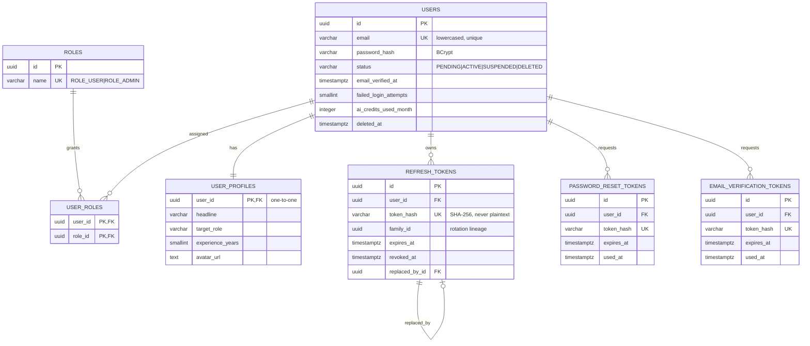
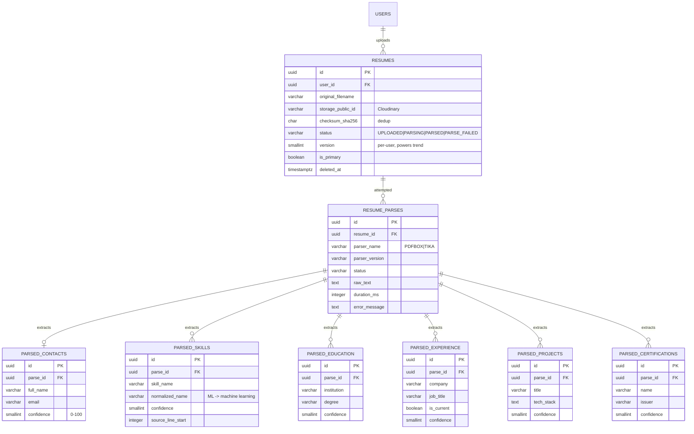
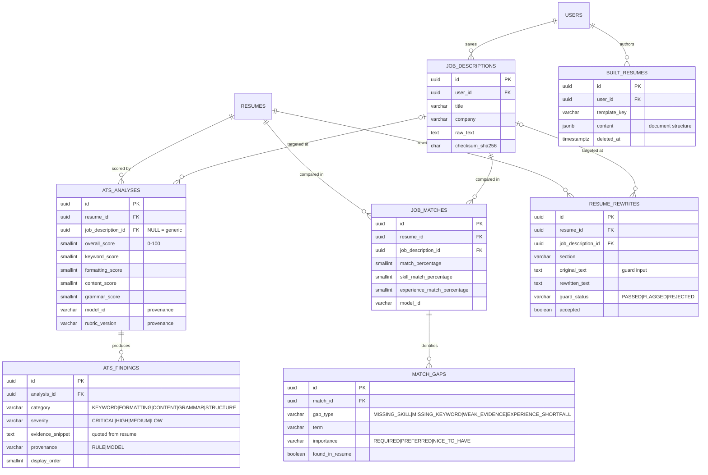
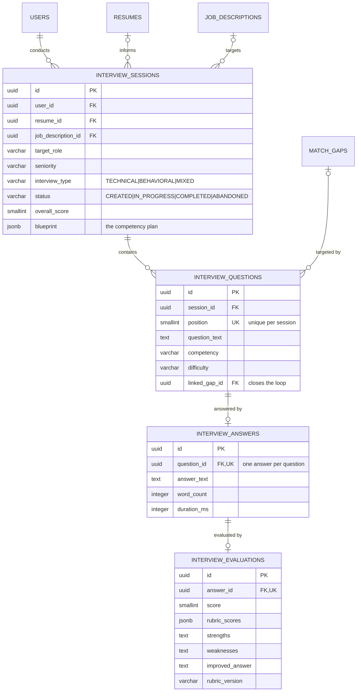
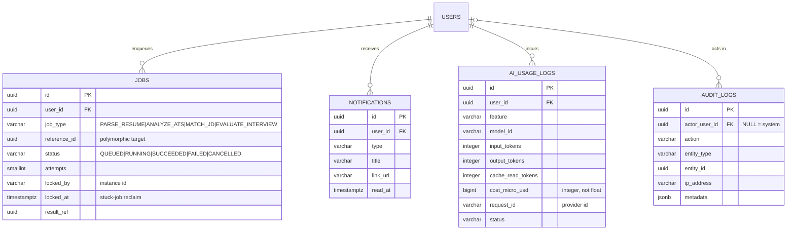
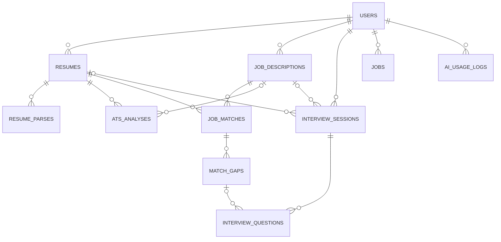

# Phase 1.4 — Entity Relationship Diagrams

**Status:** 📝 Awaiting approval
**Companion to:** [03-database-design.md](03-database-design.md) — that document is the authoritative
column-level specification; this one shows the shape.

---

## Reading these diagrams

Twenty-four tables in one diagram is a picture nobody looks at twice. They are split into the five
clusters from the database design, with a sixth diagram showing only the edges *between* clusters.

Only columns that carry structural meaning — keys, discriminators, status — appear here. Full column
lists are in the companion document.

Cardinality notation: `||--o{` is one-to-many (optional on the many side), `||--||` is one-to-one,
`}o--||` is many-to-one-optional.

---

## 1. Identity

The self-referencing edge on `REFRESH_TOKENS` (`replaced_by_id`) plus `family_id` is the rotation
chain. `family_id` is what makes revocation collective rather than per-token — see §3 of the
database design for why that matters.

---

## 2. Resume and parsing

Note the shape: parsed entities hang off **`RESUME_PARSES`**, not off `RESUMES`. A resume may be
parsed more than once — PDFBox fails, Tika succeeds; or a parser upgrade re-runs an old file — and
each attempt produces its own entity set. Hanging entities off the resume would force each re-parse
to destroy the previous extraction, losing exactly the before/after comparison that tells you
whether the parser improved.

`PARSED_CONTACTS` is `||--o|` (zero-or-one) rather than one-to-many: a resume has one contact block,
and a failed extraction produces no row rather than a row full of nulls.

---

## 3. Analysis, matching, and building

`JOB_DESCRIPTIONS` appears as an optional participant (`|o--o{`) in both `ATS_ANALYSES` and
`RESUME_REWRITES`: a user can run a generic analysis with no target job, then re-run it against a
specific posting. The same analysis pipeline serves both, which is why the FK is nullable rather
than there being two separate tables.

---

## 4. Interview

The `MATCH_GAPS → INTERVIEW_QUESTIONS` edge is the product thesis expressed as a foreign key. It is
what lets the interview report say *"this question was asked because the job requires Kubernetes and
your resume never mentions it"* — the gap analysis and the rehearsal are one system, not two
features that happen to share a login.

The chain `QUESTIONS ||--o| ANSWERS ||--o| EVALUATIONS` uses zero-or-one at each step so that an
abandoned session is representable: questions with no answers, or answers awaiting evaluation, are
valid states rather than integrity violations.

---

## 5. Platform

`JOBS.reference_id` is intentionally **not** a foreign key. It points at whichever table the job type
implies — a resume for `PARSE_RESUME`, an analysis for `ANALYZE_ATS`. A polymorphic reference cannot
be constrained by the database; the alternative is four nullable FK columns, of which exactly one is
ever populated. That trades a real constraint for a real mess. The chosen design accepts an
unconstrained UUID and relies on the job-type discriminator, which the application sets and never
derives from user input.

`AUDIT_LOGS.actor_user_id` is nullable because the actor may be the system — a scheduled purge, a
job reaper. Attributing a system action to a user would be a lie in the one table that must not
contain lies.

---

## 6. Cross-cluster edges

Everything above, with intra-cluster detail removed — the load-bearing relationships only.

Two observations from this view:

**`USERS` is the hub of every cluster.** That is the §1.2 rule made visible — the denormalised
`user_id` on every table means account deletion is a fan-out of independent deletes rather than an
ordered traversal, and every authorisation check is a local predicate.

**`RESUMES` and `JOB_DESCRIPTIONS` are the two axes the product turns on.** Every analytical artefact
— parses, scores, matches, interviews — sits at some intersection of those two. That is not an
accident of the schema; it is the product thesis showing through the data model.
