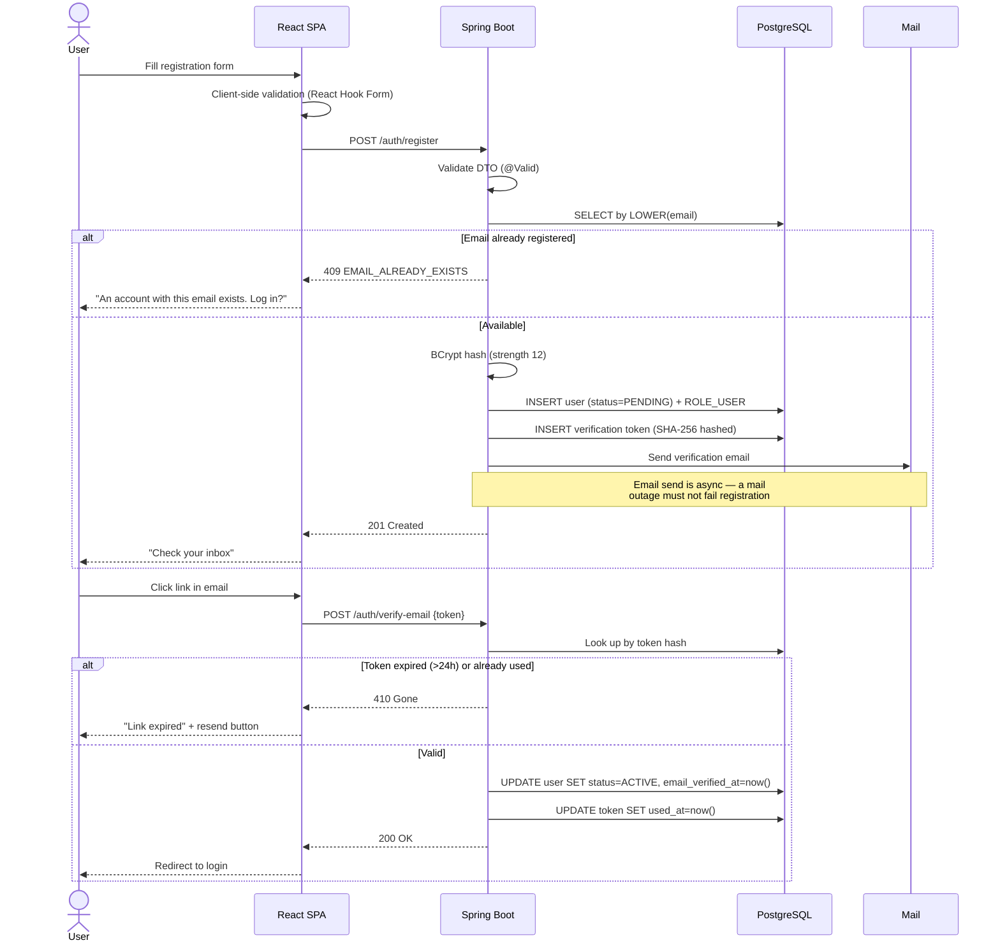
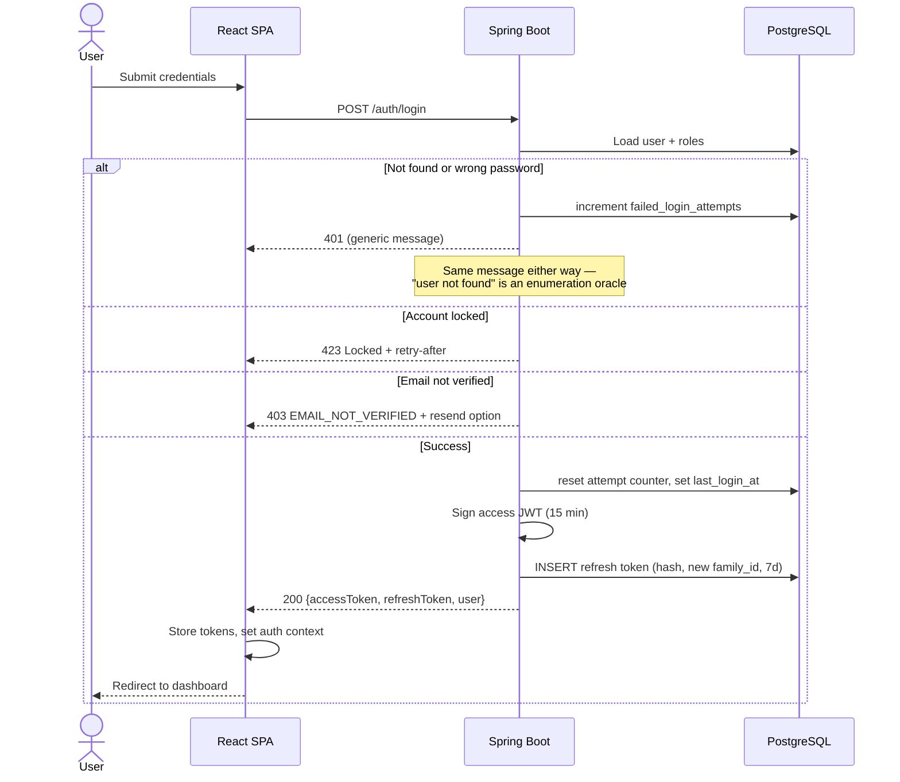
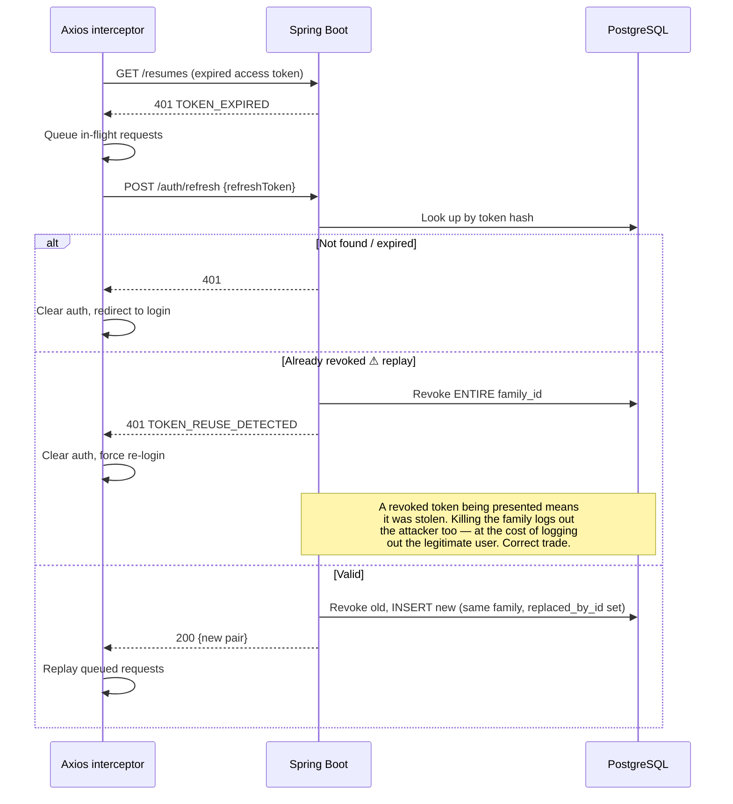
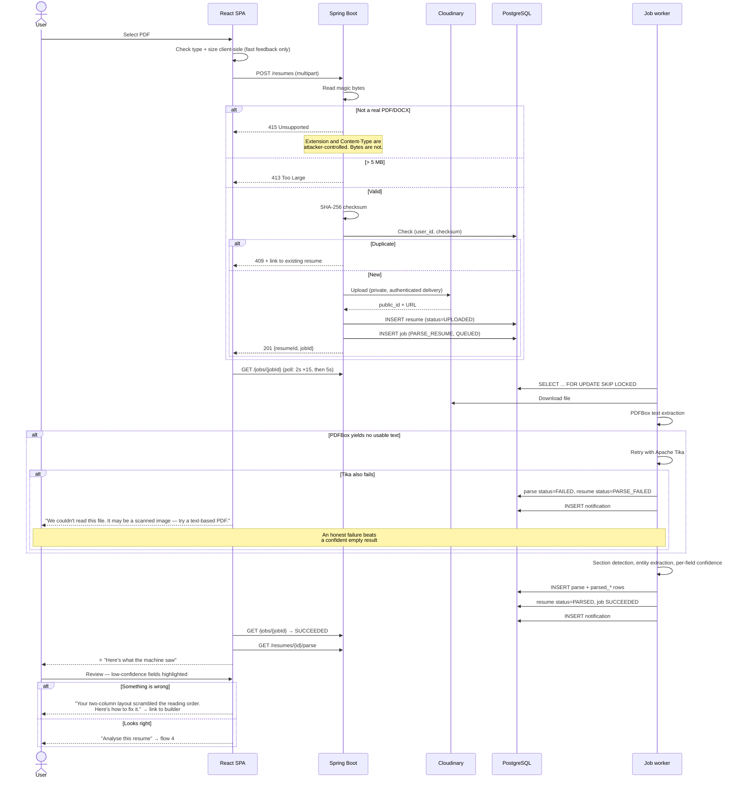
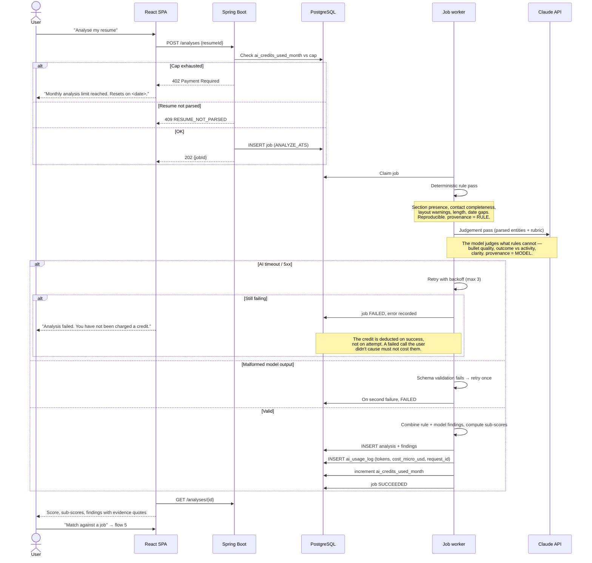
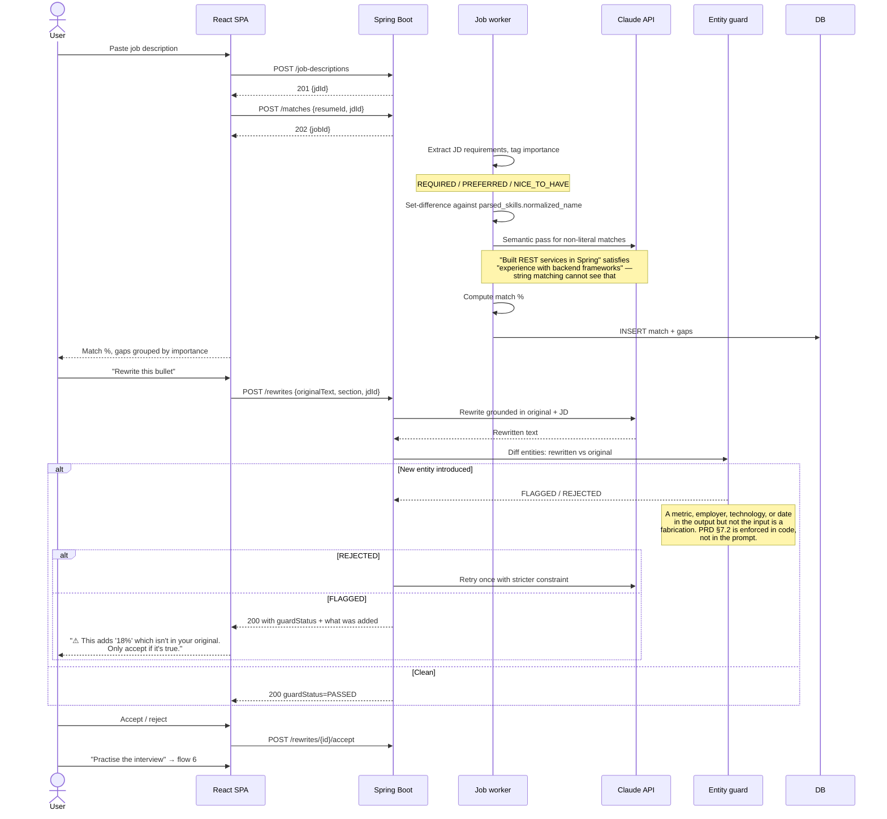
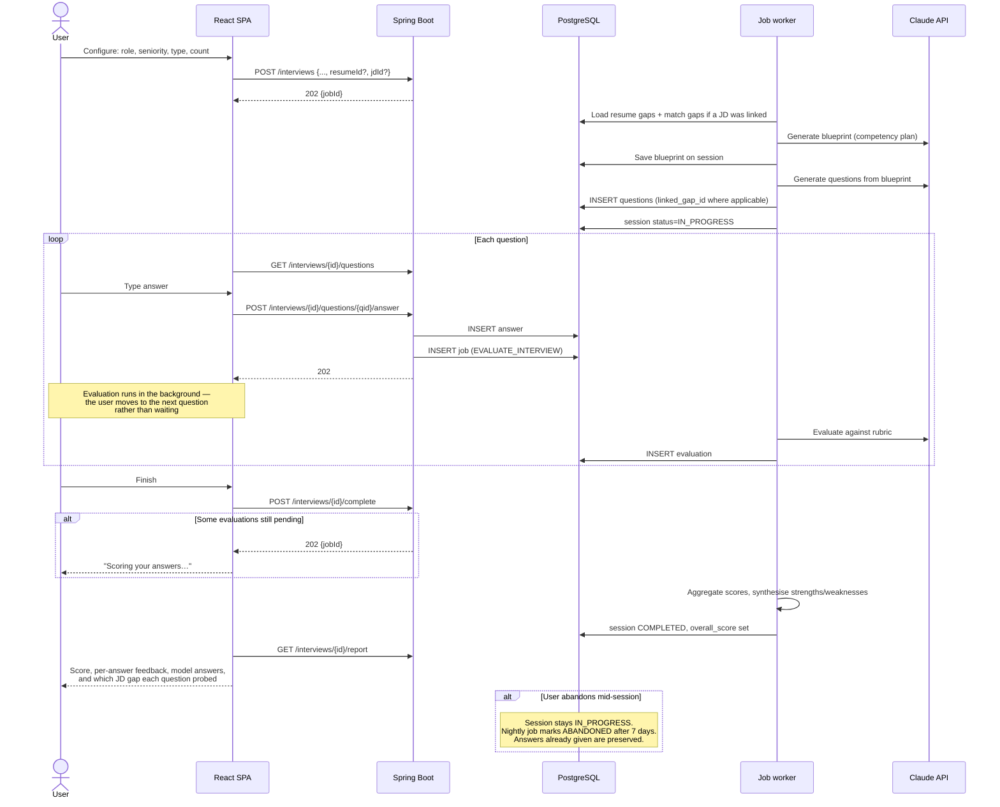
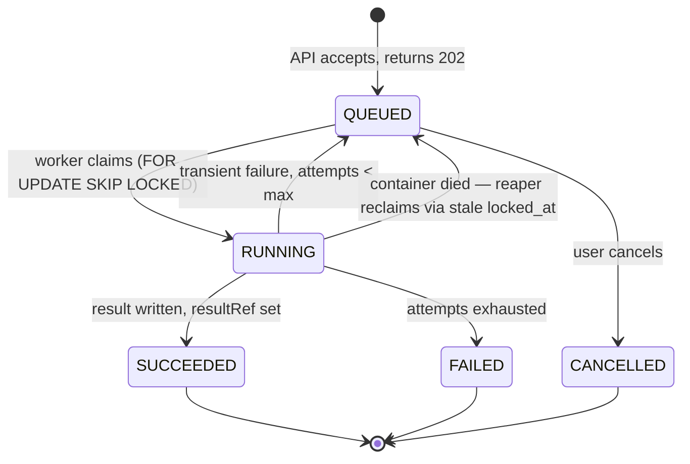

# Phase 1.6 — User Flows

**Status:** 📝 Awaiting approval

---

## Why failure paths are drawn here

Every flow below includes what happens when it goes wrong. That is the point of the document.

Happy paths get built because they are what the ticket describes. Failure paths get discovered in
production, at which point the fix is retrofitted into a design that did not anticipate it. A parse
that fails, an AI call that times out, a user who exhausts their quota mid-session — these are
ordinary operating conditions for this product, not exceptions. Designing them now costs a paragraph;
designing them later costs a refactor.

---

## 1. Registration and verification



**Why email sending is async.** If the mail provider is down and registration blocks on it, nobody
can sign up. Decoupling means the account exists and the user can request a resend, which is a far
better failure than a 500 on the first interaction anyone has with the product.

**Why the token is hashed in the database.** A verification token is a credential — presenting it
activates an account. Storing it in plaintext means a database read is an account takeover. Same
reasoning as refresh tokens.

---

## 2. Login and token refresh



### Transparent refresh



**Queuing in-flight requests during refresh is not optional.** Without it, a dashboard that fires
five parallel requests on load will fire five parallel refreshes when the token expires. Four of them
race, four rotate the token, and three end up presenting a token that was just revoked — which the
reuse detector correctly treats as theft and logs the user out. The interceptor must serialise:
first 401 triggers the refresh, the rest wait on that promise.

---

## 3. Resume upload → parse → review ⭐

The most important flow in the product.



**This screen is why the product is credible.** Every competitor hands out a score. Almost none show
the parse. A student looking at their own work history rendered as interleaved column fragments
understands the problem instantly and in a way no score can convey — and understands that the tool is
telling them something true rather than generating advice.

**The `PARSE_FAILED` path must be a first-class state, not an error toast.** A scanned-image resume
is a common real-world input, and the correct response is a clear explanation plus a route forward
(use the builder), not a red banner.

---

## 4. ATS analysis



**Two passes, not one.** The rule pass exists because a model asked "does this resume have a skills
section" will sometimes say no when it does. That question has a deterministic answer, and spending a
model call on it buys inconsistency at a price. The model is reserved for judgements that genuinely
require judgement — which is also what makes the `provenance` label meaningful in the UI.

**Schema validation of model output is mandatory.** The response is parsed into a typed structure and
rejected if it does not conform. Trusting an LLM to return valid JSON is how you get a 500 in
production on a Tuesday.

---

## 5. Job description matching and rewriting



**The guard is the difference between a tool and a liability.** A prompt that says "do not invent
experience" reduces fabrication; it does not eliminate it. A programmatic diff between input and
output entities catches what the prompt missed, and — critically — a flagged rewrite is shown to the
user *with the invention highlighted*, so they can accept it if the claim happens to be true and
reject it if it is not. The user stays the author.

---

## 6. Mock interview



**Blueprint before questions.** Generating six questions in one call produces six questions that
sound plausible and cover four competencies with three overlaps. Generating a plan first — "two on
the weakest matched skill, two behavioural on ownership, one on the missing required skill, one
open" — and then filling each slot produces coverage. It also makes a bad session diagnosable: was
the plan wrong, or was the generation from a good plan wrong? Without a stored blueprint you can only
observe that the output was poor.

**Evaluation is async and per-answer.** Blocking the user for 15 seconds between questions destroys
the flow. Evaluating as they go means the report is nearly ready by the time they finish.

---

## 7. Account deletion

```mermaid
sequenceDiagram
    actor U as User
    participant FE as React SPA
    participant API as Spring Boot
    participant DB as PostgreSQL
    participant CL as Cloudinary
    participant P as Nightly purge

    U->>FE: Settings → Delete account
    FE-->>U: Explain consequences; require password + typed confirmation
    U->>FE: Confirm
    FE->>API: DELETE /profile/account {password, confirmation}

    alt Wrong password
        API-->>FE: 401
    else Confirmed
        API->>DB: user status=DELETED, deleted_at=now()
        API->>DB: Revoke all refresh tokens
        API->>DB: INSERT audit_log (ACCOUNT_DELETION_REQUESTED)
        API-->>FE: 204
        FE->>FE: Clear auth
        FE-->>U: "Your account is scheduled for deletion. Data removed within 30 days."
    end

    Note over P: ≤ 30 days later
    P->>CL: Delete every stored file for this user
    P->>DB: DELETE per table WHERE user_id = ?
    Note over P,DB: Flat fan-out, no dependency ordering —<br/>this is what the denormalised user_id<br/>on every table bought (DB design §1.2)
    P->>DB: DELETE user row
    P->>DB: Retain audit_log entry with actor_user_id anonymised
```

**The audit entry survives the user.** Recording that an account was deleted, and when, is required
to demonstrate compliance with the deletion request itself. The actor reference is anonymised so the
record proves the action without retaining the person.

---

## 8. Cross-cutting: the async job pattern

Every long-running operation follows one shape. Building four bespoke variants would mean four
polling implementations, four retry policies, and four different behaviours when a container
restarts.



The `RUNNING → QUEUED` reclaim edge is the one that matters on Railway. Containers restart on deploy,
on scale, and on the platform's own schedule. Without a reaper watching `locked_at`, every restart
would strand every in-flight job in `RUNNING` forever, and the user would poll a status that never
changes. With it, an interrupted job is picked up by the next worker within a minute.
