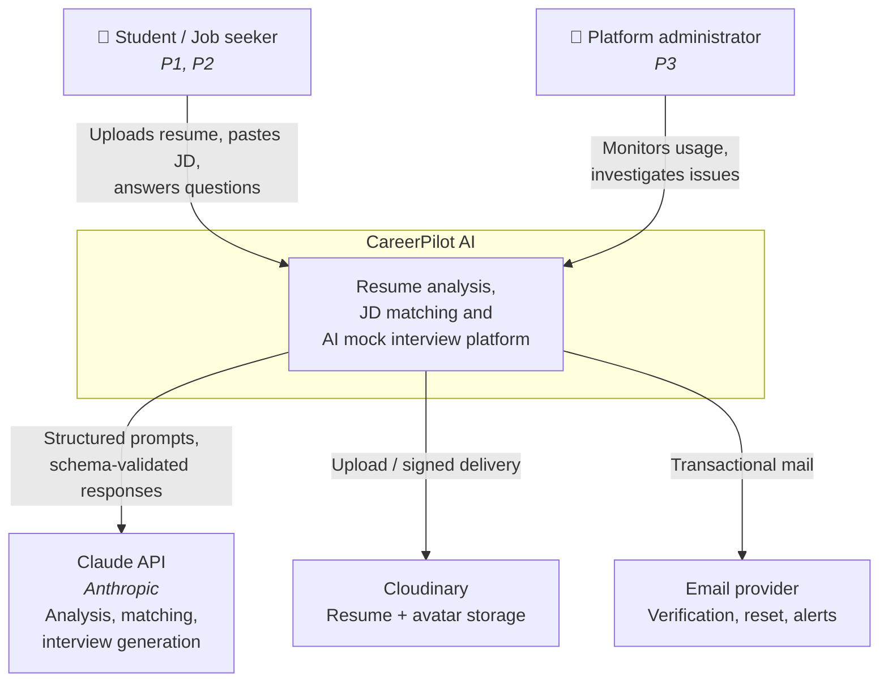
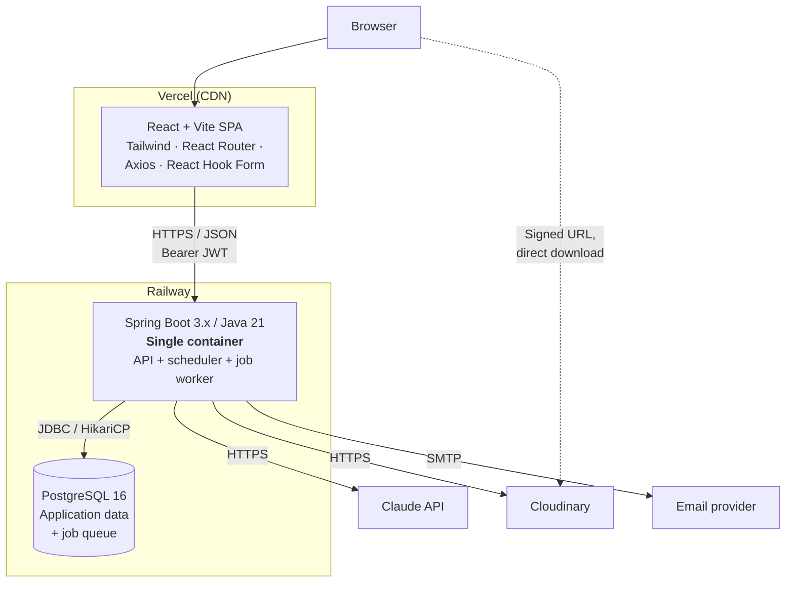
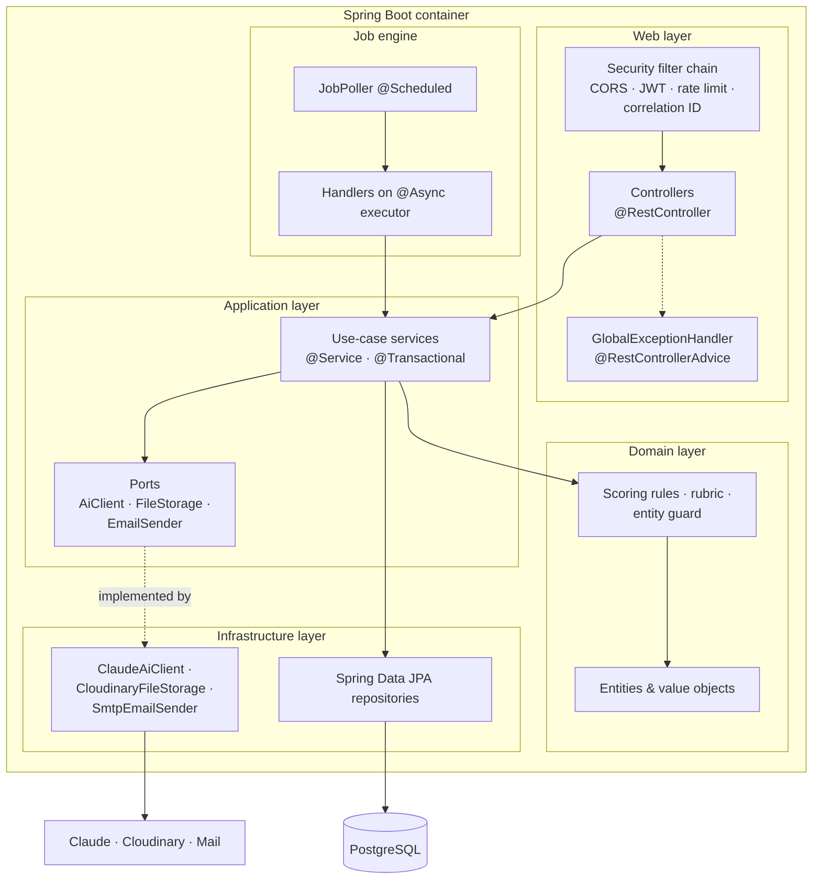
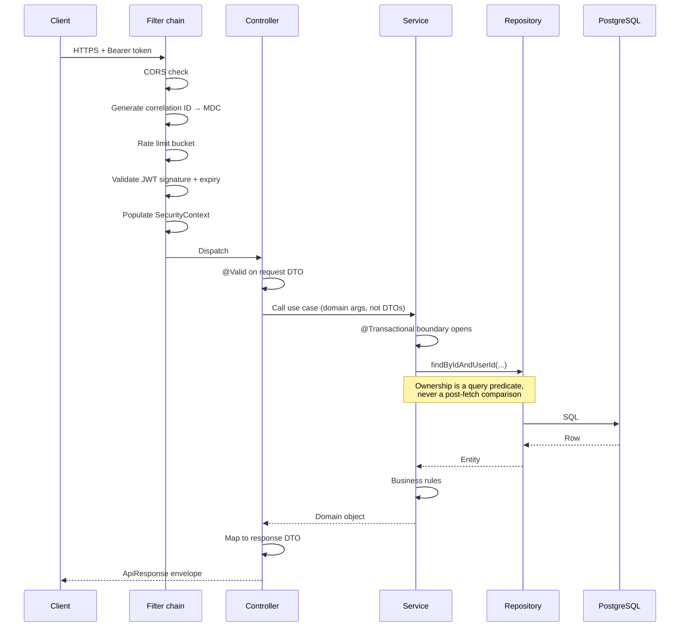
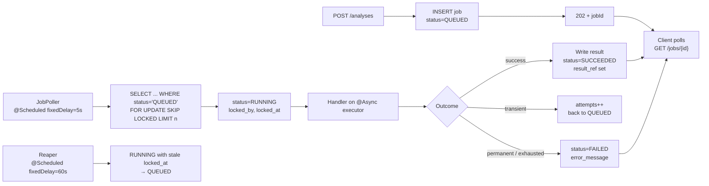
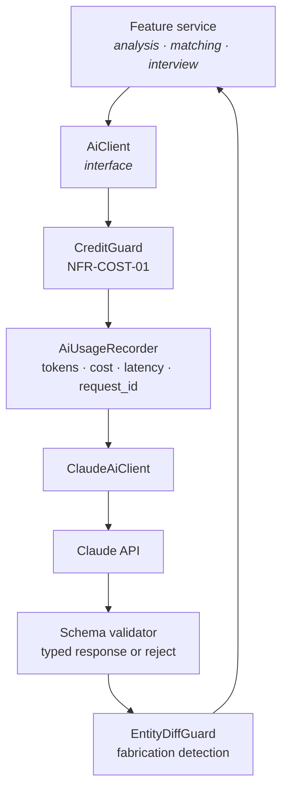
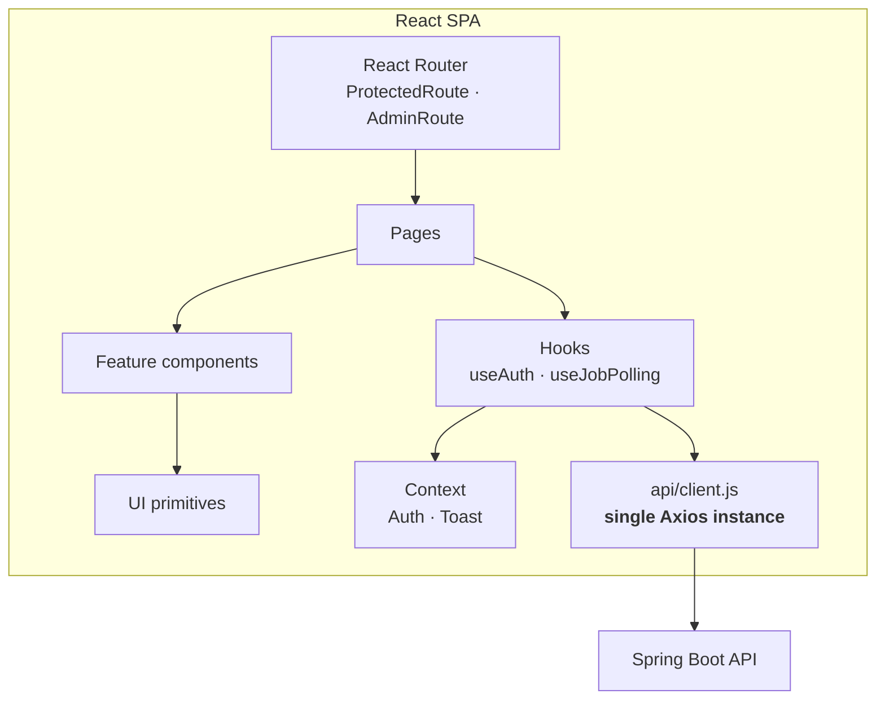
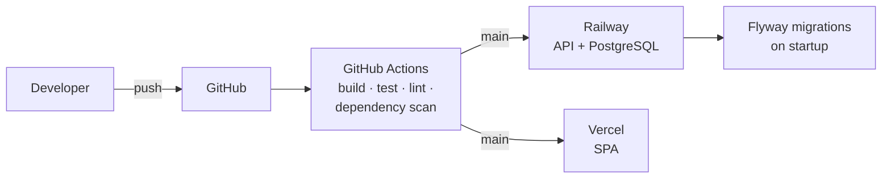

# Phase 1.7 — System Architecture

**Status:** 📝 Awaiting approval

---

## 1. Architectural style

**A modular monolith, deployed as one Spring Boot container, with a separately deployed SPA.**

Not microservices. The decision is worth defending rather than assuming, because "production-ready"
is often read as "distributed".

| Consideration | Monolith | Microservices |
|---|---|---|
| Team size 1–2 | One deployable, one log stream, one debugger | N services to run locally, N pipelines, distributed tracing before there is anything to trace |
| Transactions | `@Transactional` across resume + parse + job | Saga, compensating actions, eventual consistency for a workflow that has none of the properties that need it |
| Cost at launch | One Railway container | N containers, N idle costs |
| Failure modes | Process dies, everything restarts | Partial failure, retry storms, cascading timeouts |
| Refactoring boundaries | Move a class | Change a network contract and deploy two services |

Microservices trade local complexity for distributed complexity. That trade pays off when
independent teams need independent deploy cadence — the exact condition that does not hold here. The
monolith keeps the option open: if a component ever genuinely needs separate scaling, the module
boundary is already enforced (folder structure §5) and extraction becomes a mechanical operation
rather than an archaeology project.

**One thing is genuinely separate: the frontend.** Vercel serves static assets from a CDN; Railway
runs the API. That split is not architectural ambition, it is the correct deployment shape for a SPA
and costs nothing.

---

## 2. C4 Level 1 — System context

Three external dependencies, each a single point of failure for a specific capability. The
architecture must degrade rather than collapse when any one is unavailable: a Cloudinary outage
blocks uploads but not interview practice; a Claude outage blocks analysis but not login or
browsing history; a mail outage blocks verification but not existing users.

---

## 3. C4 Level 2 — Containers

**API, scheduler, and job worker share one container.** The alternative — a separate worker service —
means two deployables, two configurations, and a risk that enqueue and consume code drift apart. At
this scale the same JVM running an `@Async` executor plus a `@Scheduled` poller is sufficient, and
the job table (rather than in-memory state) means correctness does not depend on them being
co-located. If throughput ever demands a dedicated worker, the same image runs with a different
profile — no code change.

**File downloads bypass the API.** The browser fetches directly from Cloudinary using a short-lived
signed URL. Streaming resume bytes through a CPU-billed container adds latency and cost for no
security gain, since the signed URL is itself the access control.

---

## 4. C4 Level 3 — Inside the API container

The dotted `Ports ⇠ Adapters` edge is the whole point of the layering. `AnalysisService` depends on
the `AiClient` interface; `ClaudeAiClient` implements it and is wired in by Spring. Nothing in the
application or domain layer knows Anthropic exists.

This is not vendor-agnosticism theatre. It buys three concrete things:

1. **The scoring rubric is unit-testable** with a stub `AiClient`, no API key, no network, in
   milliseconds. Testing scoring logic through a real model call is slow, flaky, and expensive, and
   therefore does not get done.
2. **The guard stage has somewhere to live.** Entity-diff validation sits between the port and the
   caller, so every AI response passes through it regardless of which feature made the call.
3. **Usage accounting is centralised.** `AiUsageRecorder` wraps the adapter, so every call is logged
   with tokens and cost. Scattered SDK calls would mean scattered accounting, which means missed
   accounting, which means NFR-COST-01 is unenforceable.

---

## 5. Request lifecycle

**The transaction boundary is the service method, not the controller and not the repository.** In the
controller it would span serialisation and hold a connection while writing bytes to a slow client. In
the repository it would make multi-step use cases non-atomic. The service is the only place where
"one unit of business work" is a meaningful phrase.

**Controllers never receive entities and never return them.** The mapping happens at the edge, in
both directions. This is enforced by ArchUnit (folder structure §5), because NFR-SEC-05 stated as a
convention is a convention that gets violated the week someone is in a hurry.

---

## 6. Async job execution

**Why Postgres rather than Redis or a broker.** `SELECT … FOR UPDATE SKIP LOCKED` gives correct
concurrent-claim semantics — two workers cannot claim the same job — on infrastructure that already
exists. A broker adds a second stateful service, a second failure mode, and a second bill to a system
whose expected throughput is a few jobs per minute. The pattern is well-established and the table
becomes a transactional outbox if a broker is ever warranted.

**The reaper is not optional on Railway.** Containers restart on every deploy and at the platform's
discretion. A job claimed by a container that then died would sit in `RUNNING` forever, and the user
would poll a status that never changes. Reclaiming on stale `locked_at` turns a permanent hang into a
one-minute delay.

**Retry policy distinguishes transient from permanent.** A 429 or 503 from Claude is transient and
retried with backoff. A schema-validation failure on model output is retried once, because it is
sometimes transient. A corrupt PDF is permanent and retrying it three times is three times the cost
for the same failure.

---

## 7. Security architecture

Defence in depth — no single control is load-bearing.

| Layer | Control | Threat addressed |
|---|---|---|
| Transport | TLS everywhere; HSTS | Interception |
| CORS | Explicit origin allowlist, credentials off | Cross-origin abuse |
| Authentication | Short-lived access JWT (15 min) | Stolen-token blast radius |
| | Rotating refresh tokens, SHA-256 hashed at rest | DB dump → account takeover |
| | Family revocation on reuse detection | Token theft and replay |
| Authorisation | Role checks + `findByIdAndUserId` on every owned resource | Horizontal privilege escalation (IDOR) |
| Input | `@Valid` on every DTO; size caps on every string | Injection, oversized payloads |
| Files | Magic-byte type verification; 5 MB cap; sanitised filenames | Malicious upload, path traversal |
| Storage | Private Cloudinary delivery; short-lived signed URLs | Public resume exposure |
| Passwords | BCrypt strength 12; lockout after N failures | Offline cracking, credential stuffing |
| Rate limiting | Per-IP on auth, per-user on AI | Brute force, cost exhaustion |
| Output | DTOs only; global exception handler; no stack traces | Information disclosure |
| Secrets | Environment variables only; never in Git | Credential leakage |
| Audit | Security-relevant events recorded | Incident investigation |
| Dependencies | OWASP Dependency-Check in CI | Known CVEs |

**IDOR is the vulnerability most likely to actually appear in this codebase.** Every entity is
user-owned and addressed by UUID; a single repository call that forgets the ownership predicate
exposes another user's resume. The mitigation is structural rather than procedural: repositories
expose `findByIdAndUserId`, and the plain `findById` is not used for user-owned resources. A code
review can miss the omission; a missing method cannot be called.

---

## 8. AI integration

Every AI call passes through the same pipeline. Five properties follow from that:

**Model selection is a configuration decision, not a scattered constant.** The default is
`claude-opus-5` for judgement-heavy work — analysis, matching, interview evaluation. Cheaper
classification-style calls route to `claude-haiku-4-5`. Model IDs live in
`ClaudeProperties`, so switching is a config change and every call site is auditable in one file.

**Prompt caching against a stable prefix.** The scoring rubric and system instructions are large and
identical across every analysis call; the resume content varies. Placing the cache breakpoint at the
end of the rubric means the rubric is billed at cache-read rates after the first call of a window.
This requires the prefix to be byte-identical — no timestamps, no request IDs, no interpolated user
data before the breakpoint. That constraint is a design rule, not an optimisation to add later.

**Structured output is enforced, not requested.** Responses are constrained to a schema and parsed
into typed objects. An unparseable response is a rejected response, retried once, then failed
cleanly — never a 500 and never a half-populated result written to the database.

**Every call is metered before it is made.** `CreditGuard` checks the user's remaining budget and
returns 402 rather than starting work that cannot be paid for. `AiUsageRecorder` writes tokens, cost
in micro-USD, latency, and the provider's request ID for every call including failures. Discovering a
cost problem in a dashboard is a different experience from discovering it in an invoice.

**The guard runs on output, not on hope.** PRD §7.2 forbids fabricated experience. The prompt says
so; the guard checks. Entities present in the output but absent from the input are flagged, and the
user is shown exactly what was added.

---

## 9. Frontend architecture

**One Axios instance is the whole design.** Base URL, the outbound token header, the 401 refresh
interceptor with request queuing, and error normalisation all live in one file. Scattering
`axios.get` through components means the refresh logic is implemented three times and forgotten in
the fourth place — and the fourth place is the one that logs users out mid-interview.

**`useJobPolling` is the second load-bearing abstraction.** Four features produce async jobs. One
hook — poll with backoff, surface progress, stop on terminal state, clean up on unmount — is written
once and reused. Four bespoke `setInterval` implementations would be four different backoff
behaviours and four opportunities to leak a timer.

**Token storage.** Access token in memory, refresh token in a `httpOnly` cookie where the deployment
topology allows it. Both in `localStorage` is the simplest option and is XSS-vulnerable; the token
lifetimes (15 minutes / 7 days) and rotation bound the damage, but the cookie option is preferred and
is a Phase 11 decision once the Vercel/Railway domain arrangement is settled.

---

## 10. Deployment

| Concern | Approach |
|---|---|
| Configuration | Environment variables; `application-{profile}.yml` holds no secrets |
| Port | Railway injects `PORT`; the app must bind to it, not to a hardcoded 8080 |
| Migrations | Flyway on startup; `ddl-auto: validate` in every environment |
| Health | `/actuator/health` for liveness; readiness includes the database |
| Logging | JSON to stdout with correlation ID; the platform collects it |
| Rollback | Redeploy the previous image; **migrations are forward-only** |

**Forward-only migrations are a deliberate constraint.** Down-migrations look like insurance and are
mostly a way to lose data under pressure. A bad migration is corrected by a new migration that
fixes it — which is reviewable, testable, and does not run destructive DDL during an incident.

**Cold starts are handled by the async model, not fought.** Railway's free tier sleeps idle
containers. Because every long operation is a polled job rather than a held connection, a cold start
delays the first response rather than failing it — which is exactly the mitigation recorded for risk
R5.

---

## 11. Quality attributes and where they are addressed

| Attribute | Mechanism | Requirement |
|---|---|---|
| Performance | Indexes on every FK and query predicate; single aggregated dashboard endpoint; async for anything slow | NFR-PERF-01…03 |
| Availability | Stateless API (any container serves any request); job reclaim on restart; graceful external-dependency degradation | NFR-AVAIL-01 |
| Security | §7 | NFR-SEC-01…07 |
| Cost control | Credit guard, usage log, model tiering, prompt caching | NFR-COST-01 |
| Testability | Domain layer free of infrastructure; ports stubbed in unit tests; Testcontainers for integration | NFR-TEST-01, 02 |
| Observability | Correlation ID through MDC into every log line; Micrometer metrics; job table as an execution audit trail | NFR-OBS-01, 02 |
| Maintainability | Feature-first packages; ArchUnit enforcement; OpenAPI generated from annotations so it cannot drift | — |
| Scalability | Stateless API scales horizontally; job workers coordinate through the database; storage is external | — |

---

## 12. Known limitations

Stated plainly, so that nobody rediscovers them as surprises.

| # | Limitation | Consequence | When it bites |
|---|---|---|---|
| L1 | SPA renders client-side | Weak organic search discovery (risk R7) | If SEO becomes the primary channel |
| L2 | Job worker shares the API container | AI work competes with request handling for CPU | Above a few concurrent jobs — split by profile |
| L3 | Postgres as a queue | Polling latency of a few seconds; no fan-out | Above tens of jobs per minute |
| L4 | Single database, no read replica | Heavy admin analytics can affect user latency | When admin dashboards get expensive |
| L5 | Single region | Latency for distant users | If the user base globalises |
| L6 | JPA annotations on domain entities | Domain layer is not strictly framework-free | Only if the persistence technology changes |

Each of these is a conscious trade for launch speed and operational simplicity at a scale that does
not yet exist. Each has a stated trigger. Building for the scale in the right-hand column today would
mean not shipping.
